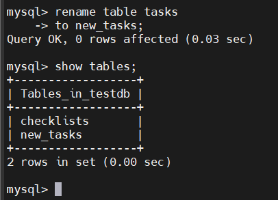

# MySQL RENAME TABLE
## Introduction
- Cú pháp:

  ```sql
  RENAME TABLE table_name
  TO new_table_name;
  ```

- Remain multiple table:

  ```sql
  RENAME TABLE 
    table_name1 TO new_table_name1,
    table_name2 TO new_table_name2,
    ...;
  ```

## Examples

