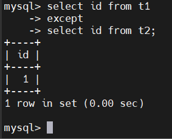
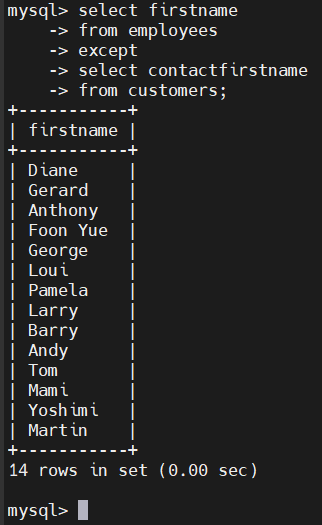
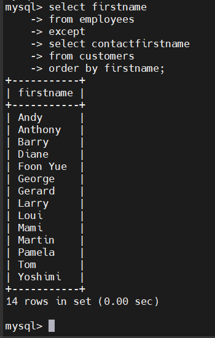
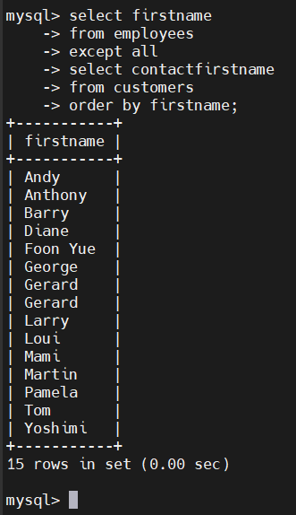

# MySQL EXCEPT
## Introduction
- EXCEPT cho phép ta lấy các hàng từ 1 truy vấn mà không xuất hiện trong 1 truy vấn khác
- Cú pháp:

  ```sql
  query1
  EXCEPT [ALL | DISTINCT]
  quert2;
  ```

- EXCEPT sẽ so sánh kết quả của query1 với tập kết quả của query2, và trả về những hàng trong kết quả của query1 không xuất hiện trong kết quả của query2.
- Mặc định, toán tử EXCEPT sử dụng tùy chọn DISTINCT nếu bạn không chỉ định.
- Để sử dụng toán tử EXCEPT, query1 và query2 cần tuân theo các quy tắc sau:

  - Thứ tự và số lượng cột trong danh sách SELECT của hai truy vấn phải giống nhau.

  - Kiểu dữ liệu của các cột tương ứng phải tương thích.

  - Toán tử EXCEPT trả về một tập truy vấn với tên cột được lấy từ tên cột của truy vấn đầu tiên (query1).

## Examples
### Ví dụ đơn giản
- Tạo hai bảng t1 và t2:

  ```sql
  CREATE TABLE t1 (
      id INT PRIMARY KEY
  );

  CREATE TABLE t2 (
      id INT PRIMARY KEY
  );
  ```

- Chèn các hàng vào 2 bảng:

  ```sql
  INSERT INTO t1 VALUES (1),(2),(3);
  INSERT INTO t2 VALUES (2),(3),(4);
  ```

- Tìm những hàng xuất hiện trong t1 nhưng không xuất hiện trong t2:

  ```sql
  SELECT id FROM t1
  EXCEPT 
  SELECT id FROM t2;
  ```

  

### Ví dụ thực tế
- Tìm các tên riêng(firstName) xuất hiện trong bảng employees nhưng không xuất hiện trong customers

  

### EXCEPT với ORDER BY
- Để sắp xếp tập kết quả được trả về bởi toán tử EXCEPT, bạn dùng mệnh đề ORDER BY.

  

### EXCEPT với ALL

  