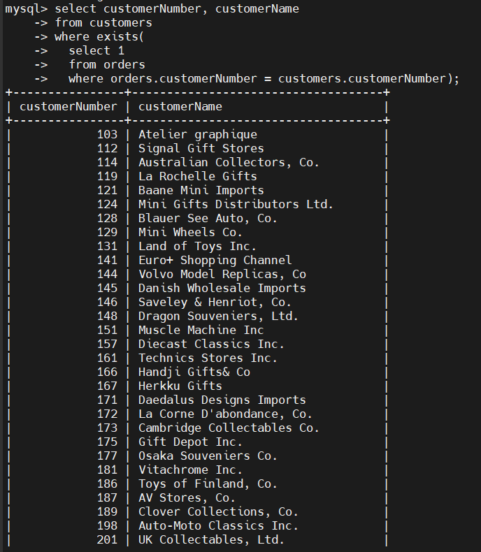
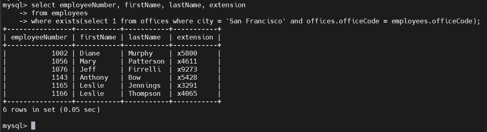
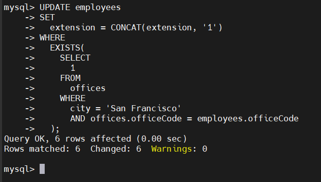
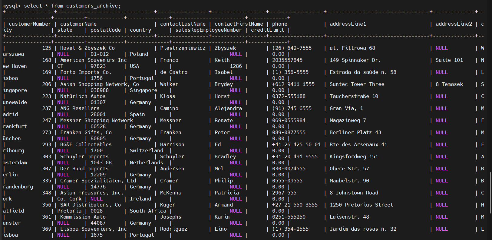

# MySQL EXISTS
## Introduction
- EXISTS là 1 toán tử boolean, thường được sử dụng để kiểm tra sự tồn tại của các hàng(rows) được trả về bởi 1 subquery
- Cú pháp:

  ```sql
  SELECT 
      select_list
  FROM
      a_table
  WHERE
      [NOT] EXISTS(subquery);
  ```

- Nếu subquery trả về ít nhất 1 hàng, EXISTS trả về true ngược lại trả về false

## Toán tử EXISTS trong MySQL
### SELECT EXISTS
- Tìm khách hàng có ít nhất 1 đơn hàng:

  ```sql
  SELECT
    customerNumber, 
    customerName
  FROM
    customers
  WHERE 
    EXISTS(
      SELECT 
        1
      FROM 
        orders
      WHERE 
        orders.customerNumber = customers.customerNumber); 
  ```

  

### UPDATE EXISTS
- Tìm các nhân viên làm việc tại văn phòng San Francisco

  ```sql
  SELECT 
    employeeNumber,
    firstName, 
    lastName, 
    extension
  FROM
    employees
  WHERE 
    EXISTS( 
      SELECT
        1
      FROM
        offices
      WHERE 
        city = 'San Francisco'
        AND offices.officeCode = employees.officeCode
    );
  ```

  

- Ta thêm số 1 vào sau extension của nhân viên làm việc tại văn phòng San Francisco

  ```sql
  UPDATE employees
  SET 
    extension = CONCAT(extension, '1')
  WHERE 
    EXISTS(
      SELECT
        1
      FROM 
        offices
      WHERE
        city = 'San Francisco'
        AND offices.officeCode = employees.officeCode
    );
  ```

  

### INSERT EXISTS
- Ta muốn lưu trữ các khách hàng không có đơn hàng nào vào 1 bảng:
- Bước 1: Tạo bảng mới:

  ```sql
  create table customer_archive
  like customers;
  ```

- Bước 2: chèn các khách hàng ko có bất kỳ đơn hàng nào

  ```sql
  insert into customers_archive
  select *
  from customers
  where not exists(
    select 1
    from orders
    where orders.customerNumber = customers.customerNumber
  );
  ```

- Bước 3: Truy vấn dữ liệu:

  ```sql
  select *
  from customers_archive;
  ```

  