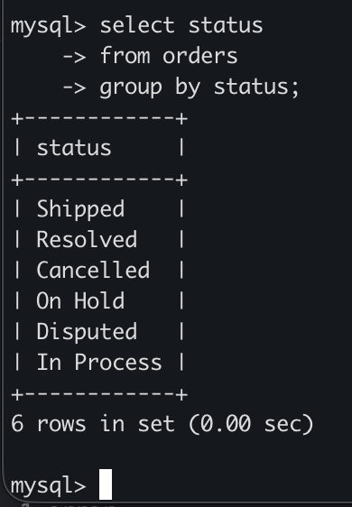
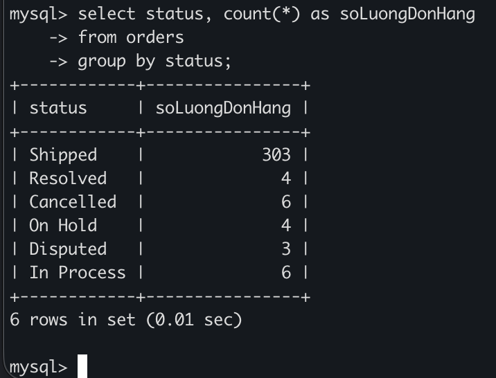
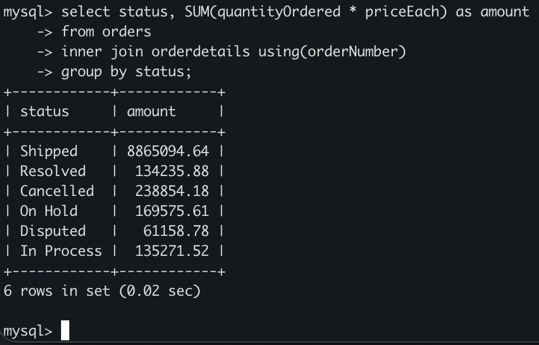
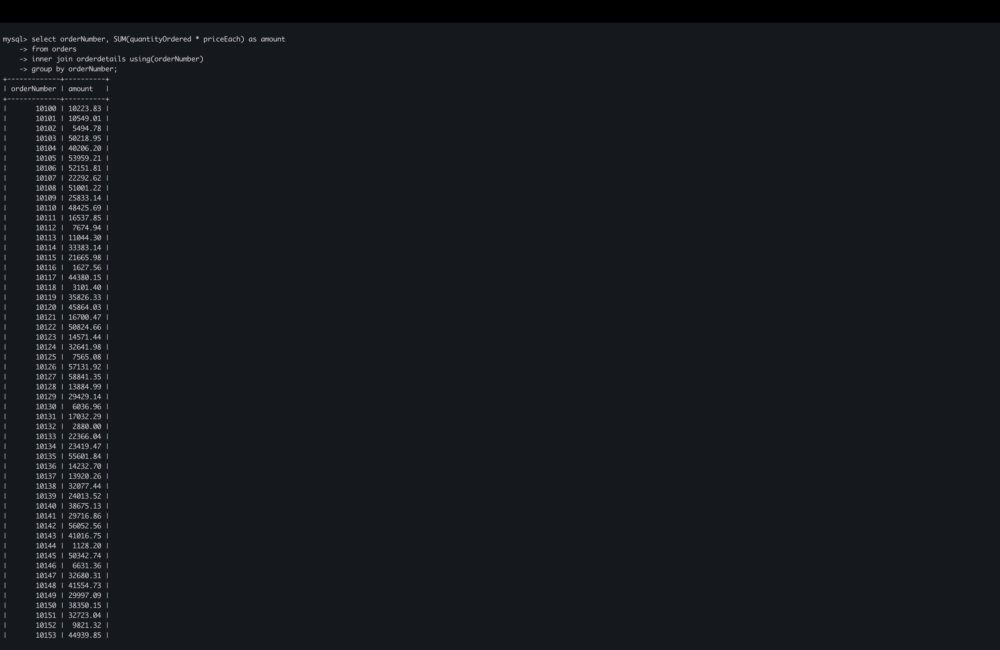
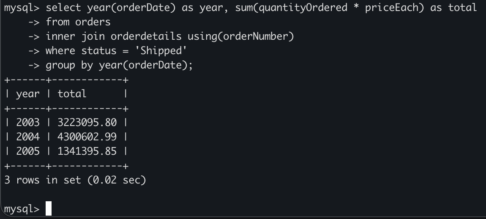
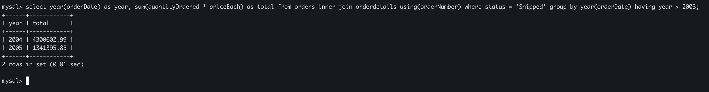
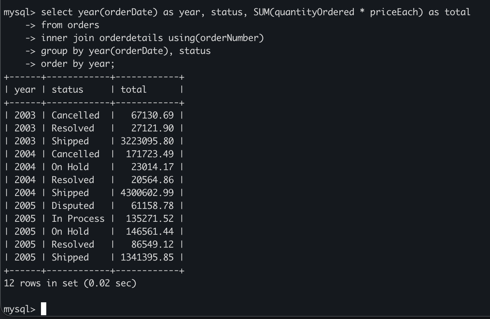

# MySQL GROUP BY
## Introduction
- GROUP BY gom các hàng lại dựa trên giá trị các cột hoặc biểu thức.
- Nó trả về một hàng cho mỗi nhóm và giúp giảm số lượng hàng trong tập kết quả.
- Cú pháp:
    ```sql
    SELECT
    c1, c2, ..., cn, aggregate_function(ci)
    FROM
        table_name
    WHERE
        conditions
    GROUP BY c1, c2, ..., cn;
    ``` 

- MySQL thực thi mệnh đề GROUP BY sau các mệnh đề FROM và WHERE, nhưng trước các mệnh đề HAVING, SELECT, DISTINCT, ORDER BY và LIMIT:

    ```
    FROM → WHERE → GROUP BY → SELECT → DISTINCT → ORDER BY → LIMIT
    ```

## Examples
### Ví dụ cơ bản
- Nhóm các trạng thái đơn hàng(`status`) trong bảng `orders`:

    

- Ở ví dụ này nó hoạt động giống `DISTINCT`

### GROUP BY với aggregate function
- Trong thực tệ ta thường kết hợp GROUP BY với hàm tổng hợp để nhóm và tính toán trên từng nhóm
- Đếm số đơn hàng theo từng trạng thái:


    

- Tính tổng tiền của các đơn hàng theo từng trạng thái, sử dụng 2 bảng `orders` và `orderdetails`:

    ```sql
    SELECT
        status, 
        SUM(quantityOrdered * priceEach) as amount
    FROM 
        orders
    INNER JOIN orderdetails USING(orderNumber)
    GROUP BY
        status;
    ```

    

- Tính tổng tiền theo từng đơn hàng:

    

### GROUP BY với biểu thức
- Ta có thể nhóm không chỉ theo cột mà còn theo biểu thức
- Tính tổng doanh thu theo năm:

    ```sql
    SELECT 
        YEAR(orderDate) AS year, 
        SUM(quantityOrdered * priceEach) AS total 
    FROM 
        orders 
    INNER JOIN orderdetails USING (orderNumber) 
    WHERE 
        status = 'Shipped' 
    GROUP BY 
        YEAR(orderDate);
    ```

    

### GROUP BY vơí HAVING
- Để lọc các nhóm(khác với WHERE - lọc từng dòng), ta dùng HAVING
- Lấy doanh thu các năm sau 2003:

    ```sql
    SELECT 
        YEAR(orderDate) as year, 
        SUM(quantityOrdered * priceEach) as total
    FROM 
        orders
    INNER JOIN orderdetails USING(orderNumber)
    WHERE
        status = 'Shipped'
    GROUP BY
        YEAR(orderDate)
    HAVING
        year > 2003;
    ```

    

### GROUP BY với nhiều cột
- Nhóm theo nhiều giá trị, Ví dụ: năm + trạng thái:

    