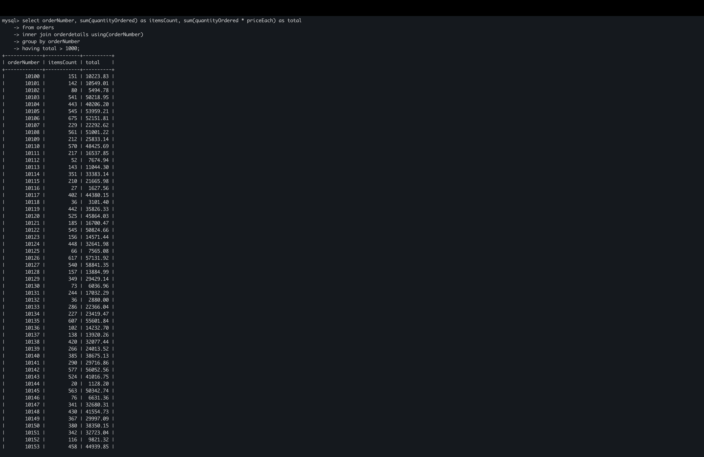
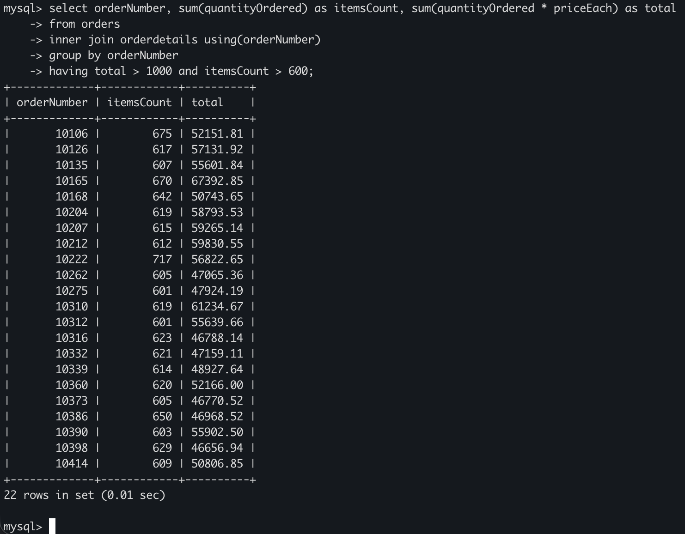

# MySQL HAVING
## Introduction
- HAVING được dùng với GROUP BY để lọc các nhóm dựa trên 1 điều kiện cụ thể
- Cú pháp:

    ```sql
    SELECT
        selectList
    FROM
        tableName
    WHERE
        condition
    GROUP BY
        groupByExpression
    HAVING
        groupCondition;
    ```

- HAVING đánh giá từng nhóm được trả về trong GROUP BY
- Nếu điều kiện đúng, nhóm đó được đưa vào trong truy vấn
- MySQL đánh giá mệnh đề HAVING sau các mệnh đề FROM, WHERE và GROUP BY,
nhưng trước DISTINCT, SELECT, ORDER BY và LIMIT:

    ```
    FROM -> WHERE -> GROUP BY -> HAVING -> SELECT -> DISTINCT -> ORDER BY -> LIMIT
    ```

## Examples
- Tìm các đơn hàng có doanh thu > 1000:

    ```sql
    SELECT 
        orderNumber,
        SUM(quantityOrdered) AS itemsCount,
        SUM(quantityOrdered * priceEach) AS total
    FROM 
        orders
    INNER JOIN 
        orderdetails USING(orderNumber)
    GROUP BY 
        orderNumber
    HAVING 
        total > 1000;
    ```

    

- Tìm các đơn hàng có doanh thu > 1000 và số lượng sản phẩm > 600:

    ```sql
    SELECT 
        orderNumber,
        SUM(quantityOrdered) AS itemsCount,
        SUM(quantityOrdered * priceEach) AS total
    FROM 
        orders
    INNER JOIN 
        orderdetails USING(orderNumber)
    GROUP BY 
        orderNumber
    HAVING 
        total > 1000 
        AND itemsCount > 600;
    ```

    

