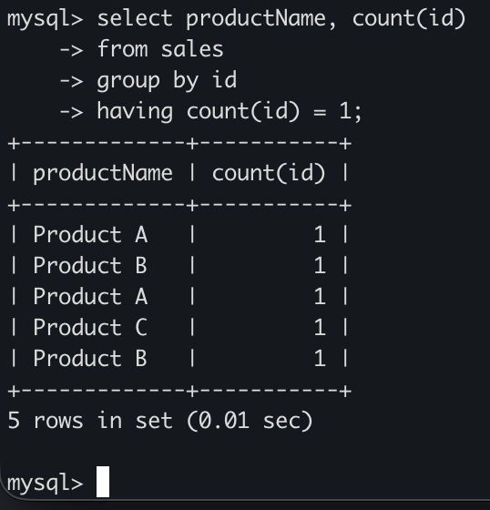
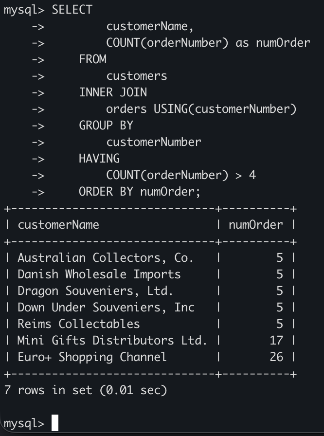

# MySQL HAVING COUNT
## Introduction
- Khi kết hợp GROUP BY với hàm COUNT, ta sẽ nhận được các nhóm và số lượng mục trong mỗi nhóm
- Để lọc các nhóm dựa trên số lượng mục trong mỗi nhóm, ta sử dụng `HAVING` cùng với hàm `COUNT`

    ```sql
    SELECT 
        c1, 
        COUNT(c2)
    FROM
        table
    GROUP BY 
        c1
    HAVING 
        COUNT(c2)...
    ```

## Examples
### Ví dụ đơn giản
- Bước 1: Tạo bảng `sales` với 3 cột `id`, `productName`, `saleAmount`
  
    ```sql
    CREATE TABLE sales (
        id INT AUTO_INCREMENT,
        productName VARCHAR(50) NOT NULL,
        saleAmount DECIMAL(10, 2) NOT NULL,
        PRIMARY KEY(id)
    );
    ```

- Bước 2: Chèn 1 số dữ liệu vào bảng `sales`:

    ```sql
    INSERT INTO sales (productName, saleAmount)
    VALUES
        ('Product A', 100.50),
        ('Product B', 75.25),
        ('Product A', 120.75),
        ('Product C', 50.00),
        ('Product B', 90.80);
    ```

- Tìm các sản phầm chỉ bán được 1 lần:
    ```sql
    SELECT 
        productName, 
        COUNT(id)
    FROM
        sales
    GROUP BY 
        id
    HAVING
        COUNT(id) = 1;
    ```

    

### Ví dụ thực tế với HAVING COUNT
- Tìm các khách hàng đã đặt hơn 4 đơn hàng

    ```sql
    SELECT 
        customerName,
        COUNT(orderNumber) as numOrder
    FROM
        customers
    INNER JOIN 
        orders USING(customerNumber)
    GROUP BY 
        customerNumber
    HAVING 
        COUNT(orderNumber) > 4
    ORDER BY numOrder;
    ```

    