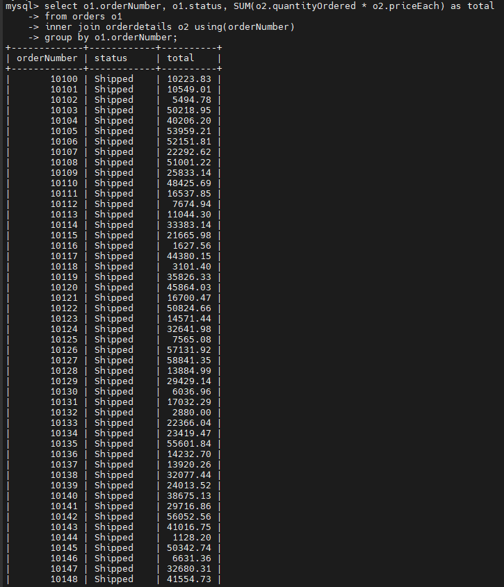
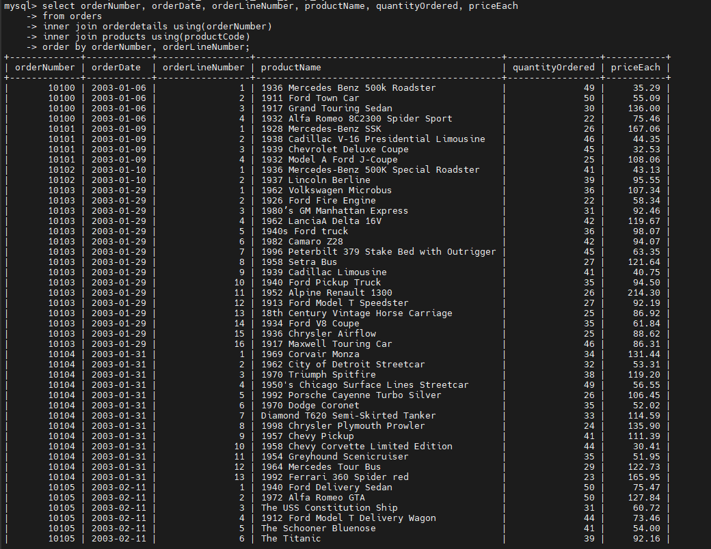
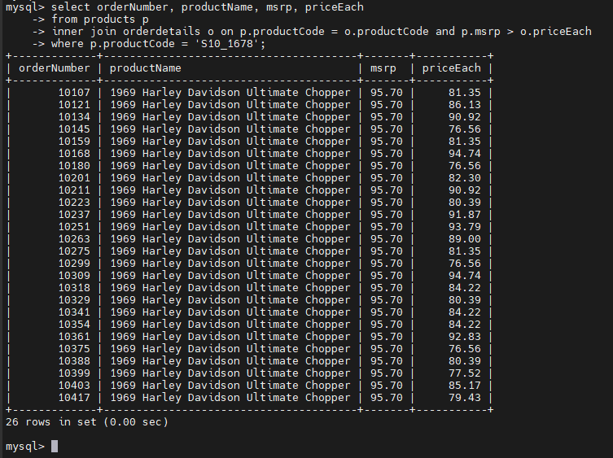

# MySQL INNER JOIN
## Introduction
- INNER JOIN là 1 mệnh đề tùy chọn của câu lệnh SELECT. Xuất hiện sau FROM
- Cú pháp:

  ```sql
  SELECT
    select_list
  FROM t1
  INNER JOIN t2 ON join_condition1
  INNER JOIN t3 ON join_condition2
  ...;
  ```
- Nếu một cặp hàng từ hai bảng thỏa điều kiện nối (TRUE), INNER JOIN sẽ tạo ra một hàng mới gồm tất cả các cột của hai hàng đó và đưa vào kết quả.

- Nếu không thỏa điều kiện, INNER JOIN sẽ bỏ qua cặp hàng đó.

## Examples
- Thông thường, ta sẽ thực hiện `JOIN` giữa các bảng có quan hệ `khóa ngoại` giống như hai bảng `productlines` và `products`.
- Giá sử ta muốn lấy:
  - `productCode` và `productName` từ bảng `products`
  - `textDescription` từ bảng `productlines`

  ```sql
  SELECT 
      productCode, 
      productName, 
      textDescription
  FROM
      products t1
  INNER JOIN productlines t2 
      ON t1.productline = t2.productline; -- có thể thay thế bằng USING
  ```

### MySQL INNER JOIN với GROUP BY
- Xem hai bảng orders và orderdetails sau:

  - trả về số đơn hàng (orderNumber), trạng thái đơn hàng (status), và tổng doanh số, bằng cách dùng INNER JOIN kết hợp với GROUP BY:

  

### Join 3 bảng
- Xem ba bảng products, orders, và orderdetails.

- Câu truy vấn dưới đây sử dụng hai mệnh đề INNER JOIN để nối ba bảng:


  ```sql
  SELECT 
      orderNumber,
      orderDate,
      orderLineNumber,
      productName,
      quantityOrdered,
      priceEach
  FROM
      orders
  INNER JOIN
      orderdetails USING (orderNumber)
  INNER JOIN
      products USING (productCode)
  ORDER BY 
      orderNumber, 
      orderLineNumber;
  ```

  

### Join 4 bảng
- Xem bốn bảng: orders, orderdetails, customers, và products.

- Câu truy vấn dưới đây sử dụng ba INNER JOIN để kết hợp dữ liệu từ cả bốn bảng:

  ```sql
  SELECT 
      orderNumber,
      orderDate,
      customerName,
      orderLineNumber,
      productName,
      quantityOrdered,
      priceEach
  FROM
      orders
  INNER JOIN orderdetails 
      USING (orderNumber)
  INNER JOIN products 
      USING (productCode)
  INNER JOIN customers 
      USING (customerNumber)
  ORDER BY 
      orderNumber, 
      orderLineNumber;
  ```

### Dùng các toán tử khác
- Dùng toán từ `<` tìm các mức giá bán(priceEach) của sản phầm có mã S10_1678 mà thấp hơn giá bán lẻ đề xuất MSRP:

  