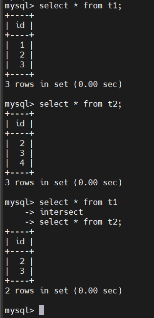

# MySQL INTERSECT
## Introduction
- INTERSECT là 1 toán tử tập hợp dùng để trả về các hàng chung của 2 hoặc nhiều truy vấn
- Cú pháp:
  ```sql
  query1
  INTERSECT [ALL | DISTINCT]
  query2;
  ```

- Để sử dụng toán tử INTERSECT cho các truy vấn, bạn cần tuân theo các quy tắc sau:

  - Thứ tự và số lượng cột trong danh sách SELECT của hai truy vấn phải giống nhau.

  - Kiểu dữ liệu của các cột tương ứng phải tương thích.

  - Toán tử INTERSECT mặc định sử dụng DISTINCT
  
## Examples
- Trả về các hàng chung của 2 bảng t1, t2:

  