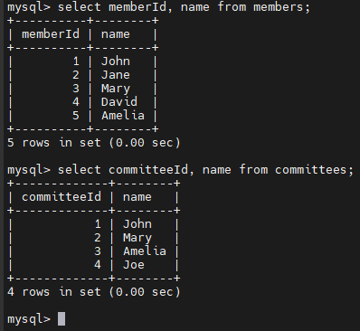
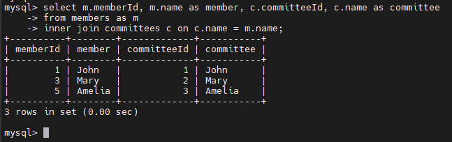
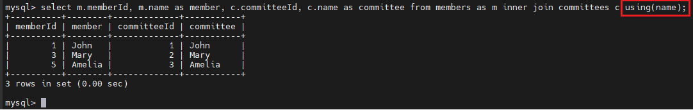
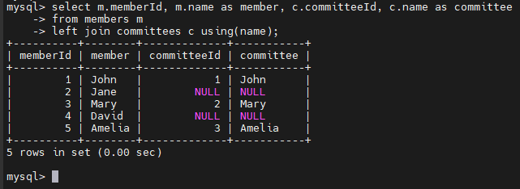
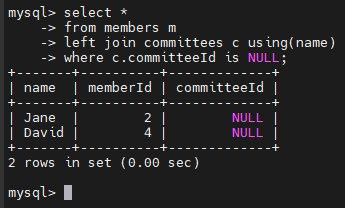
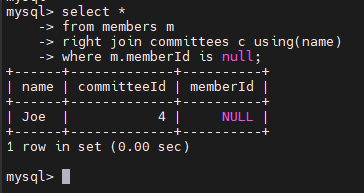
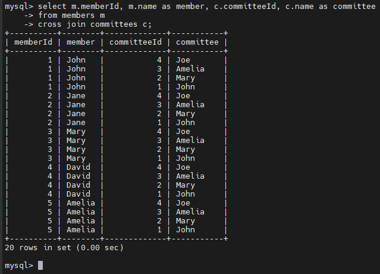

# MySQL Join
## Introduction 
- 1 relational database gồm nhiều bảng có liên kết với nhau thông qua các cột chung, thường là `foreign key`.
- Ví dụ, trong sample db ta có bảng `orders` và `orderdetails` được liên kết với nhau thông qua cột `orderNumber`

  > Để lấy đầy đủ thông tin của một đơn hàng, bạn cần truy vấn dữ liệu từ cả bảng orders lẫn orderdetails.

- Đó là lý do `join` được sử dụng
- `Join` là phương thức liên kết dữ liệu giữa 1 bảng(self join) hoặc nhiều bảng dựa trên giá trị của các cột chung.
- MySQL hỗ trợ các loại `join` sau:
  - Inner join
  - Left join
  - Right join
  - Cross join
- Các mệnh đề `join` được sử dụng trong câu lệnh `SELECT` và xuất hiện sau mệnh đề `FROM`

## Tạo các bảng mẫu
1. Tạo hai bảng `members` và `committees`:

    ```sql
    CREATE TABLE members (
        member_id INT AUTO_INCREMENT,
        name VARCHAR(100),
        PRIMARY KEY (member_id)
    );

    CREATE TABLE committees (
        committee_id INT AUTO_INCREMENT,
        name VARCHAR(100),
        PRIMARY KEY (committee_id)
    );
    ```

2. Chèn dữ liệu vào bảng:

    ```sql
    INSERT INTO members(name)
    VALUES('John'),('Jane'),('Mary'),('David'),('Amelia');

    INSERT INTO committees(name)
    VALUES('John'),('Mary'),('Amelia'),('Joe');
    ```

3. Truy vấn dữ liệu:

    


    - 1 số members là committee members và 1 số thành viên trong committees có trong bảng members

## MySQL INNER JOIN
- Cú pháp cơ bản của `INNER JOIN` để nối 2 bảng table_1 và table_2:

  ```sql
  SELECT columnList
  FROM table_1
  INNER JOIN table_2 ON joinCondition;
  ```

- `INNER JOIN` kết hợp 2 bảng dựa trên 1 điều kiện gọi là `join predicate`(điều kiện nối)
- `INNER JOIN` bao gồm các hàng khớp nhau của cả 2 bảng

### Ví dụ

- Tìm các thành viên đồng thời là thành viên của committee:

  ```sql
  SELECT 
      m.member_id, 
      m.name AS member, 
      c.committee_id, 
      c.name AS committee
  FROM
      members m
  INNER JOIN committees c ON c.name = m.name;
  ```

  

- Nếu điều kiện nối là `=` ta có thể dùng `USING` để thay thế:

  

## MySQL LEFT JOIN
- `LEFT JOIN` cũng cần 1 điều kiện nối, khi nối 2 bảng bằng `LEFT JOIN`, khái niệm `left table` và `right table` được sử dụng
- `LEFT JOIN` chọn dữ liệu từ bảng bên trái. Với mỗi hàng trong bảng trái, LEFT JOIN sẽ so sánh với từng hàng trong bảng phải.
- Nếu giá trị khớp -> tạo 1 hàng mới
- Nếu giá trị ko khớp -> vẫn tạo 1 hàng mới nhưng giá trị của các cột của `right table` sẽ hiện là `NULL`
- Cú pháp:

  ```sql
  SELECT column_list
  FROM table_1
  LEFT JOIN table_2 ON join_condition;
  ```

- `Left join` cũng hỗ trợ mệnh đề `USING` nếu cả hai bảng dùng chung một cột để so khớp:

  ```sql
  SELECT column_list
  FROM table_1
  LEFT JOIN table_2 USING (column_name);
  ```

### Ví dụ
- Dùng left join nối bảng `members` với bảng `committees`:

  ```sql
  SELECT 
      m.member_id, 
      m.name AS member, 
      c.committee_id, 
      c.name AS committee
  FROM
      members m
  LEFT JOIN committees c USING(name);
  ```

  

- Sử dụng `WHERE` để tìm các thành viên không nằm trong `committee`:

  

## MySQL RIGHT JOIN
- Ngược với lại LEFT JOIN. Bây giờ dữ liệu luôn được chọn sẽ là của `right table`

- Tìm những thành viên trong `committees` mà không có trong `members`:

  

## MySQL CROSS JOIN
- CROSS JOIN không có điều kiện nối.
- CROSS JOIN kết hợp mỗi hàng từ bảng thứ nhất với mọi hàng từ bảng thứ hai để tạo thành tập kết quả.
- Giả sử bảng thứ nhất có `n` dòng và bảng thứ hai có `m` dòng. Cross join hai bảng này sẽ trả về `n × m` dòng.
- Cú pháp:

  ```sql
  SELECT select_list
  FROM table_1
  CROSS JOIN table_2;
  ```

  
