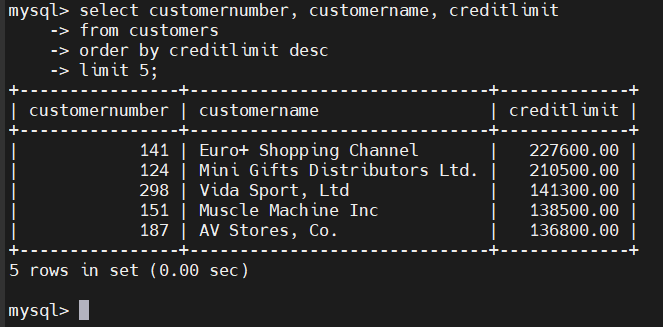
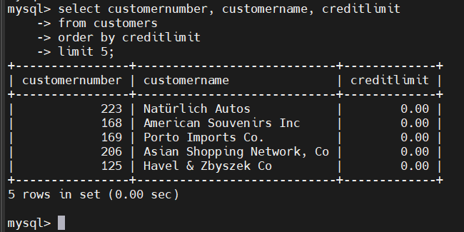
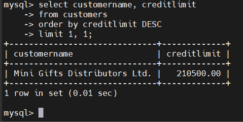
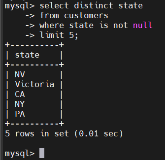

# MySQL LIMIT
## Introduction
- LIMIT dùng để giới hạn số lượng hàng(rows) được trả về trong câu lệnh SELECT
- LIMIT có thể nhận 1 hoặc 2 tham số, và cả 2 đều phải là số nguyên không âm

- Cú pháp với 2 tham số:

  ```sql
  SELECT select_list
  FROM table_name
  LIMIT [offset,] row_count;
  ```

  - `offset`: vị trí bắt đầu (hàng đầu tiên có offset = 0)

  - `row_count`: số lượng hàng tối đa muốn lấy

  ```sql
  LIMIT 5, 10;
  ```

  -> Bắt đầu từ hàng thứ 6, lấy 10 hàng

- Cú pháp với 1 tham số:

  ```sql
  LIMIT row_count;
  ```

  - tường đương:

  ```sql
  LIMIT 0, row_count;
  ```

  -> lấy `row_count` hàng từ đầu bảng

- Cú pháp thay thế:

  ```sql
  LIMIT row_count OFFSET offset;
  ```

  - Ví dụ:

    ```sql
    LIMIT 10 OFFSET 20;
    ```

    -> lấy 10 hàng bắt đầu từ hàng 21

## LIMIT Kết hợp ới ORDER BY
- Nếu không ORDER BY, kết quả từ LIMIT sẽ không dự đoán được, vì MySQL không đảm bảo thứ tự mặc định của dữ liệu.

  ```sql
  SELECT *
  FROM customers
  ORDER BY creditLimit DESC
  LIMIT 5;
  ```

## Examples
### Lấy các hàng có giá trị cao nhất/thấp nhất
- top 5 khách có credit cao nhất:

  ```sql
  SELECT customerNumber, customerName, creditLimit
  FROM customers
  ORDER BY creditLimit DESC
  LIMIT 5;
  ```

  


- top 5 thấp nhất:

  ```sql
  SELECT customerNumber, customerName, creditLimit
  FROM customers
  ORDER BY creditLimit
  LIMIT 5;
  ```

  

- Để tránh kết quả không ổn định khi nhiều người có cùng credit, dùng thêm cột phụ:

  ```sql
  ORDER BY creditLimit, customerNumber
  ```

### LIMIT dùng để phân trang
- Giả sử mỗi trang chứa 10 dòng
- Số lượng dòng:

  ```sql
  SELECT COUNT(*) FROM customers;
  ```

- Trang 1(dòng 1 -> 10):

  ```sql
  SELECT customerNumber, customerName
  FROM customers
  ORDER BY customerName
  LIMIT 10;
  ```

- Trang 2(dòng 11 -> 20):

  ```sql
  SELECT customerNumber, customerName
  FROM customers
  ORDER BY customerName
  LIMIT 10, 10;
  ```

### Lấy giá trị lớn thứ `n`
- Dùng:

  ```sql
  LIMIT n - 1, 1
  ```

- Lấy khách có credit cao thứ 2:

  ```sql
  SELECT customerName, creditLimit
  FROM customers
  ORDER BY creditLimit DESC
  LIMIT 1, 1;
  ```

  

### LIMIT kết hợp với `DISTINCT`
- MySQL sẽ dừng tìm kiếm khi đủ số hàng DISTINCT cần trả về.
- Lấy 5 tiểu bang(state) không trùng nhau:

  ```sql
  SELECT DISTINCT state
  FROM customers
  WHERE state IS NOT NULL
  LIMIT 5;
  ```

  