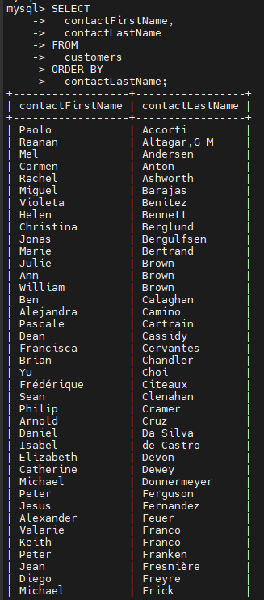
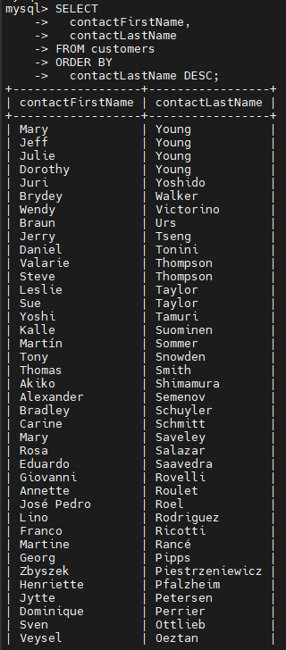
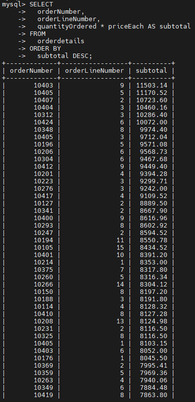
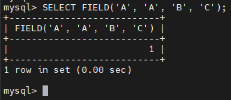
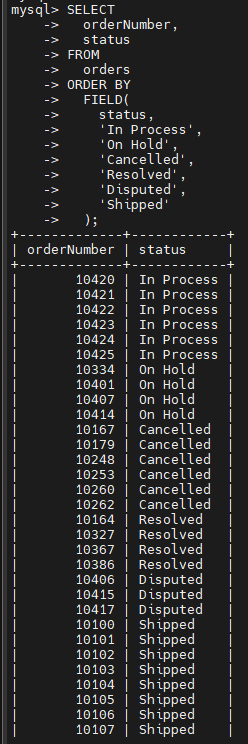
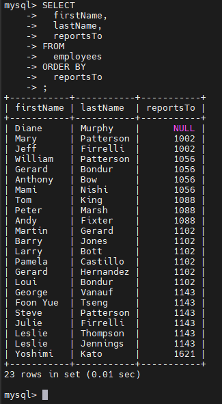
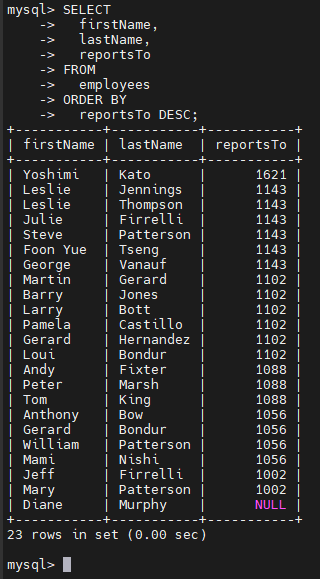

# MySQL ORDER BY
## Introduction
- Khi dùng `SELECT` để truy vấn dữ liệu từ 1 hàng, và muốn thứ tự trong hàng được sắp xếp ta dùng `ORDER BY` vào `SELECT`
- Cú pháp:

  ```sql
  SELECT 
    select_list
  FROM
    table_name
  ORDER BY
    column1 [ASC|DESC]
    column2 [ASC|DESC]
    ...;
  ```

  - `ASC`: sắp xếp tăng dần
  - `DESC`: sắp xếp giảm dần
  - Mặc định sẽ là tăng dần
- Nếu muốn sắp xếp theo nhiều cột:

  ```sql
  ORDER BY
    column1,
    column2;
  ```
  - Sắp xêp theo column1 tăng dần trước sau đó mới đến column2
- Ta cũng có thể sắp xếp 1 cột theo tăng dần, 1 cột giảm dần

  ```sql
  ORDER BY
    column1 ASC,
    column2 DESC;
  ```

## Examples
### 1. Sử dụng `ORDER BY` để sắp xếp theo 1 cột
- sắp xêp danh sách khách hàng theo họ(`last name`) theo thứ tự tăng dần:


  ```sql
  SELECT 
    contactLastname, 
    contactFirstname 
  FROM 
    customers 
  ORDER BY 
    contactLastname;
  ```

  

- sắp xếp theo thứ tự giảm dần:

  

### 2. Sử dụng `ORDER BY` để sắp xếp theo nhiều cột
- Ta sắp xếp theo họ giảm dần, rồi tiếp tục sắp xếp theo tên tăng dần:

  ```sql
  SELECT 
    contactLastName,
    contactFirstName
  FROM
    customers
  ORDER BY
    contactLastName DESC,
    contactFirstName ASC;
  ```

  

### 3. Sử dụng `ORDER BY` để sắp xếp theo 1 biểu thức
- Xét bảng `orderdetails` trong db mẫu
- Chọn các dòng đơn hàng từ bảng này, tính `subtotal = quantityOrdered * priceEach` và sắp xếp theo `subtotal`

  ```sql
  SELECT 
    orderNumber, 
    orderLineNumber, 
    quantityOrdered * priceEach as subtotal
  FROM 
    orderdetails 
  ORDER BY 
    subtotal DESC;
  ```

  

## Sử dụng `ORDER BY` để sort theo 1 danh sách tùy chỉnh

- Hàm `FIELD()` trả về vị trí(chỉ số) của 1 giá trị trong 1 danh sách các giá trị
- Cú pháp:
  
  ```sql
  FIELD(value, value1, value2, ...)
  ```

  - `value`: giá trị bạn muốn tìm vị trí
  - `value1, value2, ...`: danh sách giá trị dùng để so sánh với giá trị cần tìm
- Hàm `FIELD()` trả về vị trí của `value` trong danh sách `value1, valude2, ...`
- Nếu không tồn tại trong danh sách -> trả về `0`
- Ví dụ:

  ```sql
  SELECT FIELD('A', 'A', 'B', 'C');
  ```

  

### Sắp xếp các đơn hàng theo trạng thái với thứ tự tùy chỉnh

- Thứ tự tùy chỉnh:

  | STT | trạng thái |
  | --- | ---------- |
  | 1   | In Process |
  | 2   | On Hold    |
  | 3   | Cancelled   |
  | 4   | Resolved   |
  | 5   | Disputed   |
  | 6   | Shipped    |

  ```sql
  SELECT 
    orderNumber,
    status
  FROM
    orders
  ORDER BY
    FIELD(
      status,
      'In Process',
      'On Hold',
      'Cancelled', 
      'Resolved',
      'Disputed',
      'Shipped',
    );
  ```

  

## MySQL ORDER BY and NULL
- NULL xuất hiện trước các giá trị không phải NULL
- Khi dùng ORDER BY với tùy chọn ASC, các giá trị NULL sẽ xuất hiện đầu tiên trong kết quả
- Khi dùng ORDER BY với tùy chọn DESC, các giá trị NULL sẽ xuất hiện cuối cùng trong kết quả
- Ví dụ: truy vấn sắp xếp nhân viên theo cột `reportsTo`:
  
  

  