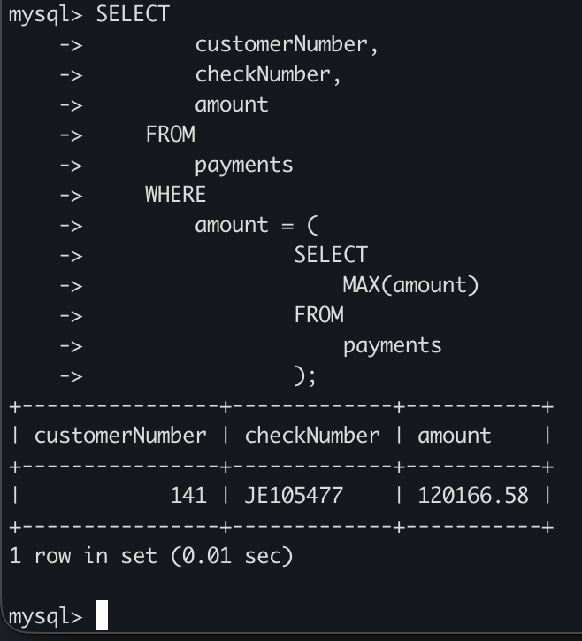
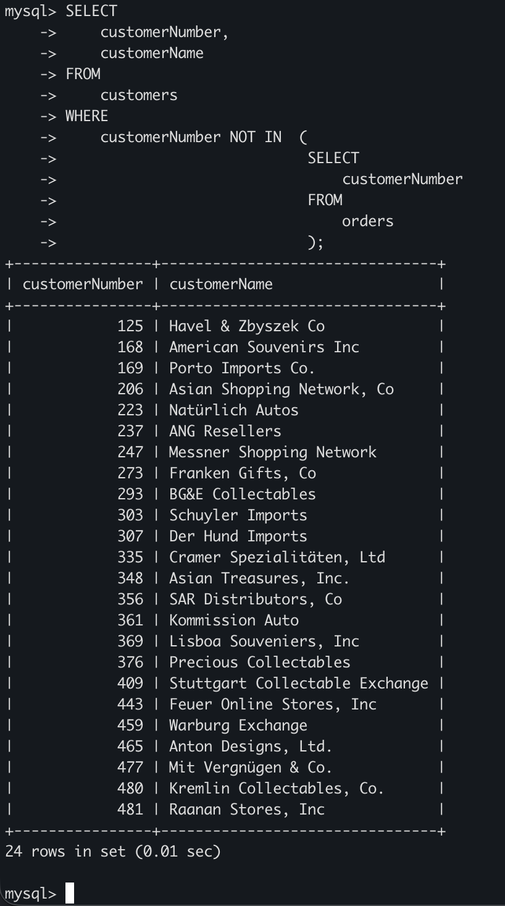
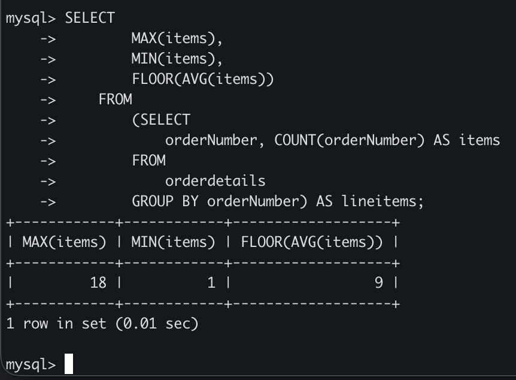
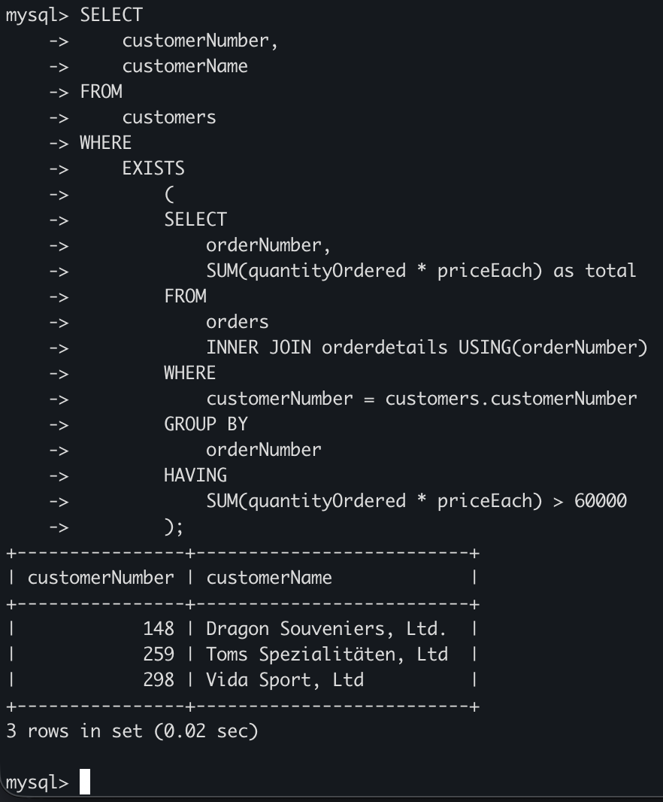

# MySQL Subquery
## Introduction
- Trong MySQL, subquery là một truy vấn lồng bên trong một truy vấn khác, chẳng hạn như SELECT, INSERT, UPDATE hoặc DELETE. Ngoài ra, một subquery có thể lồng trong một subquery khác.

## Subquery trong WHERE
### Subquery với toán tử so sánh
- Lấy khách hàng có khoản thanh toán cao nhất

    ```sql
    SELECT 
        customerNumber, 
        checkNumber, 
        amount
    FROM
        payments
    WHERE
        amount = (
                SELECT 
                    MAX(amount)
                FROM 
                    payments
                );
    ```

    

### Subquery với toàn tử IN và NOT IN
- Tìm khách hàng chưa đặt đơn hàng nào:

    ```sql
    SELECT 
        customerNumber, 
        customerName
    FROM 
        customers
    WHERE
        customerNumber NOT IN  (
                                SELECT 
                                    customerNumber
                                FROM 
                                    orders
                                );
    ```

    

## Subquery trong FROM
- Khi dùng subquery trong FROM, kết quả trả về được coi như một bảng tạm thời

- Tìm giá trị MAX, MIN, AVG số mặt hàng trong đơn hàng:

    ```sql
    SELECT 
        MAX(items), 
        MIN(items), 
        FLOOR(AVG(items))
    FROM
        (SELECT 
            orderNumber, COUNT(orderNumber) AS items
        FROM
            orderdetails
        GROUP BY orderNumber) AS lineitems;
    ```

    

## Subquery với EXISTS / NOT EXISTS
- Subquery với EXISTS trả về TRUE nếu có ít nhất một dòng, ngược lại trả về FALSE.
- Tìm khách hàng có ít nhất 1 đơn hàng > 60000

    ```sql
    SELECT 
        customerNumber,
        customerName
    FROM
        customers
    WHERE
        EXISTS
            (
            SELECT 
                orderNumber,
                SUM(quantityOrdered * priceEach) as total
            FROM 
                orders
                INNER JOIN orderdetails USING(orderNumber)
            WHERE
                customerNumber = customers.customerNumber
            GROUP BY 
                orderNumber
            HAVING 
                SUM(quantityOrdered * priceEach) > 60000
            );
    ```

    