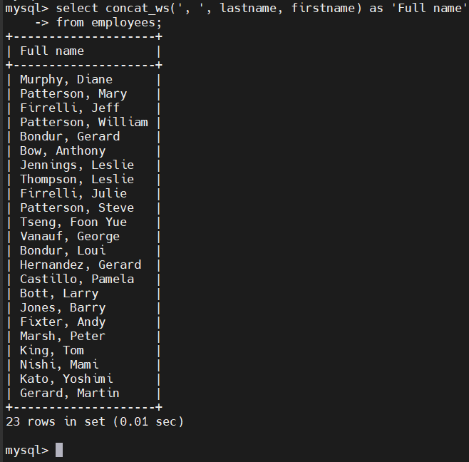
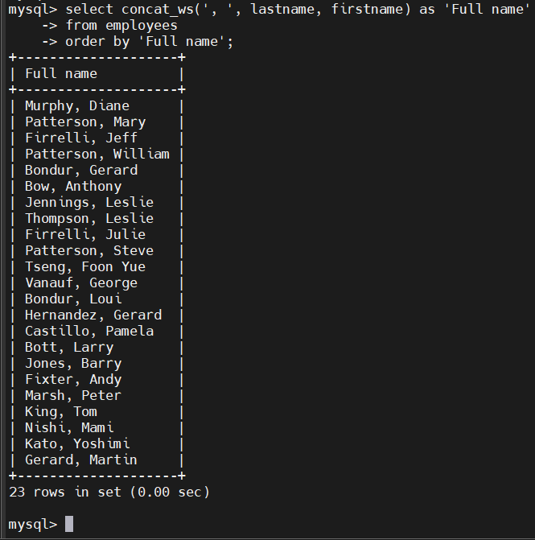
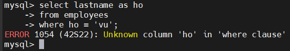
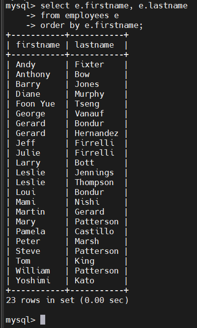

# MySQL ALIASES
## Column Aliases
- Trong MySQL, bạn dùng bí danh cột để gán một tên tạm thời cho một cột trong tập kết quả của truy vấn.
- Cú pháp:

  ```sql
  SELECT 
    [column_1 | expression] AS descriptive_name
  FROM table_name;
  ```

- Nếu bí danh có chứa dấu cách ta phải đặt trong dấu nháy: `'descriptive_name'`

  

- Dùng bí danh cho `ORDER BY`:

  

- **NOTE**: Ta không được dùng bí danh trong `WHERE`, vì khi MySQL đánh giá WHERE, các giá trị trong SELECT chưa được xử lý!!!

  

## Table Aliases

- Tương tự bí danh cột, bạn có thể gán tên tạm thời cho bảng bằng bí danh bảng.
- Cú pháp:

  ```sql
  table_name AS table_alias
  ```

- Sau khi gán bí danh, bạn có thể tham chiếu đến cột bằng cú pháp:

  ```sql
  table_alias.column_name
  ``` 

  