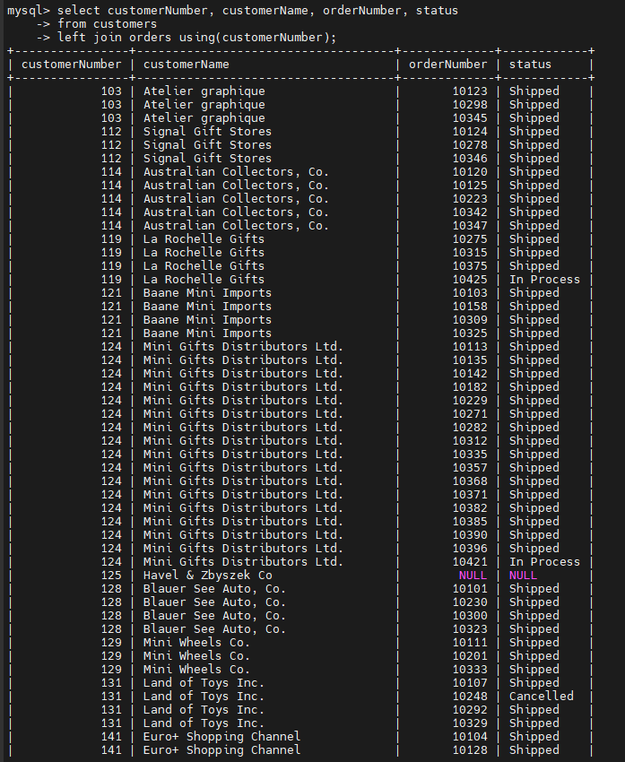
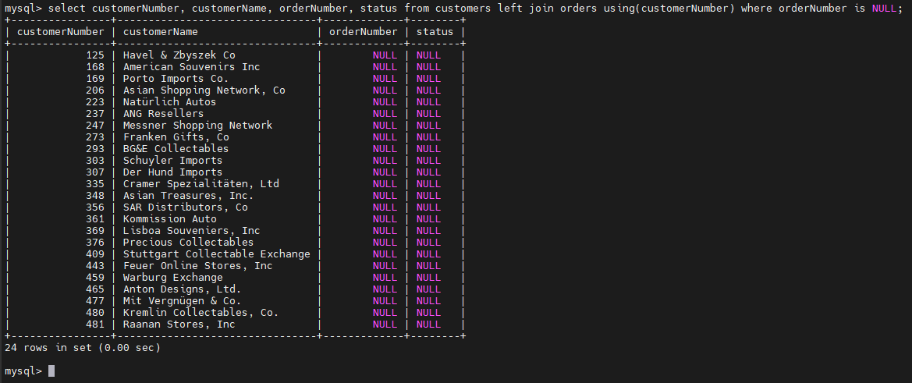
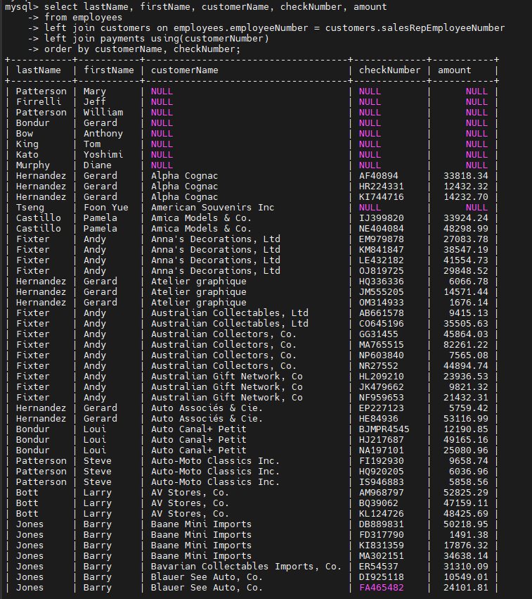

# MySQL LEFT JOIN
## MySQL LEFT JOIN examples
### LEFT JOIN nối 2 bảng
- Xem hai bảng `customers` và `orders` trong cơ sở dữ liệu mẫu.

- Mỗi khách hàng có thể có 0 hoặc nhiều đơn hàng, trong khi mỗi đơn hàng phải thuộc về một khách hàng.

- Câu truy vấn sau sử dụng `LEFT JOIN` để tìm tất cả khách hàng và các đơn hàng tương ứng của họ:

  

- **NOTE**: Nếu dùng INNER JOIN -> ta chỉ nhận được những khách hàng có ít nhất 1 đơn hàng

### LEFT JOIN tìm hàng không khớp(unmatched rows)
- `LEFT JOIN` rất hữu ích khi bạn muốn tìm các hàng trong một bảng không có hàng tương ứng ở bảng khác.

- Ví dụ sau dùng `LEFT JOIN` để tìm khách hàng không có bất kỳ đơn hàng nào:

  

### LEFT JOIN nối 3 bảng
- Xem ba bảng: `employees`, `customers`, và `payments`.

- Ví dụ sau dùng hai mệnh đề `LEFT JOIN` để nối cả hai bảng `customers` và `payments` với `employees`:

  