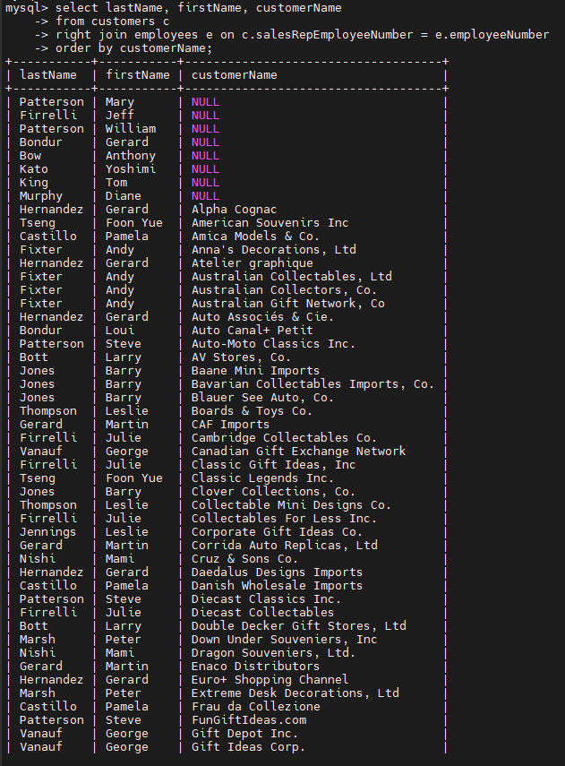
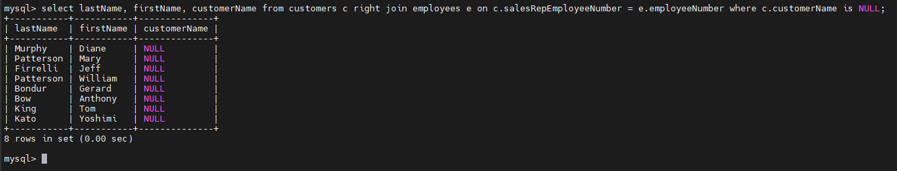

# MySQL RIGHT JOIN
## MySQL RIGHT JOIN clause examples
- Chúng ta sẽ sử dụng bảng `employees` và `customers` từ cơ sở dữ liệu mẫu để minh họa:

- Cột `salesRepEmployeeNumber` trong bảng `customers` liên kết với cột `employeeNumber` trong bảng `employees`.

- Một nhân viên kinh doanh (`sales representative`), tức một `employee`, có thể phụ trách 0 hoặc nhiều khách hàng.
- Và mỗi khách hàng được chăm sóc bởi tối đa 1 nhân viên kinh doanh.

- Nếu giá trị của `salesRepEmployeeNumber` là `NULL`, nghĩa là khách hàng không có nhân viên kinh doanh phụ trách.

### Xem nhân viên này tư vấn cho khách hàng nào

### Find unmatching rows
- RIGHT JOIN để tìm các nhân viên không phụ trách bất kỳ khách hàng nào:

  
