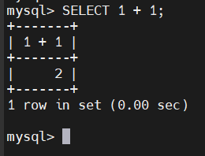
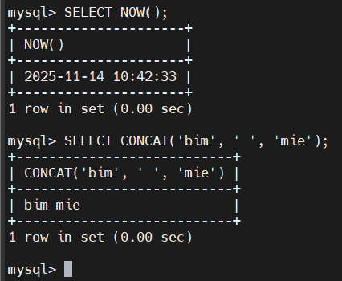
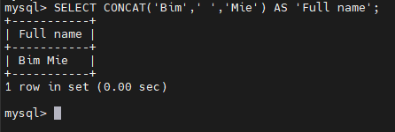

# MySQL SELECT
- Cú pháp cơ bản: 
  ```sql
  SELECT select_list
  FROM table_name;
  ```

- SELECT không cần FROM:
  - MySQL cho phép chạy SELECT không có FROM:

    ```sql
    SELECT 1 + 1;
    ```

    -> Dùng để tính toán, chạy hàm, xử lý biểu thức.

    

- Dùng hàm trong SELECT:
  - MySQL có nhiều hàm built-in như:
    - `NOW()`: trả về ngày giờ hiện tại
    - `CONCAT()`: nối chuỗi

  ```sql
  SELECT NOW();
  SELECT CONCAT('Bim', ' ', 'mie');
  ```

  

- Alias(bí danh cột):
  - Dùng `AS` để đặt tên cột dễ đọc hơn:

    ```sql
    SELECT expression AS column_alias;
    ```

  - Hoặc có thể bỏ `AS`:

    ```sql
    SELECT expression column_alias;
    ``` 

  - Nếu alias có dấu cách, phải dùng dấu nháy: 

    ```sql
    SELECT CONCAT('Bim',' ','Mie') AS 'Full name';
    ```

    