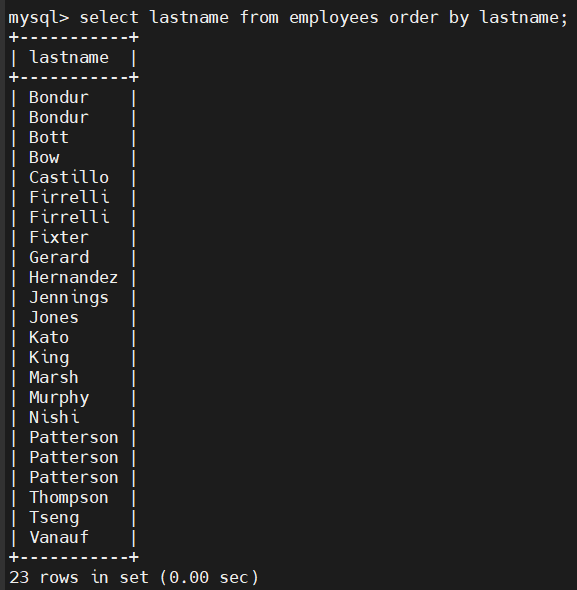
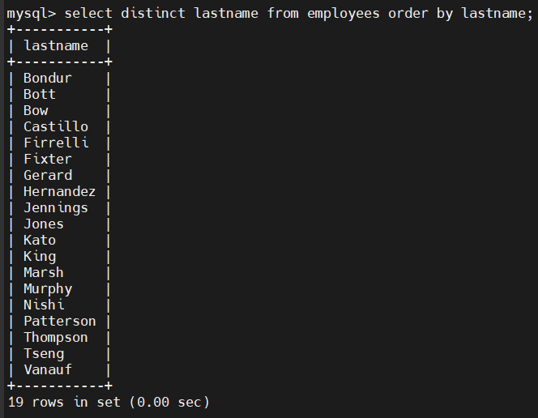
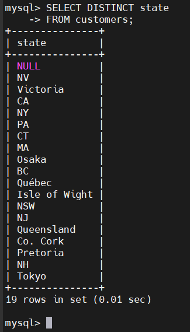
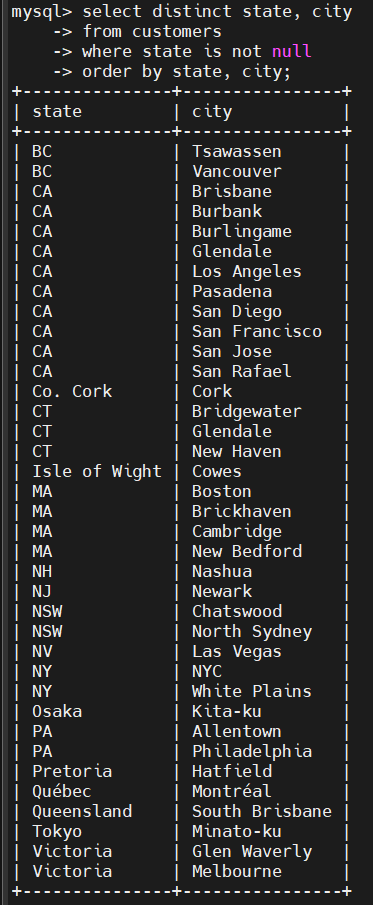
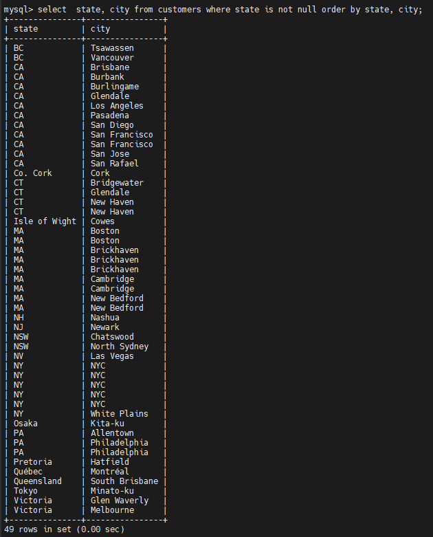

# MySQL DISTINCT
- Để loại bỏ các dòng trùng lặp ta sử dụng DISTINCT trong câu lệnh SELECT
- Cú pháp:

  ```sql
  SELECT DISTINCT 
    select_list
  FROM
    table_name
  ...
  ```

- Nếu chỉ chỉ định 1 cột, DISTINCT sẽ kiểm tra tính duy nhất dựa trên giá trị cột đó.
- Nếu chỉ định 2 cột trở lên, DISTINCT sẽ sử dụng tổ hợp giá trị của tất cả các cột để xác định tính duy nhất của mỗi hàng.
- Khi thực thi câu lệnh SELECT với DISTINCT, MySQL đánh giá mệnh đề DISTINCT sau FROM, WHERE và SELECT, và trước ORDER BY.

## Examples
- Chọn tất cả họ từ bảng employees:

  

- Chọn họ duy nhất bằng DISTINCT

  

## MySQL DISTINCT và NULL
- Khi dùng DISTINCT với cột có chứa giá trị NULL, MySQL chỉ giữ một NULL duy nhất, vì tất cả các NULL là giống nhau

- Ví dụ: cột `state` trong bảng `customers` có chứa giá trị NULL

  

## MySQL DISTINCT với nhiều cột
- Lấy danh sách duy nhất của cặp `state` và `city` từ bảng `customers`:

  ```sql
  SELECT DISTINCT
    state, city
  FROM
    customers
  WHERE 
    state IS NOT NULL
  ORDER BY
    state,
    city;
  ```

  


  - Nếu không dùng DISTINCT, bạn sẽ nhận được các cặp state–city trùng lặp, ví dụ:

    - CA – San Francisco (xuất hiện nhiều lần)

    - MA – Boston (xuất hiện nhiều lần)

  