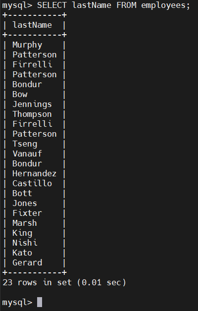
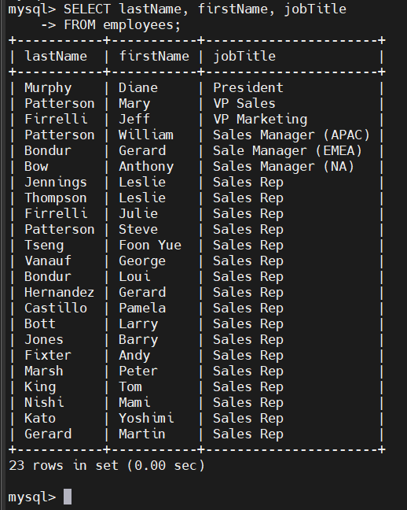

# MySQL SELECT FROM
- `SELECT` dùng để truy vấn dữ liệu từ một hoặc nhiều bảng.

- Cú pháp cơ bản:

  ```sql
  SELECT column_list
  FROM table_name;
  ```

- `column_list`: danh sách các cột muốn lấy, ngăn cách bằng dấu phẩy.

- `table_name`: tên bảng chứa dữ liệu.

- Dấu `;`: tùy chọn, nhưng cần thiết nếu có nhiều câu lệnh.

- Từ khóa SQL (SELECT, FROM…) thường viết chữ in hoa, nhưng không bắt buộc, vì SQL không phân biệt hoa–thường.

- Khi chạy câu lệnh:

  - MySQL xử lý `FROM` trước, xác định bảng → sau đó mới `SELECT` các cột.

## Ví dụ

### 1. Sử dụng câu lệnh `SELECT FROM` để lấy dữ liệu từ một ví dụ về cột duy nhất

- sử dụng câu lệnh `SELECT FROM` để lấy họ của tất cả nhân viên:

  ```sql
  SELECT lastName
  FROM employees;
  ```

  

### 2. Sử dụng `SELECT FROM` để truy vấn dữ liệu từ nhiều cột

- sử dụng `SELECT FROM` để lấy tên, họ và chức danh của nhân viên

  ```sql
  SELECT firstName, lastName, jobTitle
  FROM employees;
  ```

  

### 3. Sử dụng `SELECT FROM` để lấy dữ liệu từ tất cả các cột

- Nếu bạn muốn chọn dữ liệu từ tất cả các cột của employees, bạn có thể chỉ định tất cả tên cột khi `SELECT`:

  ```sql
  SELECT employeeNumber,
         lastName,
         firstName,
         extension,
         email,
         officeCode,
         reportsTo,
         jobTitle
  FROM   employees; 
  ```
- Ta có thể dùng `*` - ký hiệu thay thế cho tất cả các cột:

  ```sql
  SELECT * FROM employees;
  ```

  