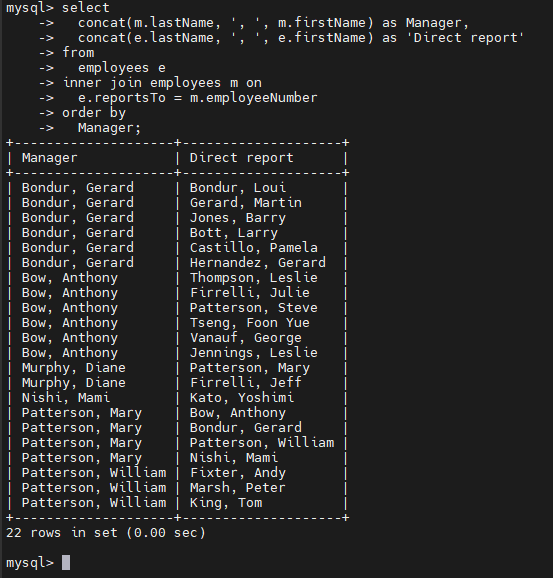
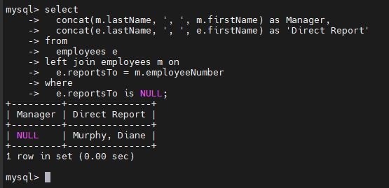
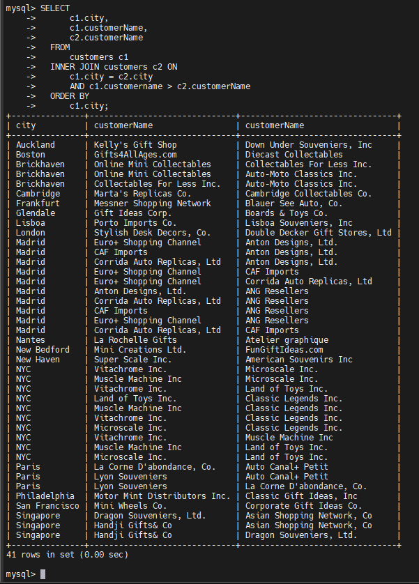

# MySQL Self Join
## Introduction
- Self join cho phép ta join 1 bảng với chính nó
- Vì MySQL không có cú pháp self join riêng, bạn cần thực hiện self join thông qua một join thông thường như LEFT JOIN hoặc INNER JOIN.
- Để thực hiện self join, bạn làm theo các bước sau:
  - Alias một bảng: Gán cho mỗi lần sử dụng bảng một bí danh khác nhau để phân biệt chúng.

  - Chỉ định điều kiện join: Định nghĩa cách các dòng từ từng phiên bản của bảng sẽ được so sánh. Trong self join, bạn thường so sánh các giá trị ở các cột trong cùng một bảng.

  - Chọn các cột cần thiết: Chỉ định những cột bạn muốn đưa vào kết quả cuối cùng.

## Examples
- Chúng ta sẽ sử dụng bảng `employees` từ cơ sở dữ liệu mẫu.

- Bảng `employees` không chỉ lưu thông tin nhân viên mà còn lưu cả cấu trúc tổ chức.
- Nó dùng cột `reportsTo` để xác định ID của người quản lý (`manager`) của một nhân viên.

### Self join bằng INNER JOIN
- Thực hiện self join trên bảng employees, dùng cột `employeeNumber` và `reportsTo` để xem cấu trúc:

  ```sql
  SELECT 
      CONCAT(m.lastName, ', ', m.firstName) AS Manager,
      CONCAT(e.lastName, ', ', e.firstName) AS 'Direct report'
  FROM
      employees e
  INNER JOIN employees m ON 
      m.employeeNumber = e.reportsTo
  ORDER BY 
      Manager;
  ```

  

### Self join bằng LEFT JOIN
- Tìm những nhân viên không có quản lý:

  

  -> Tìm ra được top manager

### So sánh các dòng liền kề trong cùng bảng
- hiển thị danh sách các khách hàng sống trong cùng một thành phố, bằng cách join bảng `customers` với chính nó:

  ```sql
  SELECT 
      c1.city, 
      c1.customerName, 
      c2.customerName
  FROM
      customers c1
  INNER JOIN customers c2 ON 
      c1.city = c2.city
      AND c1.customername > c2.customerName
  ORDER BY 
      c1.city;
  ```

  