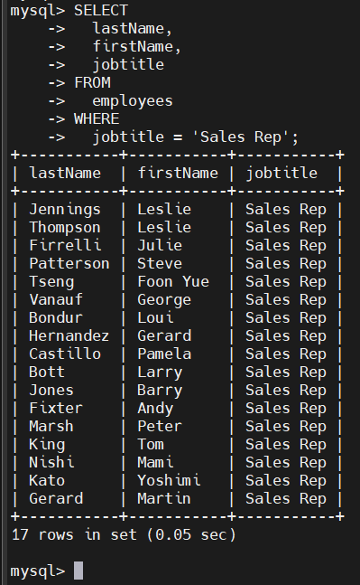
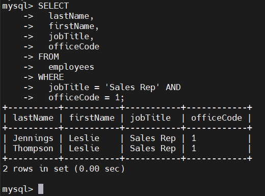
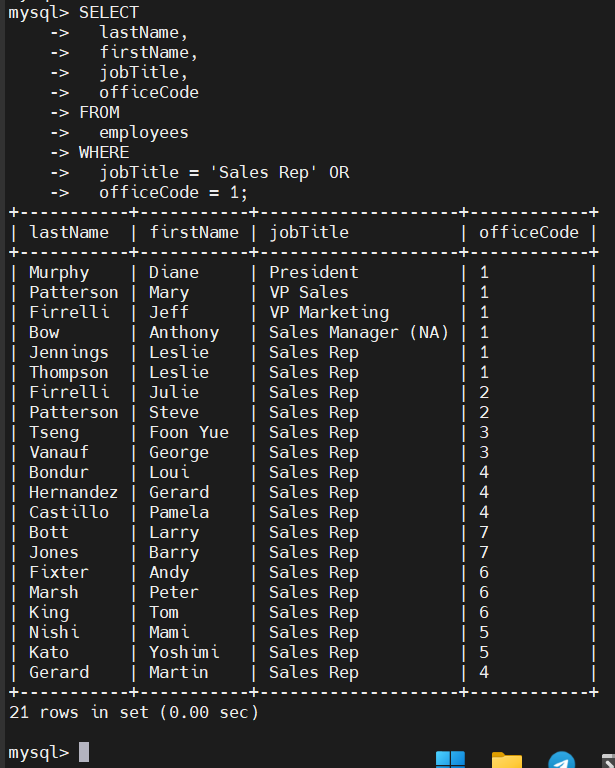
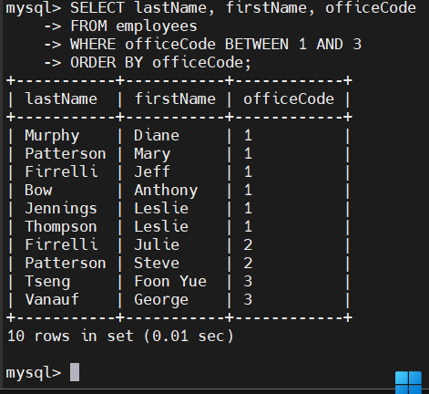
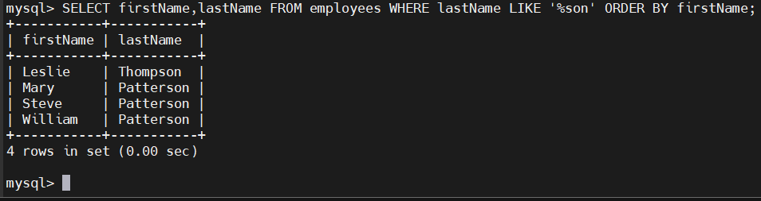
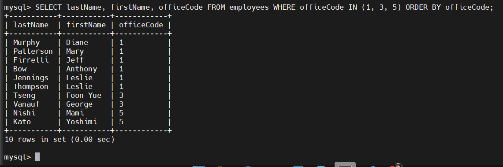
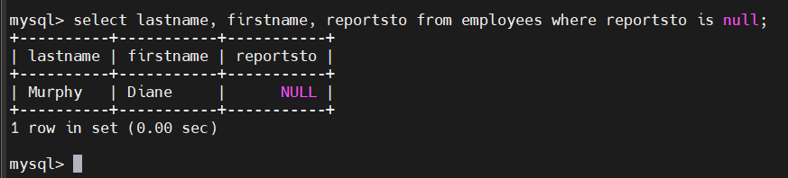
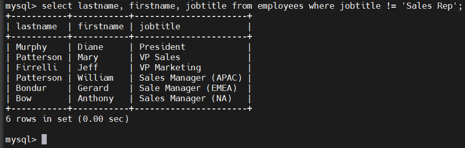
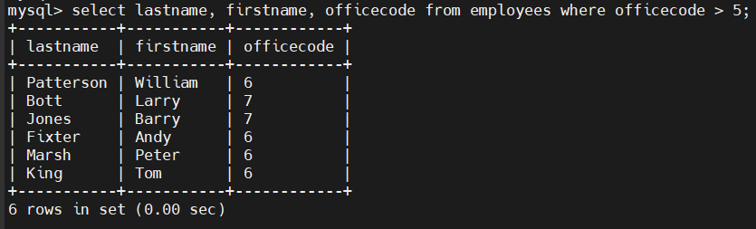

# MySQL WHERE
## Introduction
- WHERE cho phép chỉ định 1 điều kiện tìm kiếm cho các hàng được trả về bởi 1 truy vấn
- Cú pháp:

  ```sql
  SELECT
    select_list
  FROM
    table_name
  WHERE
    search_condition;
  ```

- `search_condition` là sự kết hợp của 1 hoặc nhiều biểu thức sử dụng các toán tử logic AND, OR, NOT.
- SELECT trả về bất kì hàng nào thỏa mãn `search_condition`
- Khi sử dụng SELECT với mệnh đề WHERE, MySQL sẽ đánh giá mệnh đề WHERE sau mệnh đề FROM và trước các mệnh đề SELECT và ORDER BY

## Examples
### WHERE với toàn tử `=`
- Tìm tất cả nhân viên có chức danh là `Sales Rep`:

  ```sql
  SELECT
    lastName,
    firstName,
    jobtitle
  FROM 
    employees
  WHERE
    jobtitle = 'Sales Rep';
  ```

  

### WHERE với toán tử `AND`
- Tìm nhân viên có chức danh là `Sales Rep` và mã văn phòng (`officeCode`) là `1`:

  ```sql
  SELECT
    lastName, 
    firstName, 
    jobTitle,
    officeCode
  FROM 
    employees
  WHERE
    jobTitle = 'Sales Rep' AND
    officeCode = 1;
  ```

  

### WHERE với toán tử `OR`
- Tìm nhân viên có chức danh là `Sales Rep` hoặc có mã văn phòng là `1`:

  ```sql
  SELECT
    lastName,
    firstName,
    jobTitle,
    officeCode
  FROM
    employees
  WHERE
    jobTitle = 'Sales Rep' OR
    officeCode = 1;
  ```

  

### WHERE với toán tử `BETWEEN`
- Toán tử BETWEEN trả về TRUE nếu giá trị nằm trong một khoảng:

  ```sql
  expression BETWEEN low AND high
  ```

- Tìm nhân viên có mã văn phòng từ 1 -> 3

  ```sql
  SELECT 
    firstName, 
    lastNane,
    officeCode
  FROM 
    employees
  WHERE
    officeCode BETWEEN 1 AND 3
  ORDER BY 
    officeCode;
  ```

  

### WHERE với toán tử `LIKE`
- Toán tử LIKE xác định TRUE nếu giá trị khớp với mẫu pattern:
  - `%` khớp với chuỗi bất kì (kể cả rỗng)
  - `_` khớp với đúng một kí tự

- Tìm nhân viên có họ kết thúc bằng `son`:

  ```sql
  SELECT 
    lastName,
    firstName
  FROM 
    employees
  WHERE 
    lastName LIKE '%son'
  ORDER BY firstName;
  ```

  

### WHERE với toán tử `IN`
- Toán tử IN trả về TRUE nếu giá trị khớp với một giá trị trong danh sách:

  ```sql
  value IN (value1, value2, ...)
  ```

- Tìm nhân viên có mã văn phòng thuộc các giá trị 1, 3, hoặc 5:

  ```sql
  SELECT 
    lastName,
    firstName,
    officeCode
  FROM 
    employees
  WHERE
    officeCode IN (1, 3, 5)
  ORDER BY 
    officeCode;
  ```

  

### WHERE với toán tử `IS NULL`
- Để kiêm tra giá trị là NULL hay không

  ```sql
  value IS NULL
  ```

- Tìm nhân viên có giá trị `reportsTo` là NULL:

  ```sql
  SELECT 
    lastName,
    firstName,
    reportsTo
  FROM
    employee
  WHERE reportsTo IS NULL;
  ```

  

### WHERE với các toán tử só sánh
- Các toán tử so sánh:

  | Toán tử    | Ý nghĩa           |
  | ---------- | ----------------- |
  | =          | Bằng              |
  | <> hoặc != | Không bằng        |
  | <          | Nhỏ hơn           |
  | >          | Lớn hơn           |
  | <=         | Nhỏ hơn hoặc bằng |
  | >=         | Lớn hơn hoặc bằng |

- Tìm nhân viên không phải `Sales Rep`:
  
  ```sql
  SELECT 
    lastName,
    firstName,
    jobTitle
  FROM 
    employees
  WHERE 
    jobTitle <> 'Sales Rep';
  ```

  

- Tìm nhân viên có mã văn phòng > 5:

  ```sql
  SELECT
    lastName,
    firstName,
    officeCode
  FROM
    employees
  WHERE
    officeCode > 5;
  ```

  