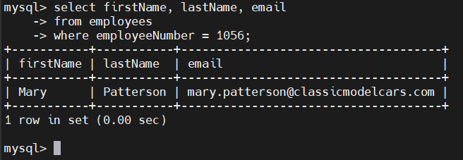
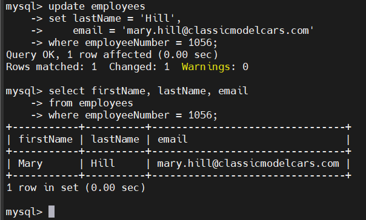
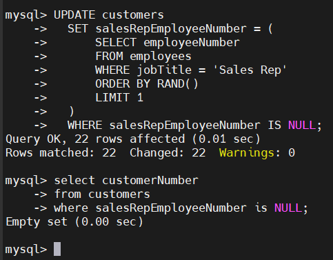

# MySQL UPDATE
## Introduction
- UPDATE dùng để cập nhật dữ liệu trong 1 bảng
- Có thể thay đổi giá trị của 1 cột hoặc nhiều cột trong 1 hoặc nhiều bảng

- Cú pháp:

  ```sql
  UPDATE [LOW_PRIORITY] [IGNORE] table_name
  SET 
    column_name1 = expr1, 
    column_name2 = expr2,
    ...
  [WHERE CONDITION];
  ```

  - `UPDATE table_name`
    - Xác định bảng cần cập nhật dữ liệu.
  - `SET column_name = expr`
    - Liệt kê các cột cần cập nhật và giá trị mới.
    - Bạn có thể cập nhật nhiều cột bằng cách dùng dấu phẩy để phân tách.
    - Giá trị mới có thể là giá trị cố định, biểu thức hoặc `subquery`.
  - `WHERE condition` (tùy chọn)
    - Xác định các hàng sẽ được cập nhật.
    -  Nếu bỏ `WHERE`, tất cả các hàng trong bảng sẽ bị cập nhật.
- Các OPTION đặc biệt:

  - `LOW_PRIORITY`: Hướng dẫn MySQL trì hoãn cập nhật cho đến khi không có kết nối nào đang đọc dữ liệu từ bảng
  - `IGNORE`: Cho phép MySQL tiếp tục cập nhật các hàng khác ngay cả khi có lỗi xảy ra.
  
## Examples
### Cập nhật giá trị của 1 cột

```sql
UPDATE employees
SET email = 'mary.patterson@classicmodelcars.com'
WHERE employeeNumber = 1056;
```

  

### Cập nhật nhiều cột cùng lúc
```sql
UPDATE employees
SET lastname = 'Hill',
    email = 'mary.hill@classicmodelcars.com'
WHERE employeeNumber = 1056;
```




### Cập nhật bằng hàm REPLACE
- Thay đổi domain email của tất cả Sales Reps có `officeCode = 6`:

  ```sql
  UPDATE employees
  SET email = REPLACE(email,'@classicmodelcars.com','@mysqltutorial.org')
  WHERE jobTitle = 'Sales Rep'
    AND officeCode = 6;
  ```

### Cập nhật dựa trên kết quả SELECT
- Giả sử trong bảng `customers`, 1 số khách hàng vẫn chưa có nhân viên đại diện nào (`salesRepEmployeeNumberr` là NULL)
- Lấy 1 nhân viên ngẫu nhiên:

  ```sql
  SELECT employeeNumber
  FROM employees
  WHERE jobTitle = 'Sales Rep'
  ORDER BY RAND()
  LIMIT 1;
  ```

- Cập nhật cho khách hàng chưa có nhân viên đại diện:

  ```sql
  UPDATE customers
  SET salesRepEmployeeNumber = (
      SELECT employeeNumber
      FROM employees
      WHERE jobTitle = 'Sales Rep'
      ORDER BY RAND()
      LIMIT 1
  )
  WHERE salesRepEmployeeNumber IS NULL;
  ```

- Kiểm tra lại:

  