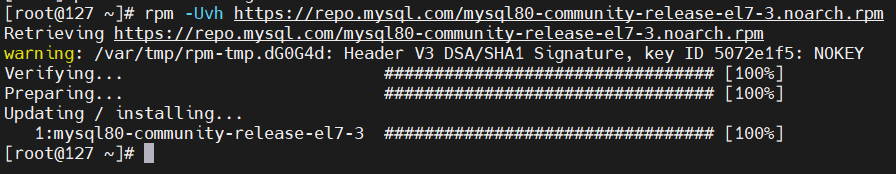
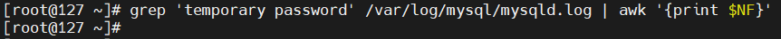
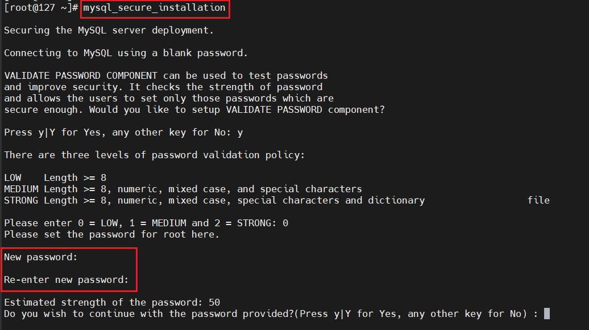
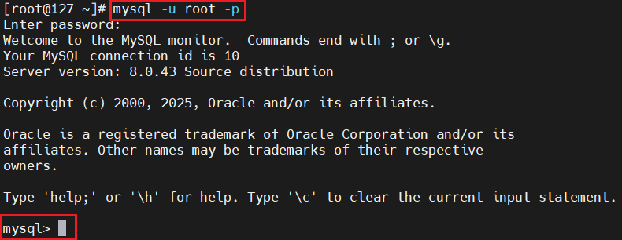
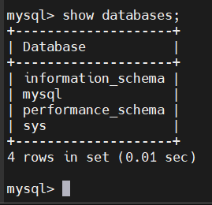

# Install MySQL on Rocky9

## Bước 1: Add the MySQL Yum Repository

  ```bash
  sudo rpm -Uvh https://repo.mysql.com/mysql80-community-release-el7-3.noarch.rpm
  ```

  

## Bước 2: Tải GPG key chính thức của MySQL (dùng để xác thực gói MySQL khi cài đặt)

  ```bash
  sudo rpm --import https://repo.mysql.com/RPM-GPG-KEY-mysql
  ```

## Bước 3: Install MySQL 8 Community Server

  ```bash
  sudo yum install mysql-server
  ```

- **NOTE**: Khi cài có thể bị lỗi:

  ```bash
  [root@127 ~]# yum install mysql-server
  MySQL 8.0 Community Server                                                                                                     4.6 MB/s | 4.4 MB     00:00
  MySQL Connectors Community                                                                                                     414 kB/s |  89 kB     00:00
  MySQL Tools Community                                                                                                          3.4 MB/s | 1.8 MB     00:00
  Rocky Linux 9 - BaseOS                                                                                                         4.1 kB/s | 4.1 kB     00:00
  Rocky Linux 9 - AppStream                                                                                                      3.3 kB/s | 4.5 kB     00:01
  Rocky Linux 9 - Extras                                                                                                         1.9 kB/s | 2.9 kB     00:01
  Error:
  Problem: cannot install the best candidate for the job
    - nothing provides libcrypto.so.10()(64bit) needed by mysql-community-server-8.0.44-1.el7.x86_64 from mysql80-community
    - nothing provides libcrypto.so.10(libcrypto.so.10)(64bit) needed by mysql-community-server-8.0.44-1.el7.x86_64 from mysql80-community
    - nothing provides libssl.so.10()(64bit) needed by mysql-community-server-8.0.44-1.el7.x86_64 from mysql80-community
    - nothing provides libssl.so.10(libssl.so.10)(64bit) needed by mysql-community-server-8.0.44-1.el7.x86_64 from mysql80-community
    - nothing provides libcrypto.so.10(OPENSSL_1.0.2)(64bit) needed by mysql-community-server-8.0.44-1.el7.x86_64 from mysql80-community
  (try to add '--skip-broken' to skip uninstallable packages or '--nobest' to use not only best candidate packages)
  ```

  - Lý do: MySQL đang cài đặt (8.0.44-1.el7) yêu cầu thư viện OpenSSL cũ (libcrypto.so.10 / libssl.so.10), trong khi Rocky Linux 9 sử dụng OpenSSL 3 nên không còn các thư viện này.
  - Cách khắc phục: 
    - Có thể tải gói MySQL chính thức cho Rocky9:

      ```bash
      # Truy cập MySQL Yum Repository:
      sudo dnf install https://dev.mysql.com/get/mysql80-community-release-el9-1.noarch.rpm

      # Kích hoạt repository MySQL 8.0:
      sudo dnf config-manager --disable mysql57-community
      sudo dnf config-manager --enable mysql80-community
      
      # Cài đặt MySQL Server:
      sudo dnf install mysql-community-server
      ```

    - Cách tạm thời: Thêm `--nobest` để cài gói không hoàn toàn tương thích:

      ```bash
      sudo yum install mysql-server --nobest
      ```

## Bước 4: Start MySQL service

  ```bash
  sudo systemctl start mysqld
  sudo systemctl enable mysqld
  ```

## Bước 5: Xem mật khẩu default của user root

- Khi cài đặt `MySQL 8.0`, tài khoản `root` sẽ được cấp một mật khẩu tạm thời. Để hiển thị mật khẩu của tài khoản `root`, sử dụng lệnh sau:

  ```bash
  sudo grep 'temporary password' /var/log/mysql/mysqld.log | awk '{print $NF}'
  ```

  - `grep 'temporary password' /var/log/mysql/mysqld.log`: Tìm dòng chứa chuỗi “temporary password” trong file log của MySQL (`/var/log/mysql/mysqld.log`).
  - `awk '{print $NF}'`: `awk` là công cụ xử lý văn bản cột theo dấu cách(space), `$NF` là trường cuối cùng (Last Field) của dòng hiện tại: mk tạm thời của root.

  

  - Ở đây khi mới khởi tạo thì user root tạm thời chưa có mật khẩu

## Bước 6: MySQL Secure Installation

```bash
mysql_secure_installation
```

  

  - Nhập mk mới cho root ở đây 

## Bước 7: Connect to MySQL

```bash
mysql -u root -p
```



- Sử dụng `SHOW DATABASES` để xem tất cả db trong server hiện tại:

  ```sql
  mysql> show databases;
  ```

  