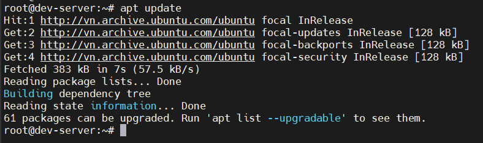
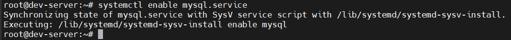
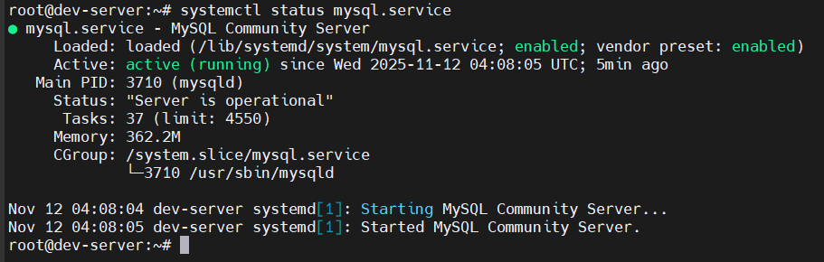
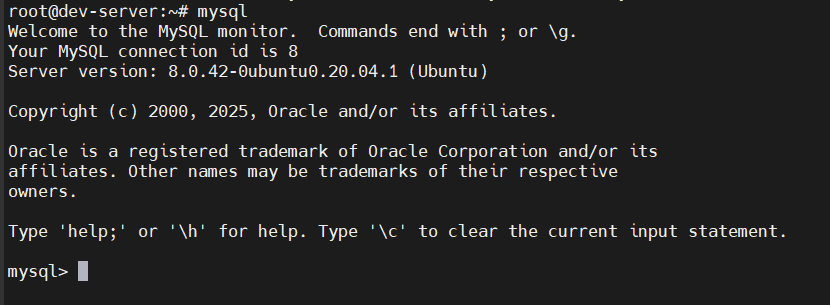
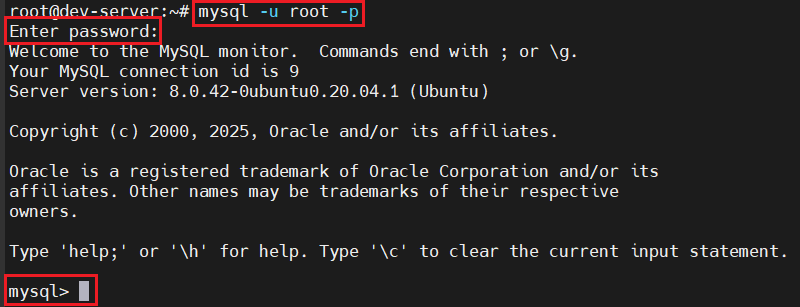

# Install MySQL on Ubuntu
## Bước 1: Update APT Package List
- Đảm bảo có thông tin mới nhất về các gói có sẵn

  ```bash
  sudo apt update
  ```

  

## Bước 2: Tải MySQL server

  ```bash
  sudo apt install mysql-server
  ```

## Bước 3: Enable MySQL service để tự khởi động khi boot

  ```bash
  sudo systemctl enable mysql.service
  ```

  

## Bước 4: Start MySQL service

  ```bash
  sudo systemctl start mysql.service
  ``` 

## Bước 5: Kiểm tra lại MySQL service xem đã được khởi động chưa


  ```bash
  sudo systemctl status mysql.service
  ```

  

## Bước 6: Đăng nhập vào MySQL và thay đổi mật khẩu của root
- Đầu tiên, đăng nhập vào MySQL server

  ```bash
  sudo mysql
  ```

  

  -> Ta đã vào môi trường dòng lệnh mysql

- Tiếp theo, thay đổi mật khẩu của tài khoản root

  ```sql
  ALTER USER root@localhost 
  IDENTIFIED WITH mysql_native_password  
  BY '<YOUR_PASSWORD>';
  ```

  

- Thoát ra khỏi MySQL database server:

  ```sql
  exit
  ```

- Thử đăng nhập vào máy chủ cơ sở dữ liệu MySQL bằng mật khẩu mới:

  ```bash
  mysql -u root -p
  ```

  

- Đổi mật khẩu thành công, ta exit khỏi mysql client tool

  ```sql
  exit
  ```

## Bước 7: Bảo mật cài đặt SQL

  ```bash
  sudo mysql_secure_installation
  ```

- Lệnh này được sử dụng để tăng cường bảo mật cho MySQL Server sau khi cài đặt. Khi chạy, nó sẽ:
  - Yêu cầu nhập mật khẩu root hiện tại.

  - Đặt/đổi mật khẩu root nếu cần.

  - Loại bỏ các tài khoản người dùng ẩn danh (anonymous users).

  - Tắt truy cập root từ xa (remote root login) để tránh rủi ro bảo mật.

  - Xóa cơ sở dữ liệu test không cần thiết và cho phép mọi người truy cập.

  - Tải lại bản quyền để áp dụng các thay đổi ngay lập tức.
- Trả lời bằng cách nhập `Y/N`