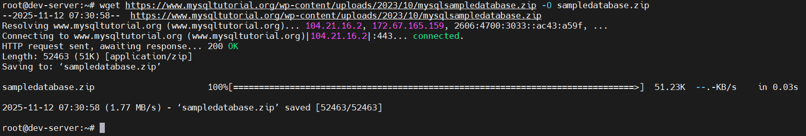
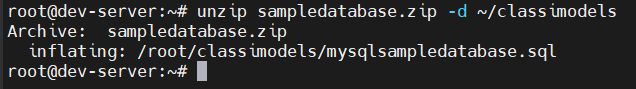
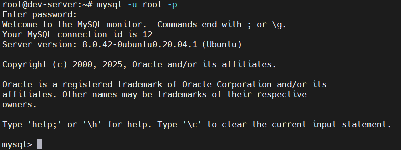
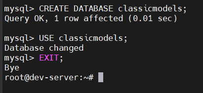
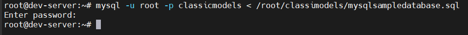

# Load Sample Database into MySQL server
## Bước 1: Tải classimodels database

- Tải file zip chứa database

  ```bash
  wget https://www.mysqltutorial.org/wp-content/uploads/2023/10/mysqlsampledatabase.zip -O sampledatabase.zip
  ```

  

- Giải nén file ZIP:

  ```bash
  unzip sampledatabase.zip -d ~/classimodels
  ``` 

  - `-d ~/classicmodels` sẽ giải nén vào thư mục `classicmodels` trong home.


  

## Bước 2: Connect to the MySQL server 
- Sử dụng `mysql`

  ```bash
  mysql -u root -p
  ```

  - `mysql`: câu lệnh để bắt đầu MySQL client
  - `-u root`: chỉ định user root để kết nối với MySQL server
  - `-p`: cờ nhắc rằng nhập mk của root 

  

## Bước 3: Tạo Database:

```sql
CREATE DATABASE classicmodels;
USE classicmodels
EXIT;
```



## Bước 4: Import dữ liệu vào database



## Bước 5: Kiểm tra 

