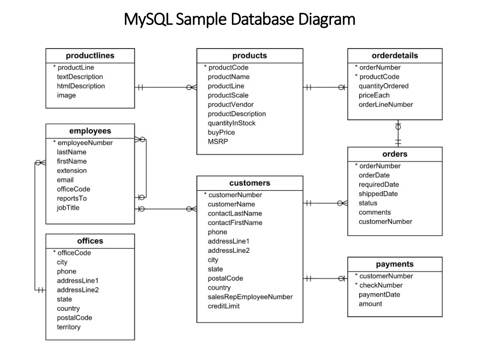

# MySQL Sample Database
- Ta sử dụng `classicmodels` database làm csdl mẫu MySQL 
- `classimodels` là một csdl mẫu mô phỏng một cửa hàng bán mô hình xe cổ. Nó chứa dữ liệu điển hình của 1 doanh nghiệp 

## Download MySQL Sample Database
- Tải file zip chứa database

  ```bash
  wget https://www.mysqltutorial.org/wp-content/uploads/2023/10/mysqlsampledatabase.zip -O sampledatabase.zip
  ```

  

- Giải nén file ZIP:

  ```bash
  unzip sampledatabase.zip -d ~/classimodels
  ``` 

  - `-d ~/classicmodels` sẽ giải nén vào thư mục `classicmodels` trong home.


  

## MySQL Sample Databse Schema

| **Bảng**         | **Chức năng / Nội dung**                                                            |
| ---------------- | ----------------------------------------------------------------------------------- |
| **customers**    | Lưu thông tin khách hàng (tên, địa chỉ, số điện thoại, v.v.)                        |
| **products**     | Danh sách các **mô hình xe hơi thu nhỏ** đang bán                                   |
| **productlines** | Nhóm các sản phẩm theo **dòng sản phẩm** (ví dụ: Classic Cars, Motorcycles, Ships…) |
| **orders**       | Các **đơn đặt hàng** mà khách hàng đã thực hiện                                     |
| **orderdetails** | Chi tiết từng mặt hàng trong mỗi đơn hàng (mối quan hệ 1 đơn hàng – nhiều sản phẩm) |
| **payments**     | Lưu thông tin **các khoản thanh toán** mà khách hàng đã trả                         |
| **employees**    | Dữ liệu **nhân viên**, bao gồm thông tin và quan hệ ai quản lý ai                   |
| **offices**      | Thông tin về **văn phòng / chi nhánh** của công ty                                  |

- Sơ đồ ERD của `classimodels`:

  

- offices:
  - Lưu thông tin văn phòng của công ty
  - Khóa chính(PK): `officeCode`
  - Các cột chính: `city`, `phone`, `addressLine1`, `country`, `territory`
  - Quan hệ:
    - Một office có nhiều employees -> 1:N
- employees:
  - Lưu thông tin nhân viên
  - PK: `employeeNumber`
  - Các cột chính: `lastName`, `firstName`, `email`, `officeCode`, `reportsTo`, `jobTitle`
  - Quan hệ:
    - Mỗi employee làm việc ở 1 office(`officeCode` là FK)
    - 1 nhân viên có thể quản lý nhiều nhân viên khác(`reportTo`)
    - 1 nhân viên có thể bán cho nhiều khách hàng
- customers:
  - Lưu thông tin khách hàng
  - PK: `customerNumber`
  - Các cột: `customerName`, `contactFirstName`, `contactLastName`, `phone`, `salesRepEmployeeNumber`, `creditLimit`
  - Quan hệ:
    - 1 khách hàng có thể do 1 employee phụ trách(`salesRepEmployeeNumber` là FK)
    - 1 khách hàng có thể có nhiều orders và payments -> 1:N
- products:
  - Lưu thông tin các sản phẩm mô hình xe
  - PK: `productCode`
  - Các cột: `productName`, `productLine`, `productSale`, `quantityInStock`, `buyPrice`, `MSRP`
  - Quan hệ:
    - Mỗi product thuộc về 1 productLine
    - 1 product có thể xuất hiện trong nhiều orderdetails -> 1:N
- productlines:
  - Lưu danh mục các dòng sản phẩm:(ví dụ: Classic Cars, Motorcycles, ...)
  - PK: `productLine`
  - Quan hệ:
    - 1 productLine có nhiều products -> 1:N
- orders:
  - Lưu thông tin đơn hàng
  - PK: `orderNumber`
  - Các cột: `orderDate`, `requiredDate`, `shippedDate`, `status`, `customerNumber`
  - Quan hệ: 
    - Mỗi order thuộc về 1 customer(`customerNumber` là FK)
    - 1 order có nhiều orderdetails -> 1:N
- orderdetails:
  - Lưu chi tiết của từng sản phẩm trong đơn hàng
  - PK kép:(`orderNumber`, `productCode`)
  - Các cột: `quantityOrdered`, `priceEach`, `orderLineNumber`
  - Quan hệ: 
    - Thuộc về 1 order và 1 product -> là bảng trung gian giữa `orders` và `products`
- payments:
  - Lưu thông tin thanh toán của khách hàng
  - PK kép:(`customerNumber`, `checkNumber`)
  - Các cột: `paymentDate`, `amount`
  - Quan hệ:
    - 1 customer có thể có nhiều payment -> 1:N