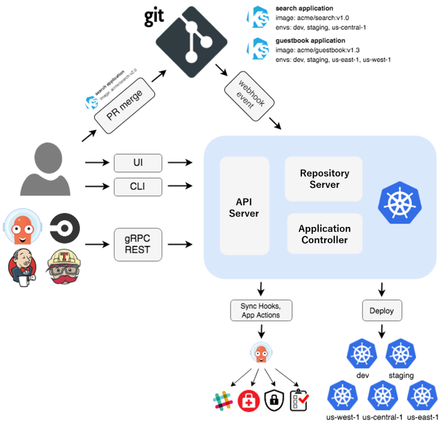

# Tìm hiểu ArgoCD 

## I. ArgoCD là gì ? 

ArgoCD là một công cụ Continuous Delivery dành cho Kubernetes, hoạt động theo mô hình declarative và nguyên tắc GitOps

Nói cách khác, trạng thái mà ứng dụng K8s cần đạt tới được mô tả trong Git, và ArgoCD chịu trách nhiệm theo dõi cũng như đưa trạng thái thực tế của cluster về đúng với trạng thái đã khai báo đó 

## II. Tại sao sử dụng ArgoCD ? 

Các thành phần như: 

- Định nghĩa của aplication
- configuration 
- environment 

nên được xây dựng theo kiểu declarative và được quản lý bằng version control, thông thường là Git 

Quá trình deployment và quản lý vòng đời của aplication cũng nên được tự động hóa, có khả năng kiểm tra/audit, dễ theo dõi và dễ hiểu. Đây chính là vấn đề mà ArgoCD hướng tới giải quyết bằng GitOps 

## III. Getting Started 

### 3.0 Quick Start 

```bash
kubectl create namespace argocd
kubectl apply -n argocd --server-side --force-conflicts -f https://raw.githubusercontent.com/argoproj/argo-cd/stable/manifests/install.yaml
```


## IV. Cách ArgoCD hoạt động 

Argo CD tuân theo mô hình GitOps, trong đó Git repository đóng vai trò là Source of Truth để xác định trạng thái mong muốn (desired state) của application.

Argo CD sẽ so sánh trạng thái đang được khai báo trong Git với trạng thái thực tế đang chạy trên Kubernetes. 

Kubernetes manifest có thể được định nghĩa bằng nhiều cách mà Argo CD hỗ trợ để tạo Kubernetes manifests:

- Kustomize
- Helm Charts
- thư mục chứa các file YAML/JSON thông thường

## V. Kiến trúc ArgoCD 

