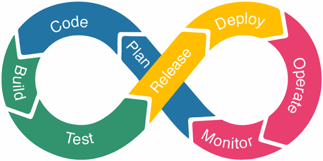

# Mục lục 

- [Mục lục](#mục-lục)
- [Tìm hiểu về DevOps \& CI/CD](#tìm-hiểu-về-devops--cicd)
  - [I. DevOps là gì ?](#i-devops-là-gì-)
  - [II. Vòng đời của DevOps](#ii-vòng-đời-của-devops)
  - [III. CI/CD là gì ?](#iii-cicd-là-gì-)
    - [3.0 CI - Continuous Integration](#30-ci---continuous-integration)
    - [3.1 CD - Continuous Delivery/Deployment](#31-cd---continuous-deliverydeployment)
- [Tài liệu tham khảo](#tài-liệu-tham-khảo)

# Tìm hiểu về DevOps & CI/CD

## I. DevOps là gì ? 

DevOps là mô hình kết hợp giữa hai bộ phận Development(phát triển phần mềm) và Operations(vận hành hệ thống), hướng đến gắn kết đội ngũ lập trình, kiểm thử, vận hành và các bộ phận liên quan trong toàn bộ vòng đời ứng dụng. 

Đây không đơn thuần là một công cụ công nghệ hay một vị trí nhân sự riêng biệt mà là sự kết nối giữa văn hóa cộng tác, quy trình thực hành và công nghệ tự động hóa, giúp doanh nghiệp phát triển, triển khai và vận hành phần mềm nhanh và ổn định hơn.

## II. Vòng đời của DevOps 

- `Plan (lập kế hoạch)`: Xác định yêu cầu, mục tiêu, tính năng cần phát triển 
- `Code (viết mã)`: Lập trình viên phát triển tính năng mới, viết test, review code, đồng thời quản lý mã nguồn bằng Git 
- `Build`: Mã nguồn mới được biên dịch và đóng gói thành bản build hoặc artifact
- `Test`: Hệ thống chạy các bài kiểm thử tự động để đảm bảo tính năng mới không làm ảnh hưởng đến các chức năng hiện có 
- `Release`: Sau khi vượt qua kiểm thử, bản build được đánh dấu là đủ điều kiện phát hành 
- `Deploy`: Phần mềm được đưa lên môi trường staging hoặc production thông qua quy trình tự động hóa để giảm sai sót khi triển khai thủ công 
- `Operate`: Tiếp tục duy trì hệ thống sau triển khai, đảm bảo ứng dụng hoạt động ổn định 
- `Monitor`: Hệ thống được theo dõi liên tục thông qua log, metrics

## III. CI/CD là gì ? 

CI/CD (Continuous Integration/Continuous Delivery - Deployment) là một tập hợp các phương pháp và công cụ giúp tự động hóa quy trình phát triển, kiểm thử và triển khai phần mềm. 

Mục tiêu chính của CI/CD là đẩy nhanh tốc độ phát hành phần mềm, giảm lỗi và nâng cao tính ổn định của các phiên bản phát hành 

### 3.0 CI - Continuous Integration

CI (Continuous Integration) là quá trình liên tục kiểm tra và tích hợp code mới vào dự án. Mục tiêu của CI là đảm bảo bất kỳ thay đổi nào trong code đều được kiểm tra ngay lập tực để phát hiện lỗi trước khi nó gây ảnh hưởng xấu tới hệ thống

### 3.1 CD - Continuous Delivery/Deployment 

- `Continuous Delivery`: Đảm bảo rằng code luôn sẵn sàng để được triển khai bất cứ lúc nào. Sau khi code đã vượt qua các kiểm tra CI, nó được đặt ở trạng thái sẵn sàng để triển khai. Tuy nhiên, việc triển khai cần có tác động thủ công của con người 
- `Continuous Deployment`: Tự động triển khai code ngay khi nó vượt qua các kiểm tra CI. Không cần sự can thiệp thủ công, hệ thống sẽ tự động đưa code vào môi trường

Mục tiêu của CD là giúp việc triển khai và phát hành phần mềm trở nên đễ dàng và có thể diễn ra thường xuyên mà không gặp nhiều rủi ro. Khi CD được thiết lập, mỗi lần comit code, code có thể tự động được triển khai vào các môi trường khác nhau (staging, prod)

# Tài liệu tham khảo 

https://cloud.vnpt.vn/blog/devops-la-gi-414

https://devops.vn/posts/ci-cd-la-gi-huong-dan-tu-a-z-cho-nguoi-moi-bat-dau/