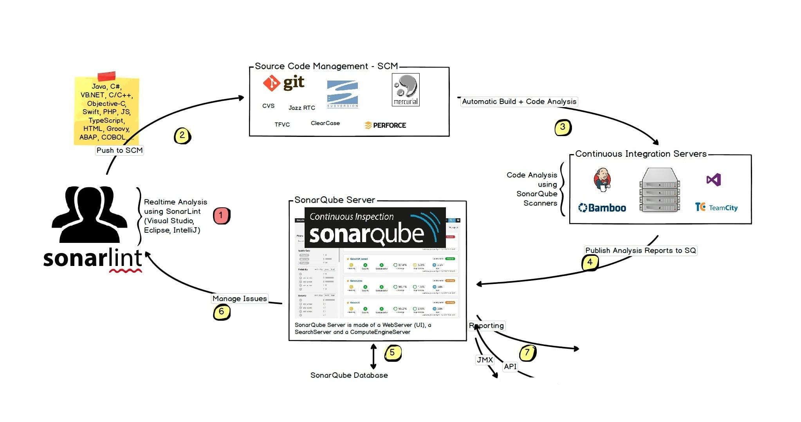

# Mục lục 

- [Mục lục](#mục-lục)
- [Các công cụ CI/CD phổ biến](#các-công-cụ-cicd-phổ-biến)
  - [I. Jenkins](#i-jenkins)
    - [1.0 Tổng quan](#10-tổng-quan)
    - [1.1 Ứng dụng của Jenkins trong phát triển phần mềm](#11-ứng-dụng-của-jenkins-trong-phát-triển-phần-mềm)
    - [1.2 Phạm vi sử dụng](#12-phạm-vi-sử-dụng)
  - [II. GitLab CI](#ii-gitlab-ci)
  - [III. GitHub Actions](#iii-github-actions)
  - [IV. Argo CD](#iv-argo-cd)
    - [4.0 Tổng quan](#40-tổng-quan)
    - [4.1 Ứng dụng của Argo CD](#41-ứng-dụng-của-argo-cd)
  - [V. Flux CD](#v-flux-cd)
  - [VI. Công cụ phân tích bảo mật ứng dụng tĩnh (SAST)](#vi-công-cụ-phân-tích-bảo-mật-ứng-dụng-tĩnh-sast)
    - [6.0 SonarQube](#60-sonarqube)
      - [6.0.0 SonarQube là gì ?](#600-sonarqube-là-gì-)
      - [6.0.1 Sonarqube để làm gì ?](#601-sonarqube-để-làm-gì-)
      - [6.0.2 Sonarqube architecture (workflow)](#602-sonarqube-architecture-workflow)
  - [VII. Secret Scanning](#vii-secret-scanning)
    - [8.0 Gitleaks](#80-gitleaks)
      - [8.0.0 Gitleaks là gì ?](#800-gitleaks-là-gì-)
      - [8.0.1 Gitleaks hoạt động như thế nào ?](#801-gitleaks-hoạt-động-như-thế-nào-)
  - [VIII. SCA \& container scan](#viii-sca--container-scan)
    - [8.0 trivy](#80-trivy)


# Các công cụ CI/CD phổ biến 

## I. Jenkins

### 1.0 Tổng quan

Jenkins là một công cụ tự động hóa mã nguồn mở được sử dụng rộng rãi trong lĩnh vực CI/CD.

Khác với GitHub Actions hoặc GitLab CI được tích hợp trực tiếp với nền tảng quản lý mã nguồn, Jenkins hoạt động như một hệ thống CI/CD độc lập. Jenkins có thể kết nối với nhiều hệ thống quản lý source code như GitHub, GitLab hoặc Bitbucket.

Quy trình CI/CD trong Jenkins thường được định nghĩa thông qua file:

```text
Jenkinsfile
```

### 1.1 Ứng dụng của Jenkins trong phát triển phần mềm

Khi lập trình viên push code lên repository, Git server có thể gửi webhook đến Jenkins. Jenkins tiếp nhận sự kiện và khởi chạy pipeline.

Pipeline có thể thực hiện:

- lấy source code mới nhất;
- cài đặt dependency;
- compile hoặc build chương trình;
- chạy unit test;
- chạy integration test;
- phân tích chất lượng mã nguồn;
- scan lỗ hổng bảo mật;
- build Docker image;
- push image lên Container Registry;
- triển khai ứng dụng lên server hoặc Kubernetes.

Nếu một bước trong pipeline thất bại, Jenkins có thể dừng pipeline và thông báo cho nhóm phát triển.

Điều này giúp phát hiện lỗi ngay từ các giai đoạn đầu của quy trình phát triển.

### 1.2 Phạm vi sử dụng

Jenkins phù hợp với các tổ chức:

- triển khai hệ thống on-premise
- cần khả năng tùy biến pipeline cao
- có nhiều hệ thống legacy
- muốn tự quản lý toàn bộ hạ tầng CI/CD.

## II. GitLab CI

GitLab CI là hệ thống CI/CD được tích hợp trực tiếp trong nền tảng GitLab.

Khi sử dụng GitLab, đội phát triển có thể quản lý source code và CI/CD trên cùng một nền tảng.

Pipeline của GitLab CI được định nghĩa trong file:

```text
.gitlab-ci.yml
```

Một pipeline thường gồm nhiều stage:

```text
Test
 ↓
Build
 ↓
Security Scan
 ↓
Package
 ↓
Deploy
```

Mỗi stage có thể chứa một hoặc nhiều job. Các job được thực thi bởi **GitLab Runner**.

## III. GitHub Actions

GitHub Actions là nền tảng tự động hóa và CI/CD được tích hợp trực tiếp trong GitHub.

Workflow của GitHub Actions thường được đặt trong thư mục:

```text
.github/workflows/
```

Ví dụ:

```text
.github/workflows/ci.yml
```

GitHub Actions hoạt động dựa trên sự kiện. Workflow có thể được kích hoạt khi:

- developer push code;
- tạo Pull Request;
- merge Pull Request;
- tạo release;
- chạy theo lịch;
- chạy thủ công.


## IV. Argo CD

### 4.0 Tổng quan

Argo CD là một công cụ Continuous Delivery dành cho Kubernetes và được xây dựng theo mô hình **GitOps**.

Khác với Jenkins, GitLab CI hay GitHub Actions, Argo CD thường không chịu trách nhiệm compile source code hoặc build Docker image.

Vai trò chính của Argo CD là đảm bảo trạng thái của Kubernetes Cluster khớp với trạng thái được khai báo trong Git.

Ví dụ trong Git:

```yaml
replicas: 3
image: backend:v2
```

Trong khi Kubernetes đang chạy:

```text
replicas: 2
image: backend:v1
```

Argo CD sẽ phát hiện sự khác biệt giữa:

- **Desired State:** trạng thái mong muốn trong Git;
- **Actual State:** trạng thái thực tế trên Kubernetes.

Sau đó Argo CD có thể đồng bộ cluster về trạng thái được khai báo trong Git.

### 4.1 Ứng dụng của Argo CD

Một pipeline phổ biến:

```text
Developer
    ↓
GitHub
    ↓
GitHub Actions
    ↓
Test
    ↓
Build Docker Image
    ↓
Push Container Registry
    ↓
Update GitOps Repository
    ↓
Argo CD
    ↓
Kubernetes
```

Trong kiến trúc này:

- GitHub Actions chịu trách nhiệm CI.
- Argo CD chịu trách nhiệm CD.

Điều này giúp CI Server không cần trực tiếp điều khiển Kubernetes Cluster.

---

## V. Flux CD

Flux CD cũng là một công cụ Continuous Delivery theo mô hình GitOps dành cho Kubernetes.

Nguyên lý hoạt động:

```text
Git Repository
      ↓
Flux CD
      ↓
Kubernetes
```

Flux liên tục kiểm tra trạng thái khai báo trong Git và reconcile trạng thái thực tế của Kubernetes.

Ví dụ Git khai báo:

```yaml
replicas: 3
```

Nếu quản trị viên thực hiện:

```bash
kubectl scale deployment backend --replicas=10
```

trạng thái thực tế trở thành:

```text
replicas = 10
```

Trong khi Git vẫn quy định:

```text
replicas = 3
```

Flux có thể phát hiện sự khác biệt và đưa hệ thống trở về:

```text
replicas = 3
```


## VI. Công cụ phân tích bảo mật ứng dụng tĩnh (SAST) 

Các công cụ này quét mà nguồn để tìm lỗ hổng mà không cần thực thi ứng dụng. Chúng hoạt động ở giai đoạn đầu của SDLC, cung cấp phản hồi nhanh chóng cho nhà phát triển 

### 6.0 SonarQube 

#### 6.0.0 SonarQube là gì ? 

SonarQube là một nền tảng mã nguồn mở được phát triển bởi SonarSource để thực hiện kiểm tra liên tục về chất lượng mã nguồn thông qua việc thực hiện đánh giá tự động bằng phân tích mã nguồn để phát hiện lỗi và các vấn đề về mã nguồn không tốt trên 29 ngôn ngữ lập trình. 

#### 6.0.1 Sonarqube để làm gì ? 

- `Kiểm tra chất lượng mã nguồn`: dùng Sonarqube đánh giá mã nguồn dự án để xác định các vấn đề về sự hiệu quả, tính nhất quán, bảo mật và tính ổn định. Sonarqube cung cấp thông tin chi tiết về các vấn đề này và cách sửa chúng 
- `Tích hợp vào quy trình CICD`: ta hoàn toàn có thể tích hợp sonarqube vào CI/CD để cho quá tình triển khai dự án được an toàn, bảo mật, tối ưu 
- `Bảo mật mã nguồn`: dùng SonarQube kiểm tra các vấn đề về bảo mật mã nguồn, như phát hiện các lỗ hổng bảo mật và cung cấp khuyến nghị về cách sửa chúng.
- `Thống kê và báo cáo`: Cung cấp báo cáo chi tiết về trạng thái chất lượng mã nguồn và tiến độ sửa lỗi, giúp bạn và nhóm phát triển theo dõi và cải thiện chất lượng mã nguồn.
- `Hỗ trợ nhiều ngôn ngữ`

#### 6.0.2 Sonarqube architecture (workflow)



3 thành phần chính: 

- `SonarLint (SonarQube for IDE)`: Phân tích code ngay trong IDE của Dev 
- `SonarScanner`: Công cụ thực hiện phân tích source code trong CI pipeline 
- `SonarQube Server`: Nơi tiếp nhận, xử lý, lưu trữ và hiển thị kết quả phân tích chất lượng code 

Workflow: 

1. Developer viết code và SonarLint kiểm tra

2. Developer Push Code lên SCM 

3. CI server thực hiện Build và Code Analysis: Jenkins checkout source code, sau đó có thể dùng SonarScanner cho việc static code analysis

4. SonarScanner gửi Analysis Report lên SonarQube Server: Sau khi phân tích, SonarScanner tạo báo cáo và upload kết quả lên SonarQube Server thông qua API.

5. SonarQube xử lý và lưu dữ liệu: Thành phần Compute Engine trên SonarQube Server xử lý báo cáo, tính toán các chỉ số và trạng thái Quality Gate. Các dữ liệu về issues, metrics, lịch sử phân tích được lưu trong SonarQube Database 

6. Dev kiểm tra và xử lý issues 

7. Reporting và tích hợp API: SonarQube cung cấp Web Dashboard và Web API để các hệ thống khai thác kết quả và phân tích 


## VII. Secret Scanning 

Ngăn chặn việc lộ thông tin nhạy cảm như khóa API và mật khẩu trong mã nguồn 

### 8.0 Gitleaks 

#### 8.0.0 Gitleaks là gì ? 

Là một công cụ mã nguồn mở, được sử dụng để phát hiện những thông tin nhạy cảm vô tình xuất hiện trong source code, Git repo và các file cấu hình 

Gitleaks thường được tích hợp vào CI/CD pipeline để phát hiện và ngăn chặn secrets bị đưa vào repository hoặc tiếp tục đi qua các bước build, deploy.

#### 8.0.1 Gitleaks hoạt động như thế nào ? 

Gitleaks không yêu cầu một server hoặc database riêng.Tool này chạy trực tiếp trên CI agent 

Workflow: 

1. Dev commit, push source code 

2. Git webhook kích hoạt Jenkins pipeline 

3. Jenkins agent chạy Gitleaks CLI để quét source code hoặc Git history 

4. Gitleaks kiểm tra nội dung 

5. Scanner xuất findings, báo cáo và exit code.

6. Jenkins quyết định tiếp tục hoặc dừng pipeline dựa trên kết quả.

## VIII. SCA & container scan 

Công cụ quản lý rủi ro từ các thư viện và thành phần opensource bằng cách quét các lỗ hổng và license 

### 8.0 trivy 

Trivy là một security scanner mã nguồn mở, all-in-one do Aqua Security phát triển. Nó có thể quét từ source code, dependency, IaC, container image cho tới k8s cluster, và dùng được hoàn toàn qua CLI 