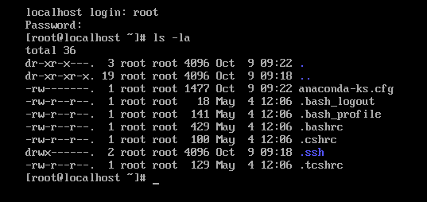

# CÀI ĐẠT ROCKY SERVER
## Chuẩn bị:
- Tải file ISO của Rocky Linux 9 từ trang chủ: https://rockylinux.org/download
- Cài đặt VMware trên máy tính

## Tiến hành cài đặt
`CTRL + n` để tạo 1 máy ảo mới

Chọn typical và nhấn next

Chọn Installer disc image file(iso) và chọn đường dẫn của file iso đã tải trong máy

Đặt tên máy ảo và chọn nơi lưu trữ trong máy

Đặt dung lượng ổ địa và chọn option `store virtual disk as a single file` - lựa chọn nơi chứa là 1 file duy nhất

Nhấn Customize Hardware... để điều chỉnh cấu hình trước khi tạo.

- `Memory`: Tăng bộ nhớ RAM (Ví dụ: 4096 MB hoặc hơn).
- `Processors`: Tăng số lượng nhân CPU (Ví dụ: 2).
- `Network Adapter`: Đảm bảo chọn NAT (để truy cập Internet) hoặc Bridged (tùy vào nhu cầu mạng của bạn).

Chọn ngôn ngữ, ví dụ: English

Chọn root password để cài mk cho root

Nhấp vào Time & Date.

- Chọn khu vực thời gian (ví dụ: Asia/Ho_Chi_Minh).

- Nhấp vào Done (góc trên bên trái).

Nhấp vào Installation Destination để chọn vị trí cài đặt

- Chọn custom để cấp phân vùng thủ công

- `/boot`: 2GB - Lưu trữ file cấu hình hệ thống

- `swap`: 16GB - bộ nhớ ra mạng

- `/home`: 30GB

- `/`: còn lại 

- Nhấn done và chọn Accept change

- User Creation: Nhấp vào User Creation, điền Full name và Username, nhập mật khẩu và xác nhận. Tùy chọn đánh dấu Make this user administrator để cấp quyền sudo.

Chọn `Begin installation` để cài đặt

Kiểm tra:

