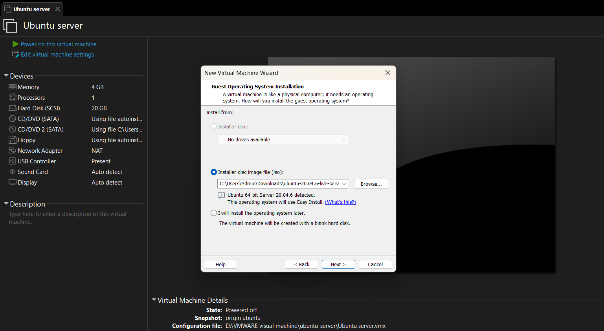
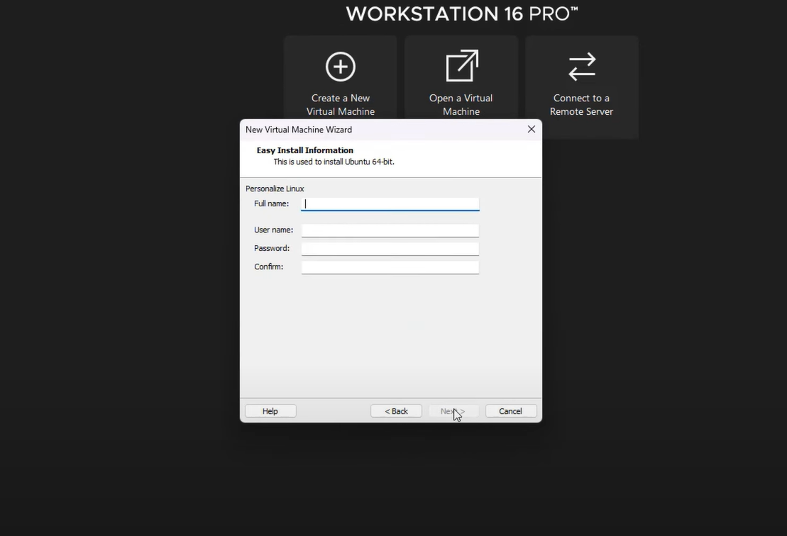
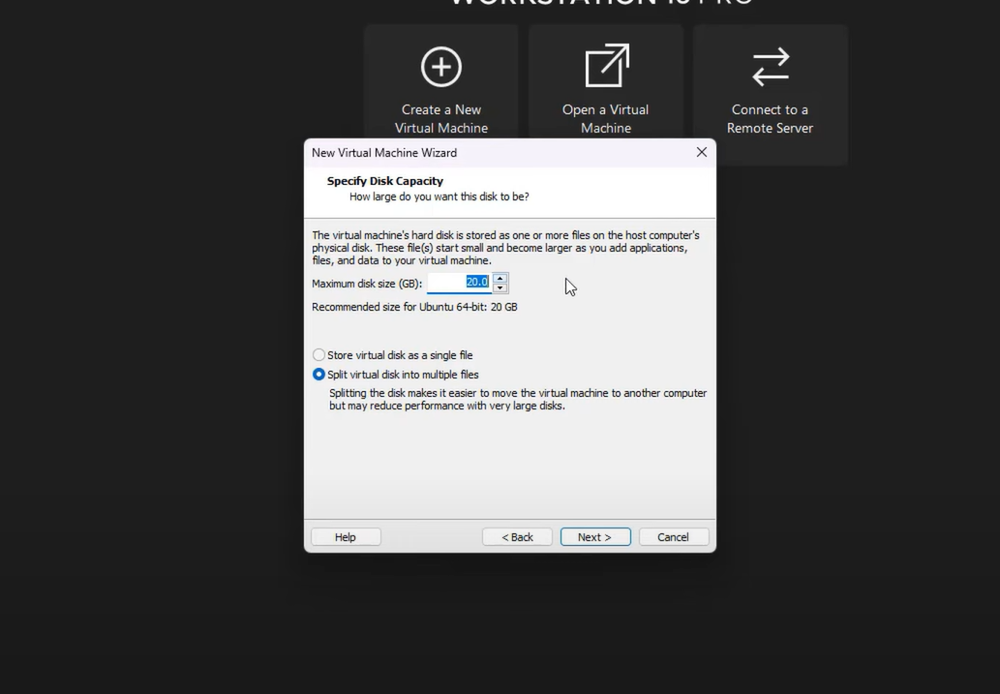
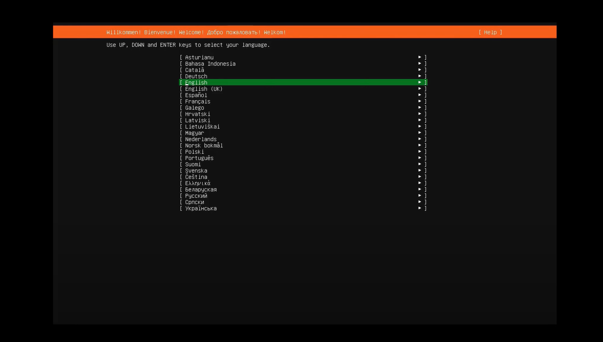
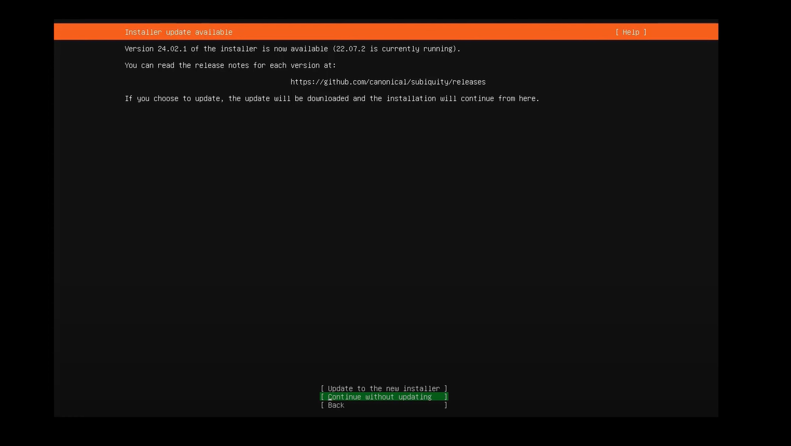
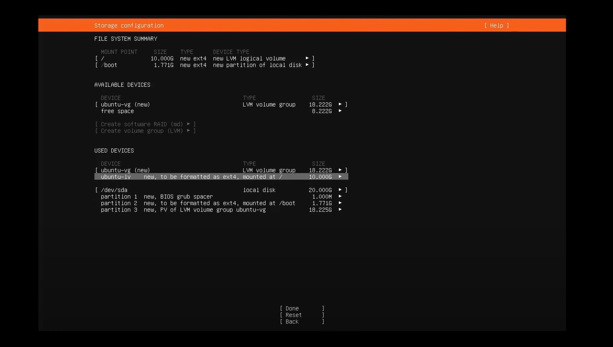
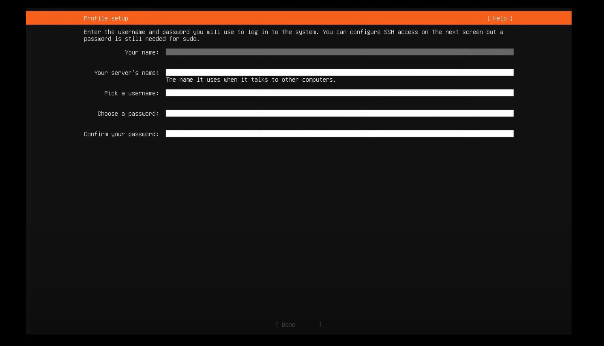
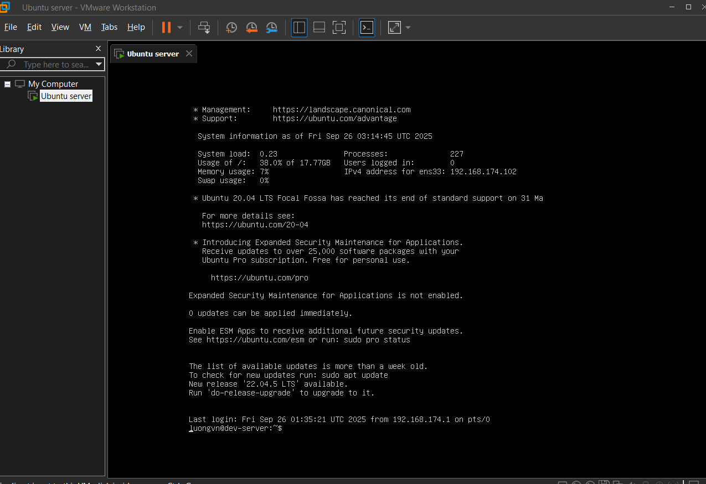

# CÀI ĐẶT UBUNTU SERVER
## Các bước cài đặt:
Cài đặt VMWARE về mày và tải ubuntu - live - server

chọn đường dẫn là đường dẫn của ubuntu - live - server vừa tải

điền các thông tin về tên và mật khẩu

điền disk size (Mặc định là 20GB) 

Sau khi làm các bước trên xong, ta sẽ bắt đầu cài đặt ubuntu server về máy với giao diện sau

Tiếp theo 

Ở đây ta chọn tùy chọn tiếp tục mà không cần update vì có thể update sau.

Tiếp tục chọn done cho đến khi thấy màn hình sau

ở đây ta thay đổi mục `used devices` sao cho 2 giá trị bằng nhau.

Cụ thể về 2 giá trị đó như sau: 

- VG (ubuntu-vg) = tổng dung lượng gom từ các partition vật lý
- LV (ubuntu-lv) = phần "cắt" từ VG để làm ổ / root

Có thể cắt:

- 10 GB (như ảnh) → còn dư 8 GB trong VG để sau này tạo thêm LV khác (ví dụ /home, /var…).
- Hoặc cắt 18 GB luôn → LV sẽ chiếm hết VG, không còn dung lượng để tạo thêm LV khác sau này.

Đây là bước nhập username và password

Sau đó cài đặt và login 

