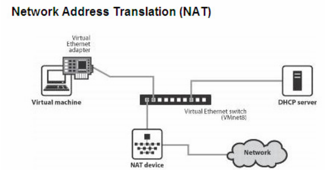
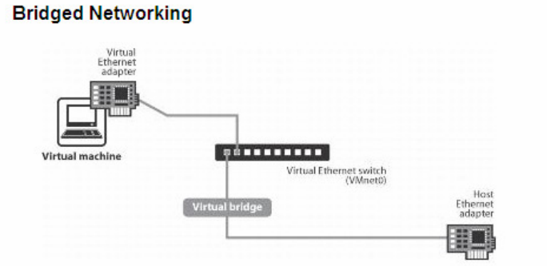
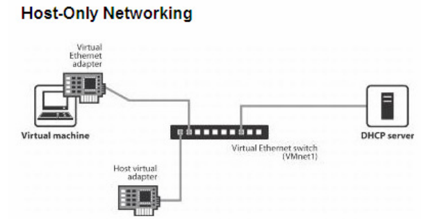

# CÀI ĐẶT, SỬ DỤNG VMWARE
## Phân biệt 3 chế độ network trong VMware: NAT, Bridged, Host-only
### Chi tiết từng chế độ
#### 1. NAT(Network Address Translation)

Máy ảo được cấu hình NAT sẽ sử dụng IP của máy thật để giao tiếp với mạng ngoài. Các máy ảo được cấp địa chỉ IP nhờ một DHCP ảo của VMware. Lúc này, các máy ảo sẽ kết nối với máy thật qua switch ảo VMnet8, và máy thật sẽ đóng vai trò NAT server cho các máy ảo.

Cách hoạt động:

1) Máy ảo (VM) gửi yêu cầu truy cập mạng: Khi máy ảo muốn truy cập một địa chỉ trên mạng (ví dụ: một trang web), nó sẽ gửi một gói tin đi. Gói tin này sẽ có địa chỉ IP nguồn là địa chỉ IP riêng (private IP) của máy ảo.

2) Máy thật (Host) thực hiện NAT lần 1: Máy thật đóng vai trò là NAT device cho máy ảo. Khi gói tin từ máy ảo đến, máy thật sẽ thay đổi địa chỉ IP nguồn trong gói tin từ địa chỉ IP riêng của máy ảo thành địa chỉ IP riêng của chính máy thật

3) Router thực hiện NAT lần 2: Gói tin sau khi đã được NAT bởi máy thật sẽ tiếp tục được gửi đến router. Router sẽ thay đổi địa chỉ IP nguồn trong gói tin từ địa chỉ IP riêng của máy thật thành địa chỉ IP công cộng (public IP) 

4) Phản hồi từ internet: Khi máy chủ web mà máy ảo đang cố gắng truy cập gửi phản hồi, gói tin sẽ có địa chỉ IP đích là địa chỉ IP công cộng của router.

5) Router chuyển phản hồi cho máy thật: Router sẽ xem bảng NAT và xác định IP riêng của máy thật và gửi về.

6) Máy thật chuyển phản hồi về máy ảo: Máy thật xem bảng NAT và xác định IP riêng của máy ảo sau đó gửi gói tin lại cho máy ảo.

#### 2. Bridged

Card mạng của máy ảo sẽ được gắn trực tiếp với card mạng của máy thật (sử dụng switch ảo VMnet0). Lúc này, máy ảo sẽ đóng vai trò như một máy trong mạng thật, có thể nhận DHCP từ mạng ngoài, hoặc đặt IP tĩnh cùng dải với mạng ngoài để giao tiếp với các máy ngoài mạng hoặc lên Internet.

Cách hoạt đông:

1) VMware dùng một "bridge" phần mềm để nối card mạng ảo của máy ảo với card mạng thật của host.
2) Khi máy ảo gửi gói, gói đó đi thằng ra LAN như là 1 thiết bị khác trên mạng.
3) DHCP trên router thật cấp IP trực tiếp cho máy ảo (có thể cài IP tĩnh).

Ví dụ:

- Router cấp IP cho máy thật: 192.168.1.5.
- Router cũng cấp IP khác cho máy ảo: 192.168.1.6.
- Cả hai đều trong cùng mạng LAN, có thể ping nhau, và các máy khác trong mạng cũng nhìn thấy máy ảo.

#### 3. Host Only

