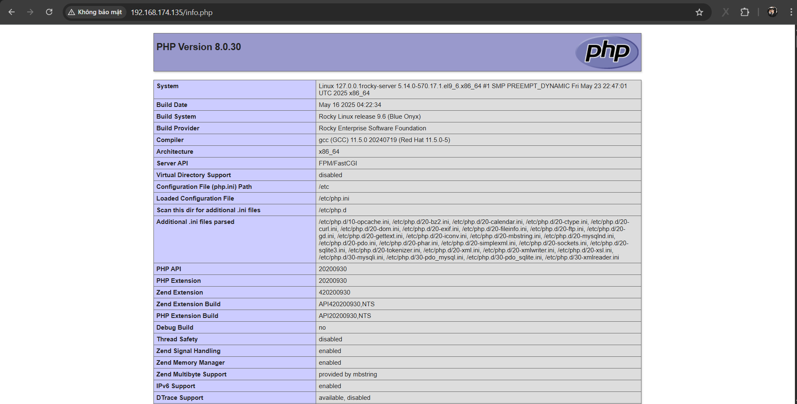

# Cài Đặt LAMP trên Rocky 9
## 1. Cài đặt Linux
- [Cài đặt Rocky9](https://github.com/Bimmie226/system-intership/blob/main/LuongVN/VMWARE/docs/setting_rocky_server.md)

## 2. Cài đặt Apache
- [Install Apache](https://github.com/Bimmie226/system-intership/blob/main/LuongVN/NETWORK/14.Webserver/docs/apache_web_server.md)

## 3. Cài đặt hệ quản trị cơ sở dữ liệu

- [Cài đặt MySQL trên Rocky 9](https://github.com/Bimmie226/system-intership/blob/main/LuongVN/SQL/docs/Install_MySQL_on_Rocky9.md)

## 4. Cài đặt PHP
- Câu lệnh cài đặt PHP:

  ```bash
  yum install -y php php-mysqlnd php-fpm php-json
  ```

- Kiểm tra phiên bản PHP:

  

- Restart Apache:

  ```bash
  systemctl restart httpd
  ```

- Thêm file `info.php`

  ```bash
  echo "<?php phpinfo();?>" > /var/www/html/info.php
  ```

- Restart Apache:

  ```bash
  systemctl restart httpd
  ```

- Vào trình duyệt gõ địa chỉ trên thanh url theo dạng sau:

  ```bash
  <địa chỉ ip>/info.php
  ```

  
