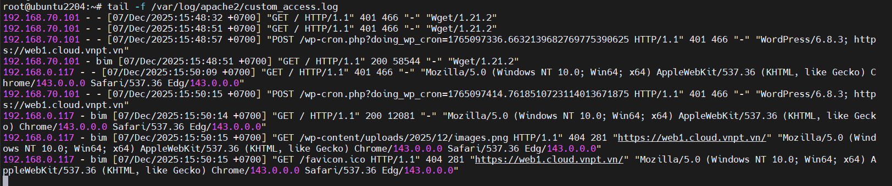

# Apache Log Format 
## Common Log Format(CLF)
`Common Log Format` là một định dạng log chuẩn hóa, cung cấp các thông tin thiết yếu về mỗi request gửi đến máy chủ web. Định dạng này bao gồm:

**Cấu Trúc:**

```perl
%h %l %u %t "%r" %>s %b
```

- `%h`: Remote host(địa chỉ IP của client)
- `%l`: Remote logname(thường để trống `-`)
- `%u`: Tên người dùng(nếu có xác thực)
- `%t`: Thời gian server nhận request
- `"%r"`: Request từ client(method, đường dẫn, giao thức)
- `%s>`: Status HTTP 
- `%b`: Kích thước phản hồi gửi về client


**Ví dụ:**

```swift
127.0.0.1 - - [14/Jul/2024:12:34:56 +0000] "GET /index.html HTTP/1.1" 200 1043
```

Giải thích:

- `%h` → 127.0.0.1 (IP của client)

- `%l` → - (không có logname)

- `%u` → - (không có username)

- `%t` → 14/Jul/2024:12:34:56 +0000

- `%`r → GET /index.html HTTP/1.1

- `%>s` → 200 (OK)

- `%b` → 1043 (bytes trả về)

## Combined Log Format 

Hãy tưởng tượng bạn đang vận hành một cửa hàng trực tuyến nổi tiếng. Bạn không chỉ muốn biết có bao nhiêu người truy cập trang web, mà còn muốn biết họ đến từ đâu và đang dùng thiết bị gì. `Combined Log Format` có thể giúp bạn trả lời những câu hỏi này.

- `Referrer` (nguồn truy cập): Trường `referrer` cho biết khách truy cập đã ở trang nào trước khi vào website của bạn. Điều này giúp bạn xác định liên kết ngoài hoặc chiến dịch marketing nào đang mang lại nhiều lưu lượng truy cập.
- `User Agent`: Chuỗi user agent chứa thông tin về trình duyệt và hệ điều hành của người dùng. Nhờ đó, bạn có thể tối ưu website cho những thiết bị phổ biến nhất và xử lý các vấn đề tương thích.


**Định dạng:**

```perl
%h %l %u %t "%r" %>s %b "%{Referer}i" "%{User-Agent}i"
```

- `%h, %l, %u, %t, %r, %>s, %b`: Giống như trong CLF

- `%{Referer}i`: URL trang giới thiệu (referrer)

- `%{User-Agent}i`: Chuỗi user agent của trình duyệt

**Ví dụ:**

```swift
127.0.0.1 - frank [18/Jul/2024:13:55:36 -0700] "GET /product/123 HTTP/1.1" 200 2326 "http://example.com/promo" "Mozilla/5.0 (Windows NT 10.0; Win64; x64) AppleWebKit/537.36 (KHTML, like Gecko) Chrome/91.0.4472.124 Safari/537.36"
```

**Giải thích:**
- Danh tính truy cập: Request đến từ user frank với IP `127.0.0.1`.

- Thời gian: Request được gửi lúc `13:55` ngày `18/07/2024`.

- Hành động: Frank yêu cầu trang sản phẩm của `item 123`.

- Kết quả: Server trả về thành công (HTTP `200`) với dung lượng phản hồi `2326` bytes.

- Nguồn truy cập: Frank đi từ trang quảng cáo `http://example.com/promo`.

- Thiết bị: Anh ta dùng `Chrome` trên `Windows 10`.

## Custom Log Format

**Ví dụ:**

```bash
ErrorLog "/var/log/apache2/custom_error.log"
LogFormat "%h %l %u %t \"%r\" %>s %b \"%{Referer}i\" \"%{User-Agent}i\"" custom
CustomLog "/var/log/apache2/custom_access.log" custom
```

