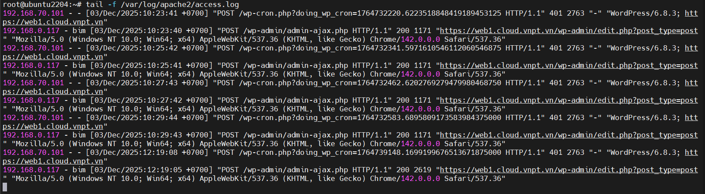
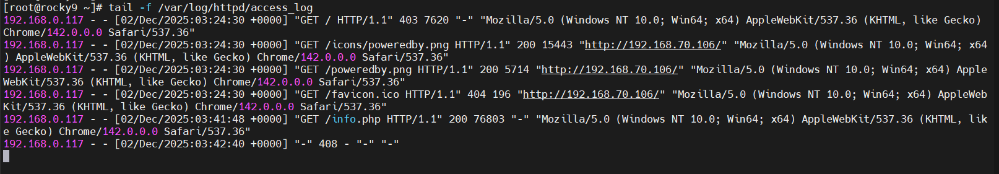
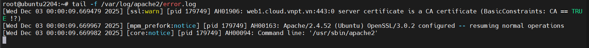
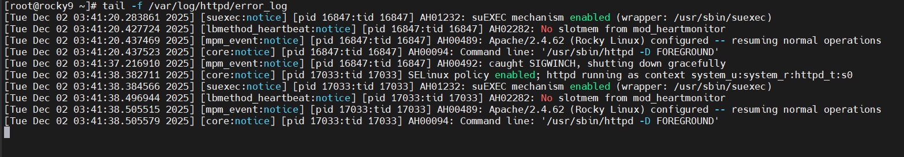
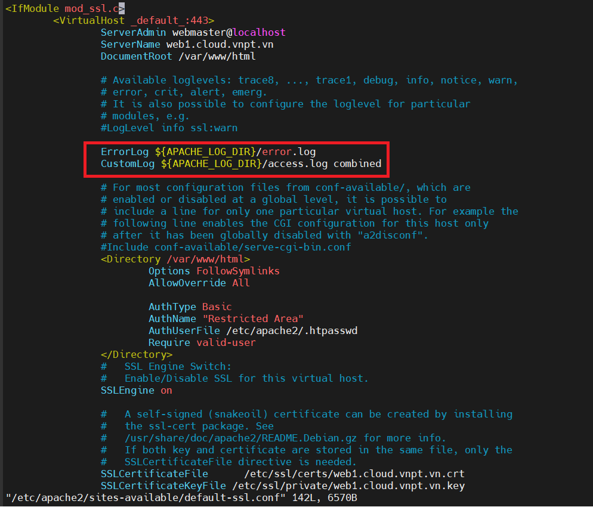
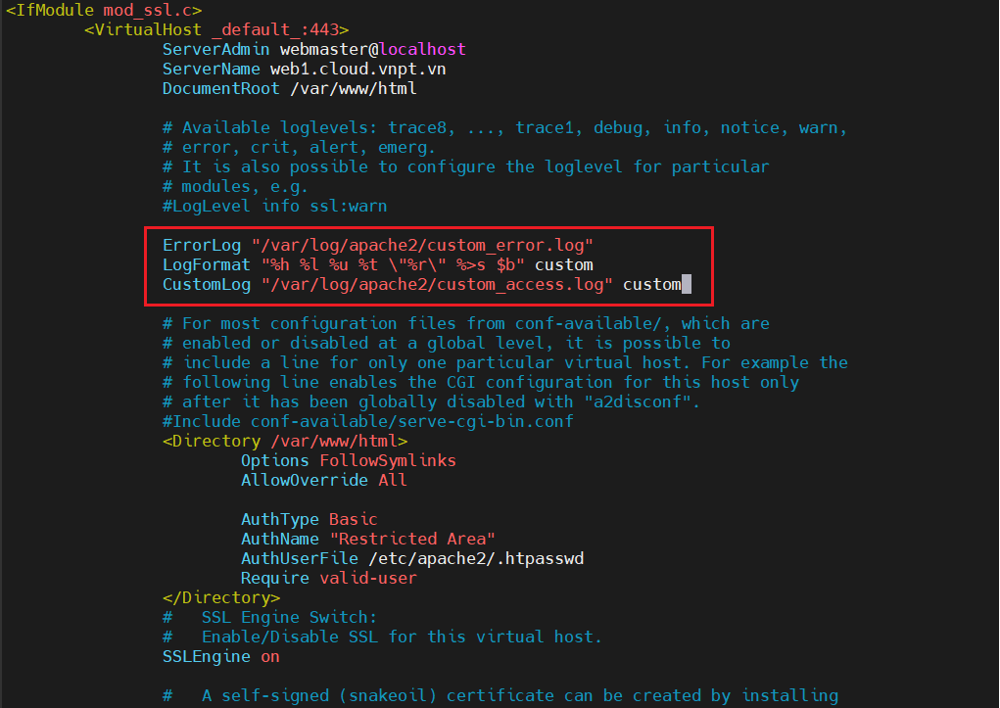
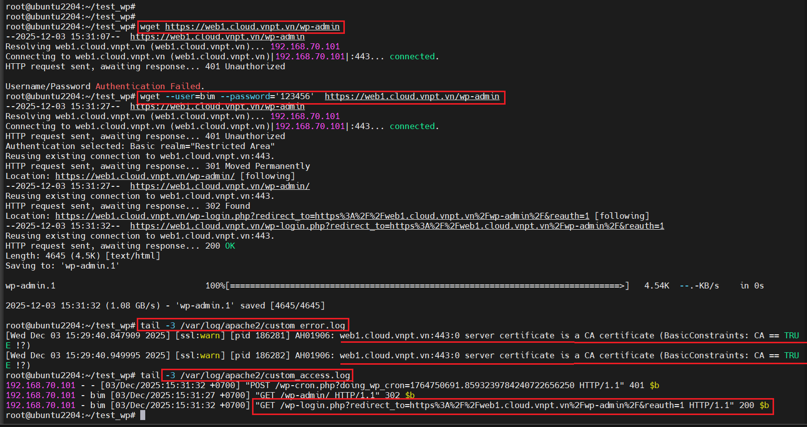

# Configuring Apache Logging
Cấu hình logging trong Apache là rất quan trọng để đảm bảo dữ liệu log được ghi nhận và lưu trữ đúng cách phục vụ cho việc phân tích.

## Default Log Locations
Ví trí log mặc định là:
- Access Logs:

  `/var/log/apache2/access.log` hoặc `/var/log/httpd/access_log`

  **Ubuntu**:

    

  **Rocky 9**:

    

- Error Logs:

  `/var/log/apache2/error.log` hoặc `/var/log/httpd/error_log`

  **Ubuntu**:

    

  **Rocky 9**:

    

## Changing the Default Apache Log Location
Thay đổi vị trí log mặc định giúp bạn tổ chức log tốt hơn hoặc chuyển chúng đến một hệ thống logging tập trung.

Truy cập vào file config của trang website(Ví dụ: `/etc/apache2/sites-enble/default-ssl.conf`)




Giải thích:

- `ErrorLog`:

  Directive này xác định đường dẫn file nơi các error log sẽ được ghi. 

- `CustomLog`:
  
  Directive này xác định đường dẫn file cho access log và định dạng log. 


## Configuring Log File Paths and Names
Ví dụ cấu hình:



Giải thích:

**ErrorLog**:
- Tất cả error log sẽ được ghi vào: `/var/log/apache2/custom_error.log`

**LogFormat**:
- Directive này định nghĩa định dạng của từng bản ghi log.

  | Format | Ý nghĩa                                                       |
  | ------ | ------------------------------------------------------------- |
  | `%h`   | Địa chỉ IP của host gửi yêu cầu (remote host)                 |
  | `%l`   | Remote logname (thường để trống hoặc "-")                     |
  | `%u`   | Tên người dùng từ HTTP authentication (nếu có)                |
  | `%t`   | Thời điểm nhận yêu cầu                                        |
  | `"%r"` | Request line từ client (ví dụ: `GET / HTTP/1.0`)              |
  | `%>s`  | Mã trạng thái HTTP mà server gửi về client                    |
  | `%b`   | Kích thước response tính bằng byte, không bao gồm HTTP header |

- `custom`: Từ khóa này gán tên cho định dạng log tùy chỉnh, để có thể tái sử dụng sau đó.

**CustomLog**:

- File access log sẽ được ghi vào: `/var/log/apache2/custom_access.log`

Ta thử kiểm tra lại xem 2 file `custom_error.log` và `custom_access.log` có hoạt động không:

  

## Piped Logs
Cấu hình trên sử dụng rotatelogs, một tiện ích giúp quản lý việc xoay vòng (rotation) log file.

  - `"|/usr/bin/rotatelogs"`: Dấu pipe (|) chuyển hướng toàn bộ log đầu ra sang chương trình rotatelogs.
  - `"/var/log/apache2/error_log.%Y-%m-%d"`: Mẫu tên file log có kèm ngày tháng, tạo log file mới mỗi ngày.
  - `86400`: Số giây để xoay vòng log (86400 giây = 24 giờ).

Ví dụ:

```perl
CustomLog "|/usr/bin/rotatelogs /var/log/apache2/access_log.%Y-%m-%d 86400" custom
```