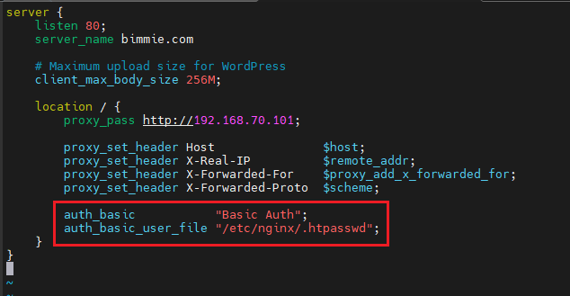
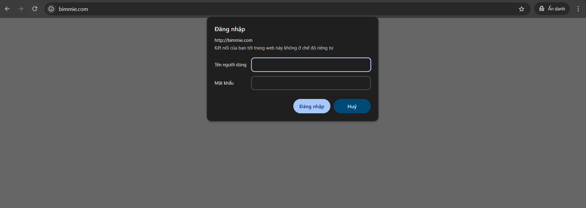

# Cấu Hình Basic Authen Trên Nginx
## Yêu cầu
Thực hiện cấu hình basic authen cho nginx làm reverse proxy 

## Thực hiện
### Bước 1: Cài đặt tool `htpasswd` trong gói `apache2-utils`

```bash
sudo apt update
sudo apt install apache2-utils
```

### Bước 2: Tạo user với password cho trang website
Ta dùng câu lệnh sau để tạo user và password, sau khi tạo thông tin về user sẽ nằm trong `/etc/nginx/.htpasswd`

```bash
htpasswd -c /etc/nginx/.htpasswd bimmie
```

```bash
root@ubuntu2204-2:~# htpasswd -c /etc/nginx/.htpasswd bimmie
New password:
Re-type new password:
Adding password for user bimmie
```


### Bước 3: Cấu hình lại file config của website trên nginx

Ta cần thêm 2 dòng sau để config basic authen:

```bash
auth_basic           "Basic Auth";
auth_basic_user_file "/etc/nginx/.htpasswd";
```



### Bước 4: Restart lại dịch vụ nginx

```bash
root@ubuntu2204-2:~# systemctl restart nginx.service
```

### Bước 5: Kiểm tra

Lên browser và truy cập thử vào trang website. Nếu nó hiện phải nhập user + password thì ta đã cấu hình thành công

