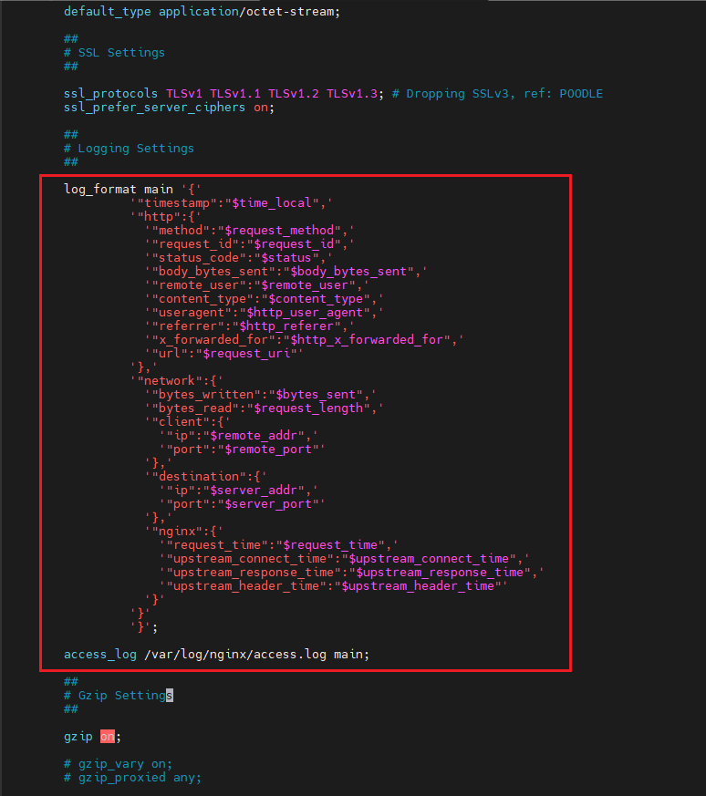
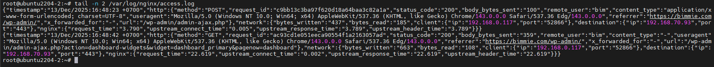

# Cấu Hình Định Dạng json log trên Nginx
## Yêu cầu
Thay đổi log format trên nginx thành json
## Thực hiện
Để chuyển đổi định dạng log của nginx thành json, ta thực hiện theo các bước sau:
- Backup file cấu hình nginx:

    ```bash
    cp /etc/nginx/nginx.conf /etc/nginx/nginx.conf.backup
    ```

- Truy cập vào file `/etc/nginx/nginx.conf` và cấu hình lại `log_format`:

    ```nginx
    log_format main '{'
                 '"timestamp":"$time_local",'
                 '"http":{'
                   '"method":"$request_method",'
                   '"request_id":"$request_id",'
                   '"status_code":"$status",'
                   '"body_bytes_sent":"$body_bytes_sent",'
                   '"remote_user":"$remote_user",'
                   '"content_type":"$content_type",'
                   '"useragent":"$http_user_agent",'
                   '"referrer":"$http_referer",'
                   '"x_forwarded_for":"$http_x_forwarded_for",'
                   '"url":"$request_uri"'
                 '},'
                 '"network":{'
                   '"bytes_written":"$bytes_sent",'
                   '"bytes_read":"$request_length",'
                   '"client":{'
                     '"ip":"$remote_addr",'
                     '"port":"$remote_port"'
                   '},'
                   '"destination":{'
                     '"ip":"$server_addr",'
                     '"port":"$server_port"'
                   '},'
                   '"nginx":{'
                     '"request_time":"$request_time",'
                     '"upstream_connect_time":"$upstream_connect_time",'
                     '"upstream_response_time":"$upstream_response_time",'
                     '"upstream_header_time":"$upstream_header_time"'
                   '}'
                 '}'
                 '}';
    ```

    

- Kiểm tra lại cấu hình nginx và khởi động lại nginx:

    ```bash
    root@ubuntu2204-2:~# systemctl restart nginx.service
    root@ubuntu2204-2:~# systemctl status nginx.service
    * nginx.service - A high performance web server and a reverse proxy server
        Loaded: loaded (/usr/lib/systemd/system/nginx.service; enabled; preset: enabled)
        Active: active (running) since Sat 2025-12-13 16:45:34 +07; 2s ago
        Docs: man:nginx(8)
        Process: 51250 ExecStartPre=/usr/sbin/nginx -t -q -g daemon on; master_process on; (code=exited, status=0/SUCCESS)
        Process: 51252 ExecStart=/usr/sbin/nginx -g daemon on; master_process on; (code=exited, status=0/SUCCESS)
    Main PID: 51253 (nginx)
        Tasks: 17 (limit: 19097)
        Memory: 13.1M (peak: 13.9M)
            CPU: 99ms
        CGroup: /system.slice/nginx.service
                |-51253 "nginx: master process /usr/sbin/nginx -g daemon on; master_process on;"
                |-51254 "nginx: worker process"
                |-51255 "nginx: worker process"
                |-51256 "nginx: worker process"
                |-51257 "nginx: worker process"
                |-51258 "nginx: worker process"
                |-51259 "nginx: worker process"
                |-51260 "nginx: worker process"
                |-51261 "nginx: worker process"
                |-51262 "nginx: worker process"
                |-51263 "nginx: worker process"
                |-51264 "nginx: worker process"
                |-51265 "nginx: worker process"
                |-51266 "nginx: worker process"
                |-51267 "nginx: worker process"
                |-51268 "nginx: worker process"
                `-51269 "nginx: worker process"

    Dec 13 16:45:34 ubuntu2204-2 systemd[1]: Starting nginx.service - A high performance web server and a reverse proxy server...
    Dec 13 16:45:34 ubuntu2204-2 systemd[1]: Started nginx.service - A high performance web server and a reverse proxy server.
    root@ubuntu2204-2:~#
    ```

- Kiểm tra access log của nginx:

    ```bash
    tail -n 2 /var/log/nginx/access.log
    ```

    