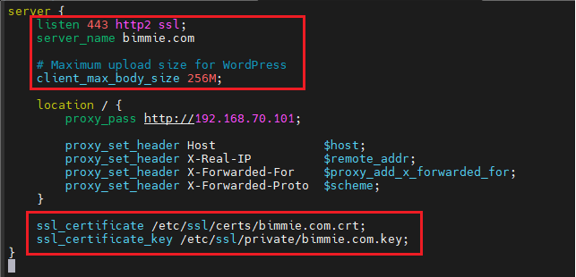
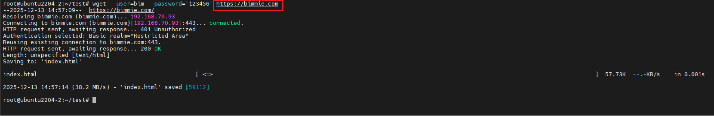
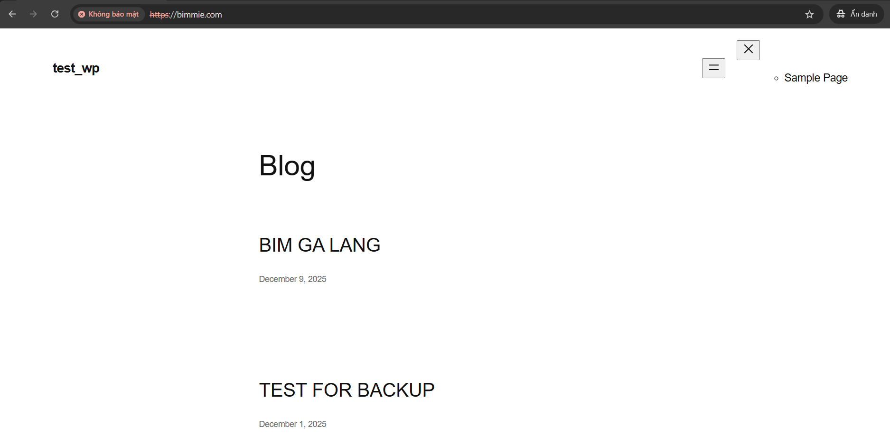

# Cấu Hình Self-Signed Certificate cho Nginx
## Yêu cầu 
Tạo cert cho nginx làm reverse proxy 

## Thực hiện
### Bước 1: Tạo chứng chỉ SSL
Ta dùng câu lệnh sau để gen cert:

```bash
openssl req -x509 -nodes -newkey rsa:2048 \
-keyout /etc/ssl/private/bimmie.com.key \
-out /etc/ssl/certs/bimmie.com.crt \
-days 365 \
-subj "/CN=bimmie.com" \
-addext "subjectAltName=DNS:bimmie.com"
```

### Bước 2: Import Certificate vào hệ thống
```bash
cp /etc/ssl/certs/bimmie.com.crt /usr/local/share/ca-certificates/
sudo update-ca-certificates
```

### Bước 3: Cấu hình lại file config của website trên nginx
Thêm các dòng sau vào file cấu hình site:

```bash
listen 443 http2 ssl;
ssl_certificate /etc/ssl/certs/bimmie.com.crt;
ssl_certificate_key /etc/ssl/private/bimmie.com.key;
```



### Bước 4: Restart lại dịch vụ nginx

```bash
root@ubuntu2204-2:~# systemctl restart nginx.service
```

### Bước 5: Kiểm tra
#### Trên server Nginx

Dùng lệnh sau để tải dữ liệu của website về:

```bash
wget https://bimmie.com
```



#### Trên browser máy window

Ta tìm kiếm: `https://bimmie.com`

