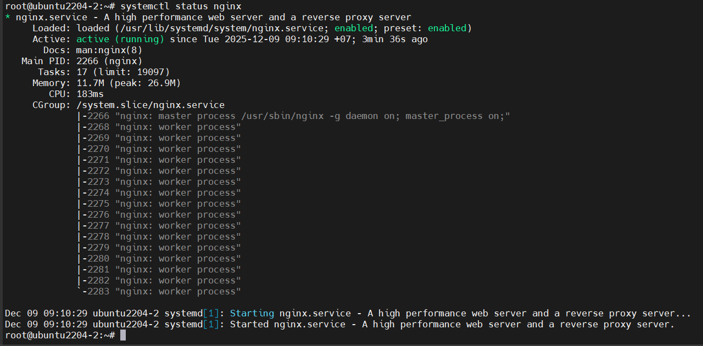
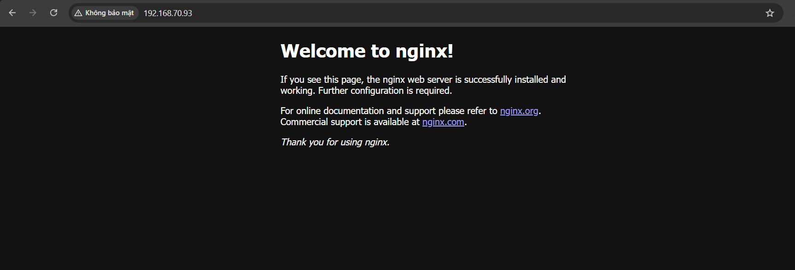

# NGINX 
## Nginx là gì?
Nginx là 1 phần mềm mã nguồn mở để phục vụ web. Nó sử dụng kiến trúc đơn luồng và được thiết kế để có hiệu suất và độ ổn định tối đa, vì thế nó hiệu quả hơn Apache nếu được cấu hình chính xác. Ngoài khả năng làm web server, nó cũng có thể hoạt động như trình cân bằng tải hay 1 reverse proxy cho các máy chủ HTTP, TCP và UDP

### Chức năng chính
**Máy chủ web (Web server):**
- Nginx có khả năng phục vụ các trang web tĩnh (HTML, CSS, JavaScript, hình ảnh,...) và động (PHP, Python,...) một cách hiệu quả.
- Nó nổi tiếng với khả năng xử lý số lượng lớn kết nối đồng thời mà vẫn duy trì hiệu suất cao.

**Reverse Proxy:**
- Nginx có thể hoạt động như một reverse proxy, nhận các yêu cầu từ máy khách và chuyển tiếp chúng đến các máy chủ ứng dụng (backend servers).
- Điều này giúp cải thiện hiệu suất, bảo mật và khả năng mở rộng của ứng dụng web.

**Load Balancer:**
- Nginx có thể phân phối lưu lượng truy cập đến nhiều máy chủ ứng dụng, giúp cân bằng tải và đảm bảo tính sẵn sàng cao của ứng dụng.

**HTTP cache:**
- Nginx có thể lưu trữ các nội dung web tĩnh trong bộ nhớ cache, giúp giảm tải cho máy chủ ứng dụng và tăng tốc độ tải trang.

### Đặc điểm nổi bật
**Hiệu suất cao:**
- Nginx được thiết kế để xử lý số lượng lớn kết nối đồng thời một cách hiệu quả, đặc biệt là trong các môi trường có lưu lượng truy cập cao.

**Tiêu thụ tài nguyên thấp:**
- Nginx sử dụng ít tài nguyên hệ thống (CPU, RAM) hơn so với một số máy chủ web khác, giúp tiết kiệm chi phí phần cứng.

**Tính ổn định:**
- Nginx được biết đến với tính ổn định và khả năng hoạt động liên tục trong thời gian dài.

**Cấu hình linh hoạt:**
- Nginx cung cấp một hệ thống cấu hình linh hoạt, cho phép người dùng tùy chỉnh để phù hợp với nhu cầu của mình.

### Các modes load balancing trong Nginx
Nginx hỗ trợ nhiều thuật toán cân bằng tải khác nhau. Các mode phổ biến gồm:

**1. Round Robin (mặc định)**

    Nginx gửi mỗi request đến các server theo vòng lặp tuần tự. Không cần cấu hình thêm.

    ```nginx
    upstream backend {
        server srv1;
        server srv2;
        server srv3;
    }
    ```

    Ưu điểm: đơn giản, dễ dùng

    Nhược điểm: không xét đến tải của từng server

**2. Weighted Round Robin**

    Cho phép gán trọng số (weight) cho server mạnh hơn để nhận nhiều request hơn

    ```nginx
    upstream backend {
        server srv1 weight=3;
        server srv2 weight=1;
    }
    ```

**3. Least Connections**

    Nginx gửi request đến server có ít kết nối đang mở nhất.

    ```nginx
    upstream backend {
        least_conn;
        server srv1;
        server srv2;
    }
    ```

    Hiệu quả khi request dài hoặc không đều nhau

**4. IP Hash**

    Nginx sử dụng hàm băm của IP client để xác định server.

    Giúp một client luôn vào cùng 1 server -> dùng cho session 

    ```nginx
    upstream backend {
        ip_hash;
        server srv1;
        server srv2;
    }
    ```

**Tóm tắt nhanh:**

| Mode                  | Ý nghĩa                    | Khi dùng                              |
| --------------------- | -------------------------- | ------------------------------------- |
| **Round Robin**       | Luân phiên                 | Tải đều, request nhỏ                  |
| **Weighted RR**       | Luân phiên theo trọng số   | Server mạnh/yếu khác nhau             |
| **Least Connections** | Server nào ít kết nối nhất | Request dài hoặc không đều            |
| **IP Hash**           | Một client → 1 server      | Session lưu tại server                |

### Các loại Load Balancer mà Nginx hỗ trợ
#### 1. Application Load Balancer (ALB) 
Nginx load balancing theo tầng Layer 7 (HTTP/HTTPS) với các khả năng:
- Routing thông minh: Theo URL, theo host, theo header/cookie, ...
- Tích hợp SSL termination: Ta có thể gắn certificate vào Nginx để offload TLS.

**Ví dụ cấu hình:**

```nginx
http {
    upstream backend {
        least_conn;                  # Thuật toán LB
        server 10.0.0.1:8080 weight=2;
        server 10.0.0.2:8080;
        server 10.0.0.3:8080 max_fails=3 fail_timeout=30s;
    }

    server {
        listen 80;
        server_name example.com;

        location /api/ {
            proxy_pass http://backend;
            proxy_set_header Host $host;
            proxy_set_header X-Real-IP $remote_addr;
        }
    }
}
```

- Routing theo URL `/api/`
- Thuật toán LB: `least_conn`
- Health check đơn giản bằng `fail/fail_timeout`

#### 2. Network Load Balancer (NLB)
Nginx hỗ trợ load balancing Layer 4 nhưng không mạnh.

Nginx có module:

- `stream {}` để load balance TCP/UDP. Như là LB cho MySQL, DNS, ...

**Ví dụ cấu hình:**
- Load Balance cho MySQL: 

    ```nginx
    stream {
        upstream mysql_backend {
            server 10.0.0.11:3306;
            server 10.0.0.12:3306;
        }

        server {
            listen 3306;
            proxy_pass mysql_backend;
        }
    }
    ```

## Cài đặt Nginx trên Ubuntu

`Bước 1`: Cài đặt nginx

```bash
sudo apt install nginx
```

`Bước 2`: Khởi chạy dịch vụ nginx

```bash
sudo systemctl enable nginx
sudo systemctl start nginx
```

Ta có thể kiểm tra lại xem đã khởi động thành công chưa bằng lệnh:

```bash
sudo systemctl status nginx
```



`Bước 3`: Kiểm tra kết quả

Mở trình duyệt truy cập: `http://<IP-server>`

