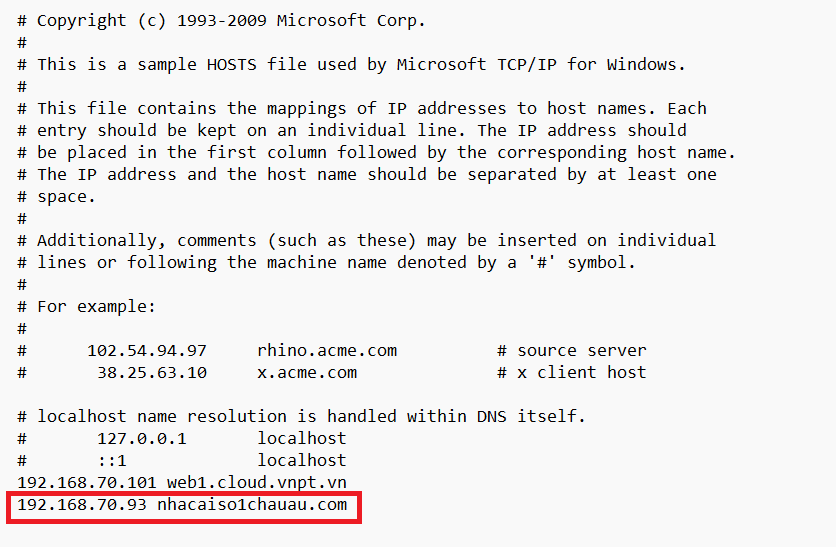
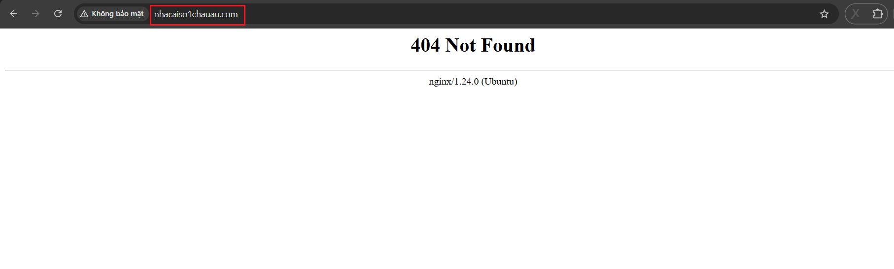
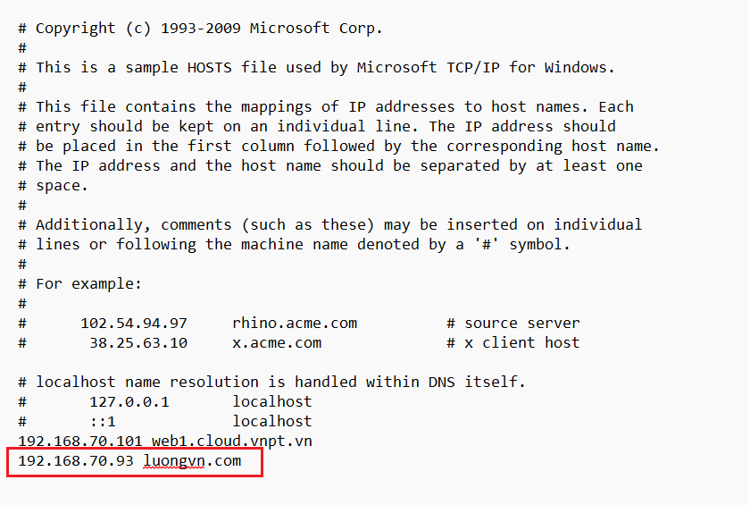
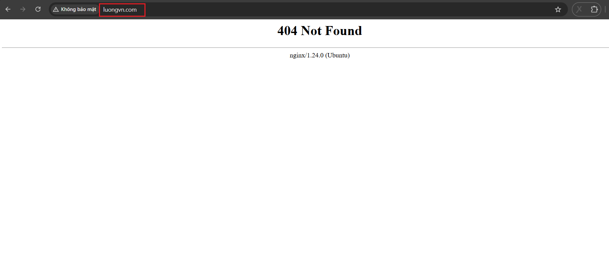
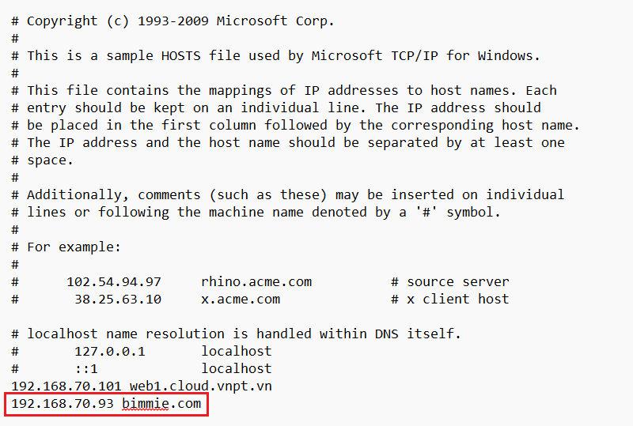
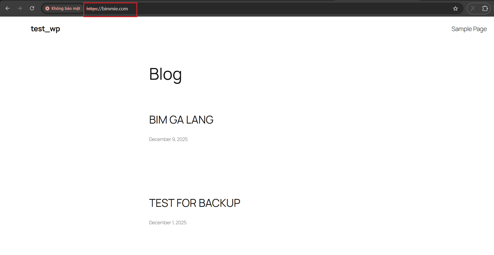

# Cấu hình fixed domain
## Yêu cầu
- Chỉ chấp nhận domain được cấu hình, domain khác -> trả về lỗi 404

## Thực hiện
**Nguyên tắc:** Nginx chỉ route theo `server_name`. Nếu domain không khớp `server_name` nào -> rơi vào `default server`. Do đó ta tạo **default server** trả về 404.

### Bước 1: Cấu hình default server
Cấu hình trong `/etc/nginx/sites-enable/default`

```nginx
server {
    listen 80 default_server;
    server_name _;
    return 404;
}

server {
    listen 443 ssl default_server;
    server_name _;

    ssl_certificate     /etc/ssl/certs/bimmie.com.crt;
    ssl_certificate_key /etc/ssl/private/bimmie.com.key;

    return 404;
}
```

### Bước 2: restart lại nginx

```bash
systemctl restart nginx.service
```

### Bước 3: Kiểm tra

Ta chỉnh sửa file hosts với domain khác ví dụ: `nhacaiso1chauau.com`, `luongvn.com`, ... để kiểm tra:









Ta chỉnh sửa domain là `bimmie.com` giống với khi ta cấu hình:




