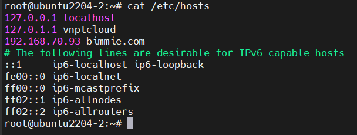
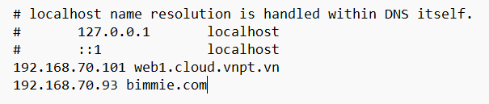
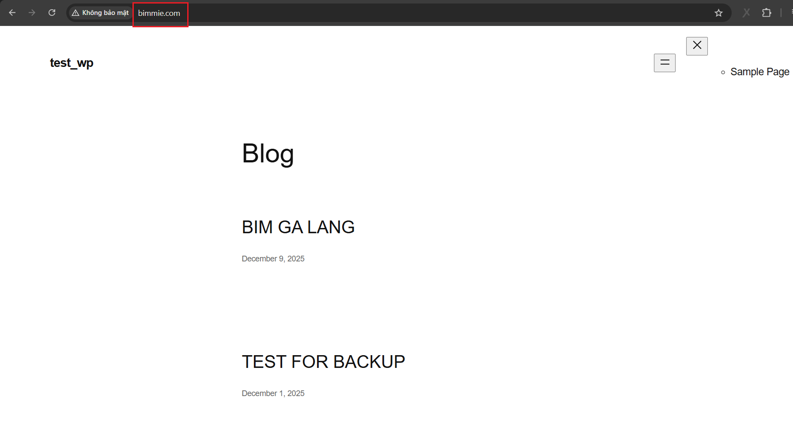

# Cấu hình Nginx làm reverse proxy cho Apache WordPress
## Mục tiêu
Ta có:
- IP của máy Apache WordPress là: `192.168.70.101`
- IP của máy Nginx là: `192.168.70.93`

Ta sẽ cấu hình máy nginx làm reverse proxy cho máy apache wordpress

## Thực hiện
### Bước 1: Backup file cấu hình
Vì quá trình thực hiện có thể có lỗi dẫn đến bị mất file cấu hình nginx ban đầu, để an toàn ta sẽ backup lại file cấu hình này

```bash
cp /etc/nginx/nginx.conf /etc/nginx/nginx.conf.backup
```

Khởi động lại dịch vụ nginx:

```bash
sudo systemctl restart nginx
```

### Bước 2: Tạo file config cho reverse proxy
Khai báo file config nằm trong thư mục `/etc/nginx/sites-available`. 

Ta sẽ tạo file với domain là: `bimmie.com`

```bash
vi /etc/nginx/sites-available/bimmie.com.conf
```

Nội dung của file như sau:

```nginx
server {
    listen 80;
    server_name bimmie.com

    # Maximum upload size for WordPress
    client_max_body_size 256M;

    location / {
        proxy_pass http://192.168.70.101;

        proxy_set_header Host               $host;
        proxy_set_header X-Real-IP          $remote_addr;
        proxy_set_header X-Forwarded-For    $proxy_add_x_forwarded_for;
        proxy_set_header X-Forwarded-Proto  $scheme;
    }
}
```

- `server name`: nhập tên miền sẽ sử dụng để nhập trên web
- `proxy_pass`: nhập vào địa chỉ ip của Apache WP để nginx trỏ về.

Restart lại nginx service:

```bash
systemctl restart nginx
```

### Bước 3: Kiểm tra
Ta thêm domain `bimmie` với IP tương ứng là: `192.168.70.93` vào file hosts





Vào trình duyệt và gõ `http://bimmie.com` nếu trang trả về là trang WordPress thì ta đã cấu hình thành công:

