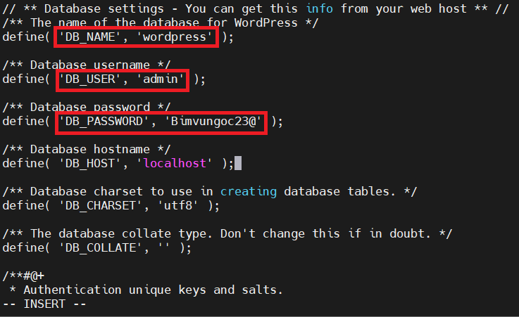
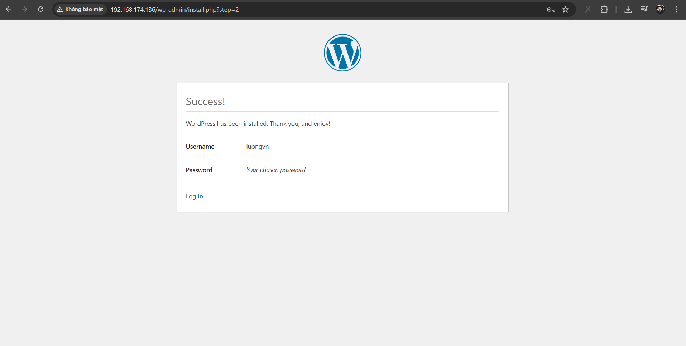

# Cài Đặt WordPress với LAMP trên Rocky 9
## Tổng Quan
- WordPress là công cụ giúp ta tạo ra các trang Website như: blog cá nhân, trang tin tức, trang thương mại. 
- Là 1 hệ thống quản lí nội dung miễn phí và mã nguồn mở xây dựng dựa trên PHP mà MySQL.

## Cài Đặt
### 1. Chuẩn bị
- Đầu tiên, ta cần [cài đặt LAMP Stack](https://github.com/Bimmie226/system-intership/blob/main/LuongVN/WORDPRESS/2.Install_LAMP_On_Rocky9.md)

### 2. Tạo cơ sở dữ liệu và tài khoản cho WordPress

- Đăng nhập vào tài khoản `root` của database:

  ```bash
  mysql -u root -p
  ```

  

- Tạo database cho WordPress. Ở đây ta đặt là `wordpress`

  ```sql
  CREATE DATABASE wordpress;
  ```

- Tạo tài khoản riêng để quản lí DB. Tên tài khoản: `admin`, mật khẩu: `admin`

  ```sql
  CREATE USER admin@localhost IDENTIFIED BY 'Bimvungoc23@';
  ```

- Bây giờ ta sẽ cấp quyền quản lí cơ sở dữ liệu cho user mới tạo:

  ```sql
  GRANT ALL PRIVILEGES ON wordpress.* TO 'admin'@'localhost';
  ```

- Sau đó xác thực lại những thay đổi về quyền:

  ```sql
  FLUSH PRIVILEGES;
  ```

- Sau đó, ta thoát ra khỏi MySQL:

  ```sql
  exit
  ```

### 3. Tải và cài đặt WordPress
- Cài đặt gói hỗ trợ `php-gd`:

  ```bash
  yum -y install php-gd
  ```

- Tải xuống WordPress phiên bản mới nhất: 

  ```bash
  wget https://wordpress.org/latest.tar.gz
  ```

  - **NOTE**: cần để ý tới thư mục đang lưu trữ file wordpress đang được tải xuống. Ở đây  lưu tại thư mục `/root.`
- Sau khi tải xong. Ta tiến hành giải nén file `latest.tar.gz`:

  ```bash
  tar xvfz latest.tar.gz
  ```

  - **NOTE**: Giải nén sẽ ra thư mục `wordpress` có đường dẫn: `/root/wordpress`
- Copy các file trong thư mục `wordpress` tới đường dẫn `/var/www/html`

  ```bash
  cp -Rvf /root/wordpress/* /var/www/html
  ```

### 4. Cấu hình wordpress
- File cấu hình wordpress: `/var/www/html/wp-config.php`
- Di chuyển tới thư mục: `/var/www/html`

  ```bash
  cd /var/www/html
  ```

- File cấu hình wordpress là `wp-config.php`. Tuy nhiên tại đây chỉ có file `wp-config-sample.php`. Tiến hành copy lại file cấu hình như sau:

  ```bash
  cp wp-config-sample.php wp-config.php
  ```

- Chỉnh sửa file cấu hình `wp-config.php`. Chỉnh lại tên `database`, `username`, `password` đã đặt ở trên. (`db_name`: wordpress, `username`: admin, `pass`: Bimvungoc23@) và lưu lại.

  

### 5. Hoàn tất cài đặt giao diện
- Trên trình duyệt gõ địa chỉ IP server vào URL, ta được giao diện như sau:

  

- Nhập các thông tin cần thiết rồi click `Install WordPress`.

  

- Tiến hành đăng nhập vào WordPress:

  

- Giao diện sau khi đăng nhập vào WordPress:

  

### 6. Phân quyền WordPress
- Khi upload ảnh vào bài viết sẽ xuất hiện lỗi sau:

  

- Phân quyền thư mục `wordpress` cho user `apache` để user này được phép tạo các thư mục và lưu trữ các tệp tin tải lên.

  ```bash
  chown -R apache:apache /var/www/html/*
  chmod -R 755 /var/www/html/*
  ```

- Như vậy ta đã có thể tiến hành upload ảnh và đăng bài viết lên trang `wordpress` của mình.

  

  


- upgrade 6.9
- cau hinh basic authen cho trang web
- cấu hình domain, selt-sign có trust
