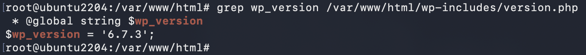
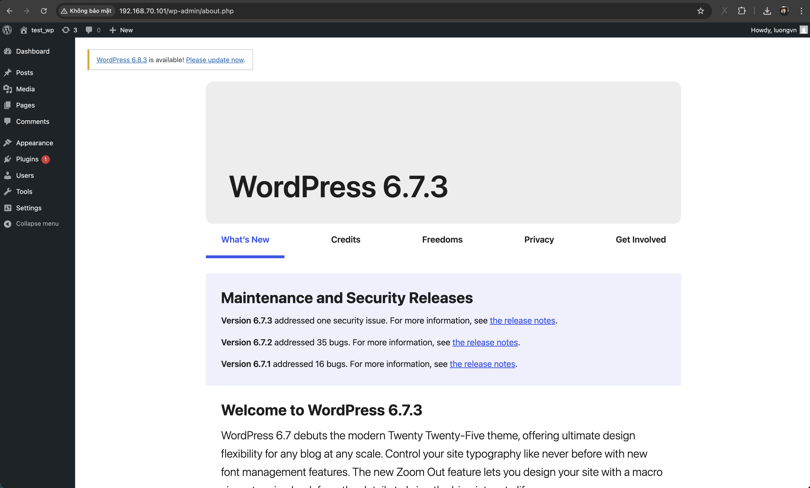
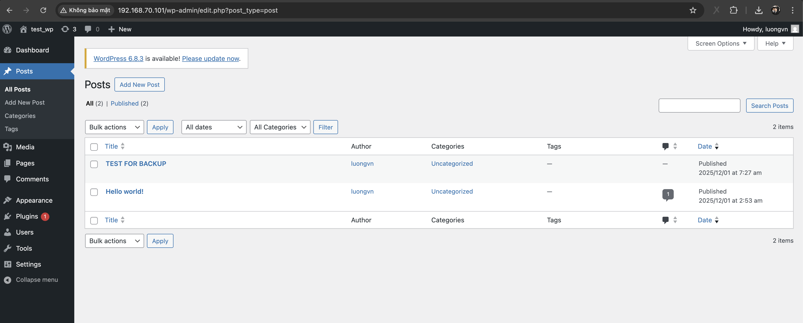
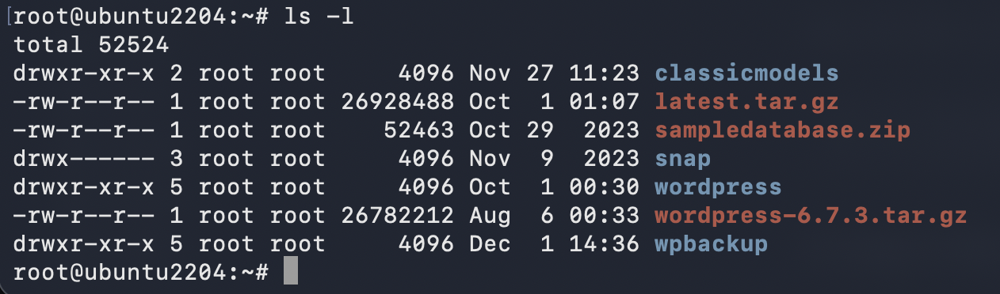
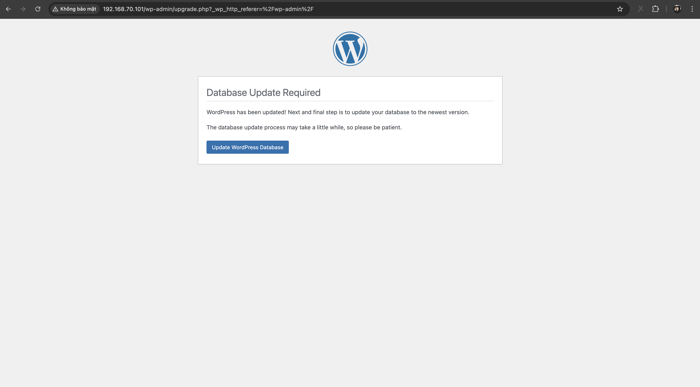
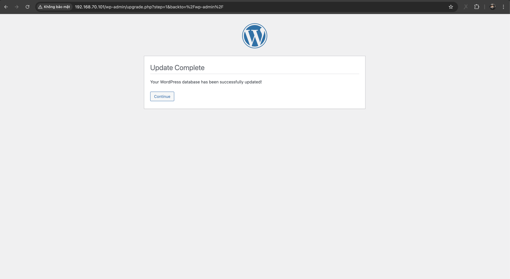
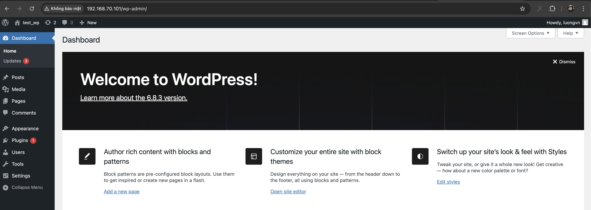
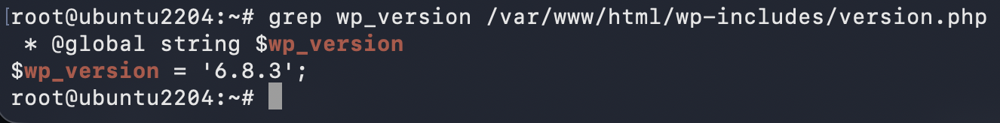

# Update Version Wordpress On Ubuntu
## Yêu cầu
- Update phiên bản WordPress lên mới nhất
- Dữ liệu trang WordPress sau khi update còn nguyên vẹn

- [Link tải các phiên bản của WP](https://wordpress.org/download/releases/)

## Thực hiện
### 1. Kiểm tra phiên bản hiện tại của WP trên server

- Sử dụng lệnh: 

    ```bash
    grep wp_version /var/www/html/wp-includes/version.php
    ```

    

- Ta cũng có thể xem version trên trang admin wordpress. `Chọn mục 1 - Dashboard -> 2 - Home `

    


- Tạo 1 bài viết trên trang wordpress để lát ta kiểm tra lại sự bảo toàn dữ liệu.

    


### 2. Backup dữ liệu
- Việc backups dữ liệu là cần thiết để tránh tình trạng mất dữ liệu khi có lỗi xảy ra trong quá trình update wordpress.

- Backup toàn bộ thư mục trang wordpress :


    ```bash
    # Tạo thư mục backup
    mkdir /root/wpbackup

    # Copy toàn bộ file và thư mục của trang wordpress
    cp -Rvf /var/www/html/* /root/wpbackup/
    ```

### 3. Tải phiên bản mới của WP
- Tải về server phiên bản update bạn muốn của WP. Ở đây, ta tải về tại thư mục `/root/`

    ```bash
    wget https://wordpress.org/latest.tar.gz
    ```

- Giải nén:

    ```bash
    tar xvfs latest.tar.gz
    ```

- Ta thây thư mục `wordpress` được tạo ra:

    

### 4. Xoá 2 thư mục `wp-admin` và `wp-includes`
- Xoá 2 thư mục `wp-admin` và `wp-includes` trong thư mục gốc của trang wordpress

    ```bash
    rm -rf /var/www/html/wp-admin
    rm -rf /var/www/html/wp-includes
    ```

### 5. Copy 2 thư mục `wp-admin` và `wp-includes`
- Copy 2 thư mục `wp-admin` và `wp-includes` từ thư mục `/wordpress` mới giải nén vào thư mục gốc của trang `wordpress`

    ```bash
    mv -f /root/wordpress/wp-admin /var/www/html/

    mv -f /root/wordpress/wp-includes /var/www/html/
    ```

### 6. Sao chép các tệp mới từ thư mục của phiên bản mới tới thư mục gốc của trang `wordpress` 

    ```bash
    mv -f /root/wordpress/* /var/www/html/
    ```

### 7. Truy cập site admin của trang wordpress
- Truy cập bằngh đường dẫn:

    ```bash
    <địa_chỉ_ip_server>/wp-admin
    ```

- Ta thấy thông báo:

    

- Chọn `Update WordPress Database`

- Sau khi update thành công. Sẽ xuất hiện thông báo thành công:

    

- Chọn `Continue`

### 8. Kiểm tra lại
- Sau khi đăng nhập vào `site admin` ta sẽ thấy phiên thông tin phiên bản của WP:

    

- Trên server:

    

- Kiểm tra các bài viết ta tạo:

    

> Wordpress đã update lên phiên bản 5.4 thành công và không bị mất dữ liệu.