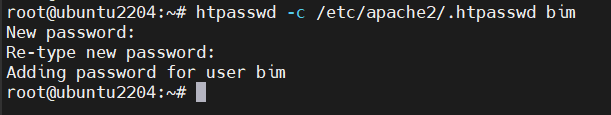
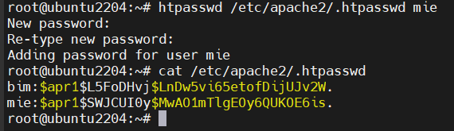
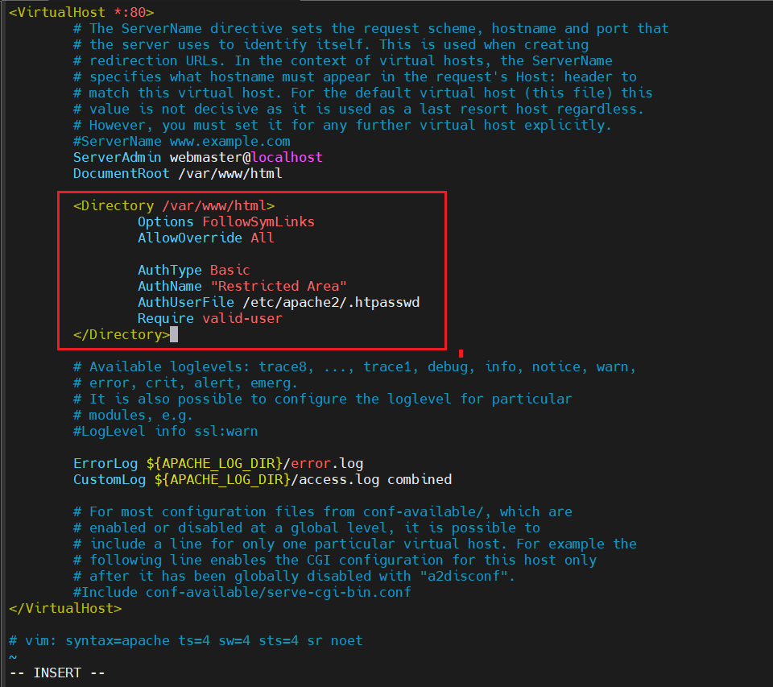
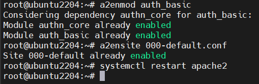
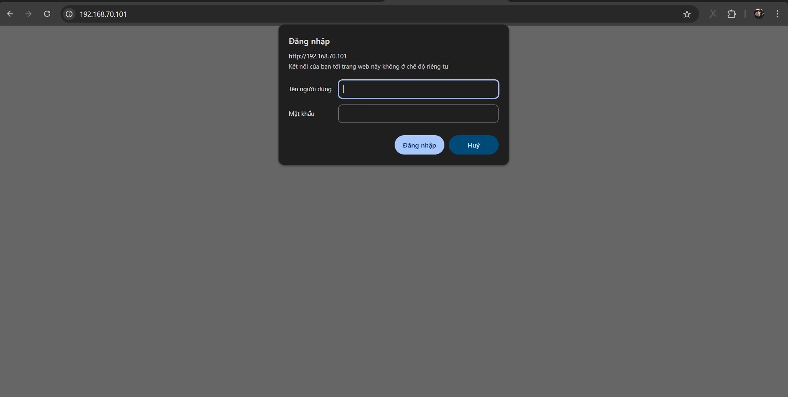
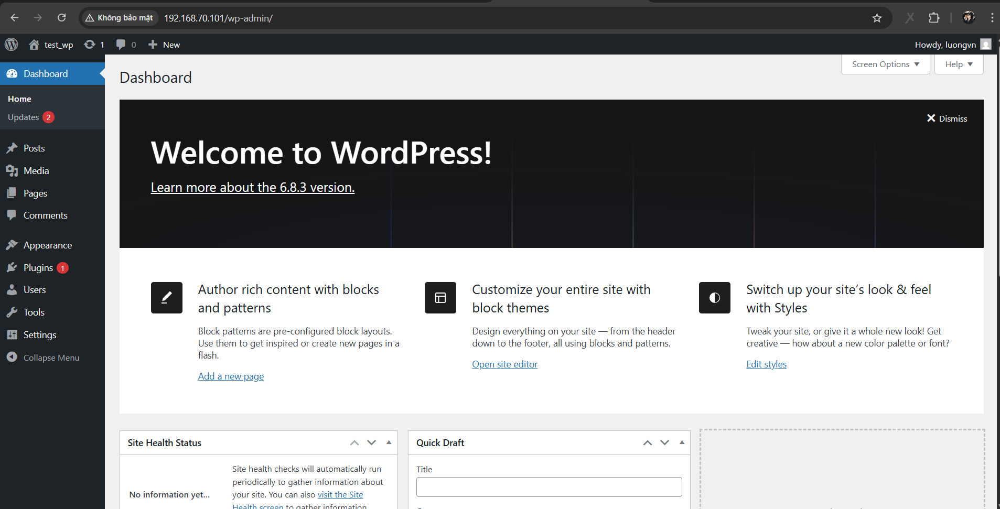

# Cấu Hình Basic Auth WordPress Ubuntu
- Ta có thể bảo vệ website với 1 file `.htaccess` tham chiếu đến 1 file `.htpasswd`
- Lệnh `htpasswd` có tạo 1 file `.htpasswd` chứa 1 userid và 1 password

  ```bash
  sudo apt update
  sudo apt install apache2-utils
  sudo htpasswd -c /etc/apache2/.htpasswd bim
  ```

  

  - Tạo user `bim` đi kèm pw

  

  - Tạo thêm user `mie` mới
- Sau đó ta tạo tệp `.htaccess` ở DocumentRoot của WP:

  - Mở file site config (mặc định là `000-default.conf` hoặc file riêng nếu bạn đã tạo site mới):

    ```bash
    vi /etc/apache2/sites-available/000-default.conf
    ```

    

    - `AllowOverride All` → để WordPress .htaccess vẫn hoạt động.

    - `AuthType Basic` + `AuthName` + `AuthUserFile` + `Require valid-user` → bật Basic Auth.
- Bật module Apache và site config:

  ```bash
  sudo a2enmod auth_basic
  sudo a2ensite 000-default
  sudo systemctl restart apache2
  ```

  

- Kiểm tra lại: Truy cập: `http://ip_address`

  

  - Nhập `user`: bim, `pw`: 123456 

  

  - Truy cập thành công