# Cấu Hình Domain Self-Signed WordPress Ubuntu

## Yêu cầu
- Ta truy cập được vào trang WP với đường dẫn: `https://web1.cloud.vnpt.vn` mà không hiện `not secure`
- Không dùng địa chỉ IP

## Thực hiện

### 1. Tạo Self-Signed Certificate

Ta dùng câu lệnh sau đây để gen cert cho trang WP: 

```bash
openssl req -x509 -nodes -newkey rsa:2048 \
-keyout /etc/ssl/private/web1.cloud.vnpt.vn.key \
-out /etc/ssl/certs/web1.cloud.vnpt.vn.crt \
-days 365 \
-subj "/CN=web1.cloud.vnpt.vn" \
-addext "subjectAltName=DNS:web1.cloud.vnpt.vn"
```

Giải thích các trường:

  - `-x509`: tạo chứng chỉ X.509 (thường dùng cho SSL/TLS).

  - `-nodes`: không mã hóa key bằng passphrase (ngăn Apache hỏi passphrase khi khởi động).

  - `-days 365`: chứng chỉ có hiệu lực 1 năm.

  - `-newkey rsa:2048`: tạo key RSA 2048-bit mới.

  - `-keyout` và `-out`: đường dẫn lưu key và certificate.

  - `/CN=mywp.com`: Common Name = tên domain của bạn.
  - `-addext "subjectAltName=DNS:mywp.com"`: SAN của cert này: 

**Một số lưu ý**:
- `domain` khi ta truy cập phải khới với `Common Name` khi ta tạo cert
- Khi gen cert ta bắt buộc phải có SAN, lý do là từ năm 2017 tất cả browser hiện đại(Chrome, Firefox, Edge, Safari) đã không còn dùng CN để kiểm tra hostname của certificate, bắt buộc phải kiểm tra SAN. Điều này nằm trong chuẩn: `RFC 2018`
- Khi ta thêm SAN, ví dụ: `-addext "subjectAltName=DNS:web1.cloud.vnpt.vn"`, lúc này cert chứa `SAN = DNS:web1.cloud.vnpt.vn (cái browser thực sự dùng)` Browser kiểm tra SAN:

  ```bash
  Hostname: web1.cloud.vnpt.vn
  SAN list: DNS:web1.cloud.vnpt.vn
  ```

  -> MATCH -> Browser Trust

### 2. Import Certificate vào hệ thống 

```bash
cp /etc/ssl/certs/mywp.crt /usr/local/share/ca-certificates/
sudo update-ca-certificates
```

Copy certificate vào thư mục CA của Ubuntu.

`update-ca-certificates` sẽ thêm certificate vào trusted store của hệ thống.

Sau bước này, các trình duyệt trên hệ thống (hoặc các tool như wget, curl) sẽ tin tưởng chứng chỉ này.

### 3. Thêm domain vào `/etc/hosts`

Ta sẽ thêm domain `web1.cloud.vnpt.vn` với IP là `192.168.70.101` để khi gõ `https://web1.cloud.vnpt.vn` máy sẽ truy cập server WordPress

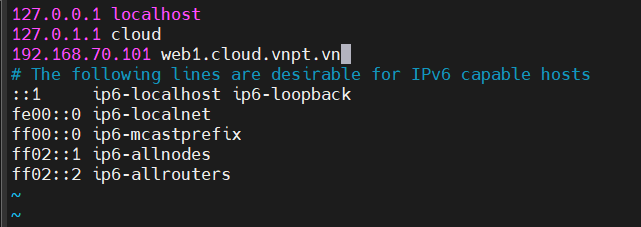

### 4. Cấu hình Apache
Vào file config ssl của trang WP của bạn(mặc định: `/etc/apache2/sites-available/default-ssl.conf`, hoặc trang mà bạn đã tạo riêng)

  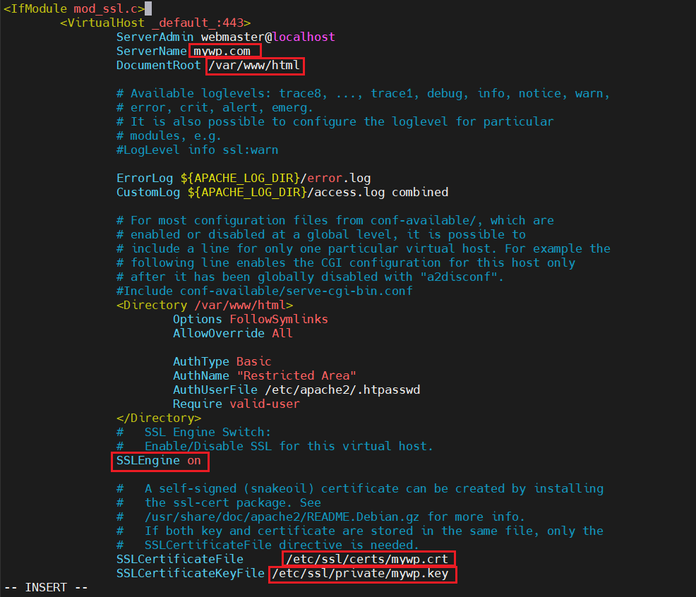

Ta cần lưu ý cấu hình đúng với các trường được tô đỏ:
- `ServerName`: phải đúng với tên domain
- `DocumentRoot`: đúng với trang WordPress
- `SSLEngine`: kích hoạt SSL
- `SSLCertificateFile`: Đường dẫn đến file cert mà ta đã gen
- `SSLCertificateKeyFile`: Đường dẫn đến file chứa key mà ta đã gen
  
### 5. Chỉnh sửa file `wp-config.php`
Nếu ta không chỉnh sửa file này, khi truy cập vào các config của trang WordPress sẽ gặp lỗi, Ví dụ khi ta truy cập: `https://web1.cloud.vnpt.vn/wp-admin`

```bash
ERROR: certificate common name 'web1.cloud.vnpt.vn' doesn't match requested host name '192.168.70.101'.
```

Nguyên nhân là do chứng chỉ SSL của website là cho domain `web1.cloud.vnpt.vn` nhưng server lại redirect sang địa chỉ IP `192.168.70.101`

```bash
https://web1.cloud.vnpt.vn/wp-admin  →  https://192.168.70.101/wp-login.php
```

Để sửa, ta có thể chỉnh sửa URL của WordPress để nó không redirect sang IP bằng cách chỉnh sửa trực tiếp trong `wp-config.php`

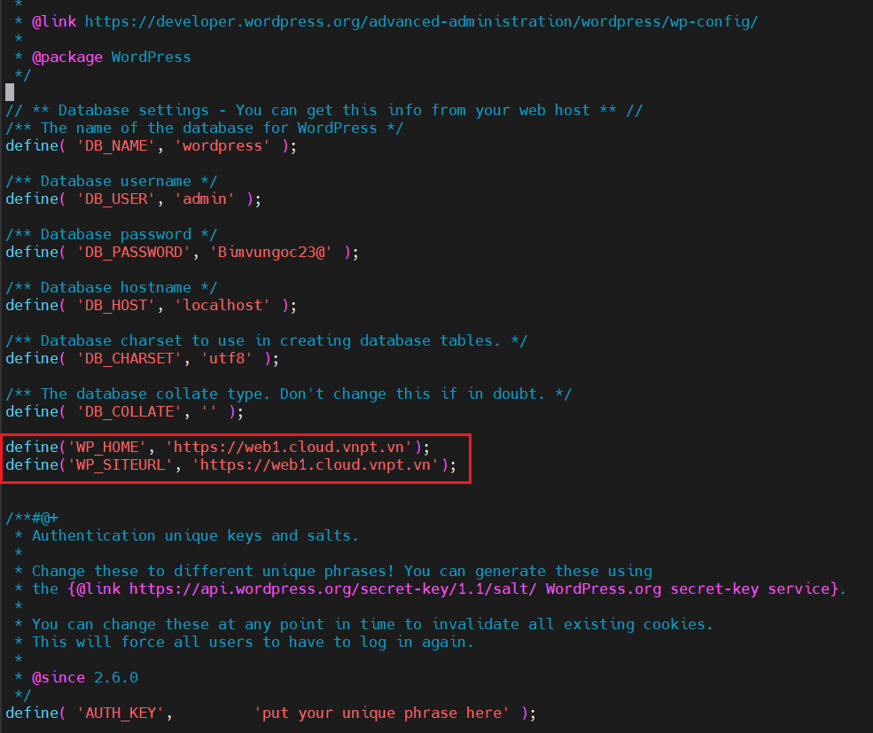

Bây giờ khi bạn gõ `https://web1.cloud.vnpt.vn/wp-admin` trình duyệt sẽ hiển thị: `https://web1.cloud.vnpt.vn/wp-admin` không tự đổi thành `https://192.168.70.101`

### 6. Bật module SSL & site SSL

```bash
sudo a2enmod ssl
sudo a2ensite default-ssl.conf
sudo systemctl restart apache2
``` 

### 7. Kiểm tra
#### 7.1. Trên Server
Ta sẽ thử tải dữ liệu của trang `https://web1.cloud.vnpt.vn/wp-admin` về máy bằng lệnh `wget`

Lưu ý: Khi cấu hình `apache2` ta đã cấu hình basic authen cho trang WP nên khi `wget` ta phải đi kèm với `--user` và `--password` để có thể truy cập:

  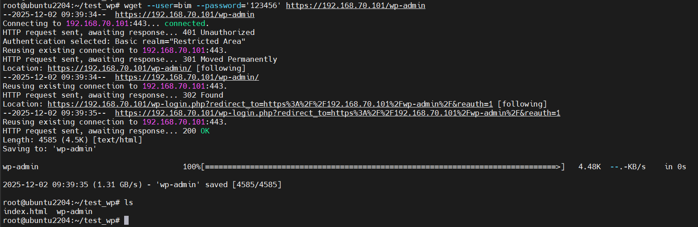

Như vậy hệ thống đã trust cho trang website này

#### 7.2.Trên máy window
Đầu tiên ta tạo 1 folder để lưu file `.crt` từ ubuntu, sau đó mở trên terminal và dùng `scp` để lấy file `.crt` về:

  ```bash
  scp root@192.168.70.101:/etc/ssl/certs/web1.cloud.vnpt.vn.crt .
  ```

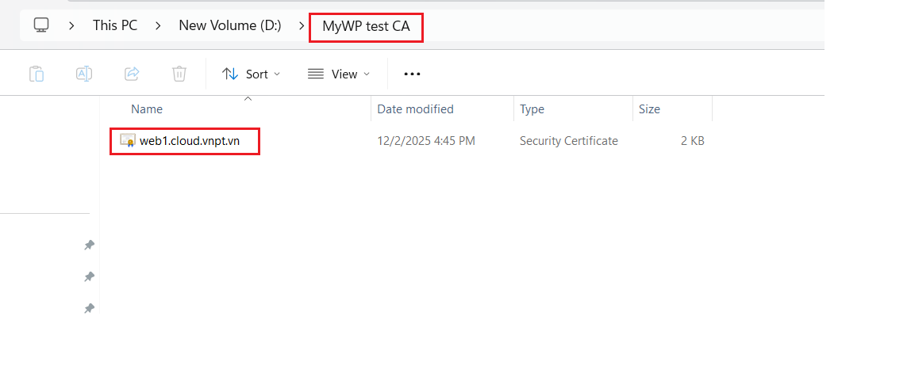

Ta đã thấy có file `web1.cloud.vnpt.vn.crt` là file cert mà ta đã gen ở server

Sau đó, Import Certificate vào `Trusted Root CA` trên máy Window

- Bước 1: Double-click `web1.cloud.vnpt.vn.crt`

  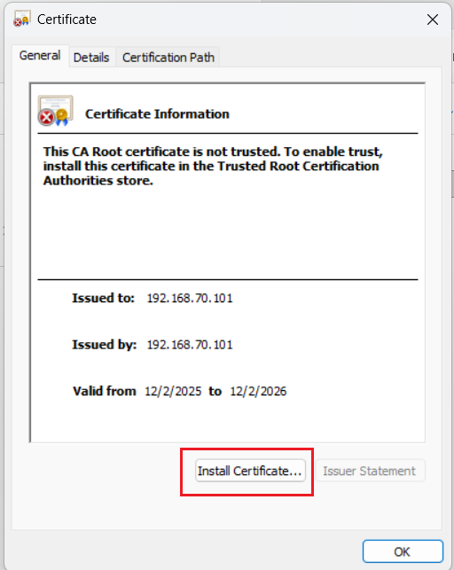

- Bước 2: Chọn `Install Certificate`

  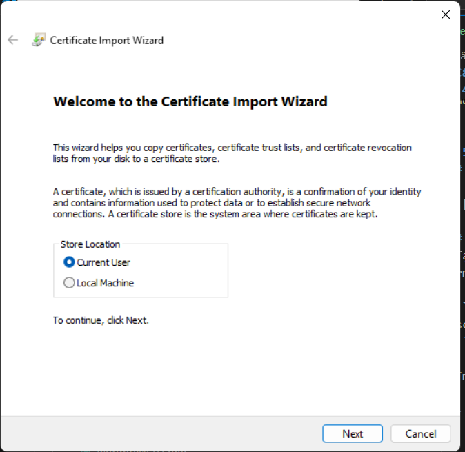

- Bước 3: Chọn: `Local Machine` sau đó chọn `Place all certificates in:→ Trusted Root Certification Authorities`

  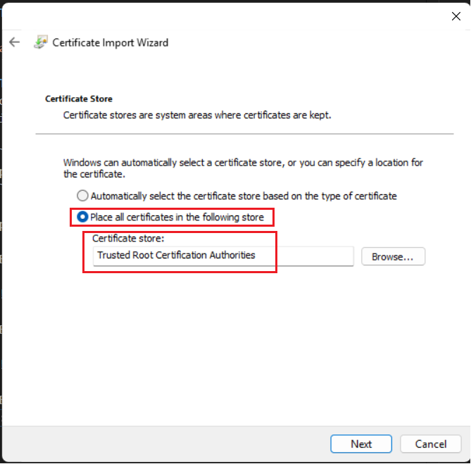

- Bước 4: Chọn `next` -> `finish`

  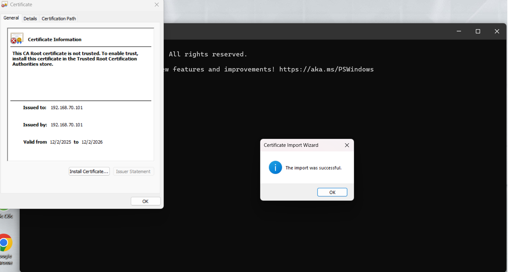

Cuối cùng ta chỉnh sửa file `host` trên máy window và truy cập thử vào trang WP: `https://web1.cloud.vnpt.vn`

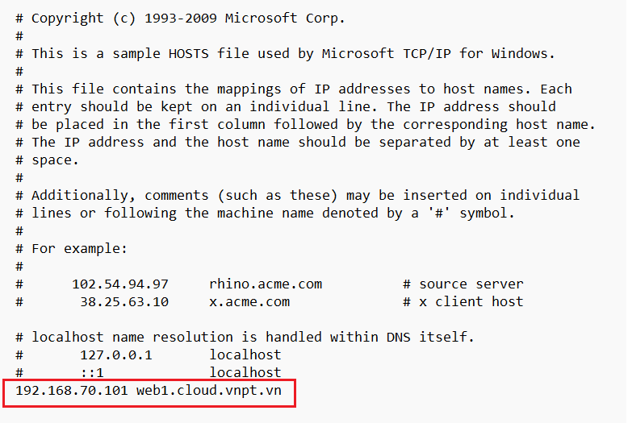

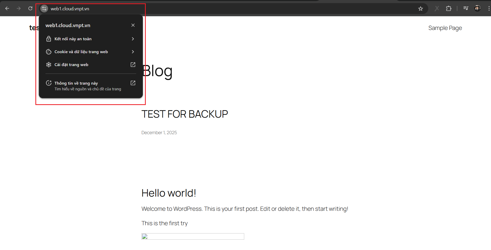

Ta cũng có thể truy cập `https://web1.cloud.vnpt.vn/wp-admin` để xem hệ thống có redirect sang IP không?

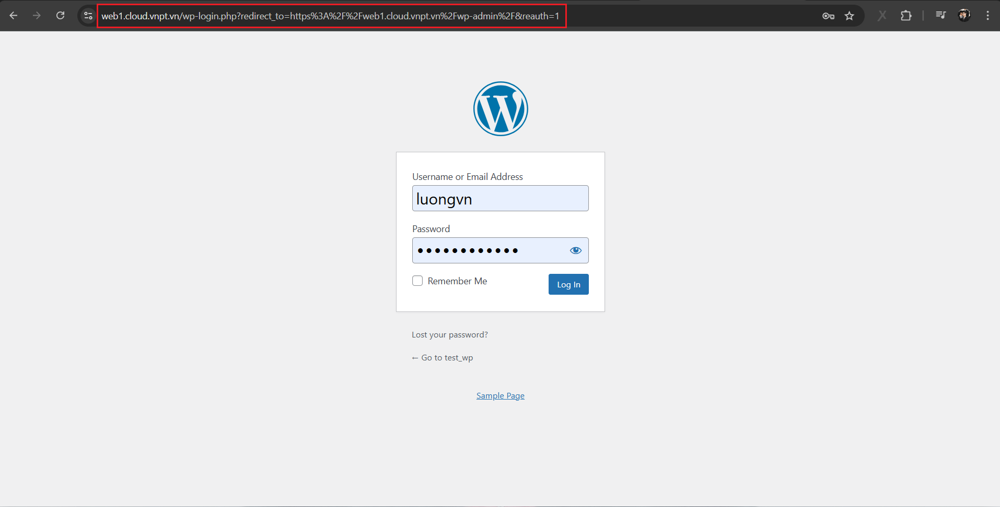

Như vậy Website đã không Redirect sang địa chỉ IP